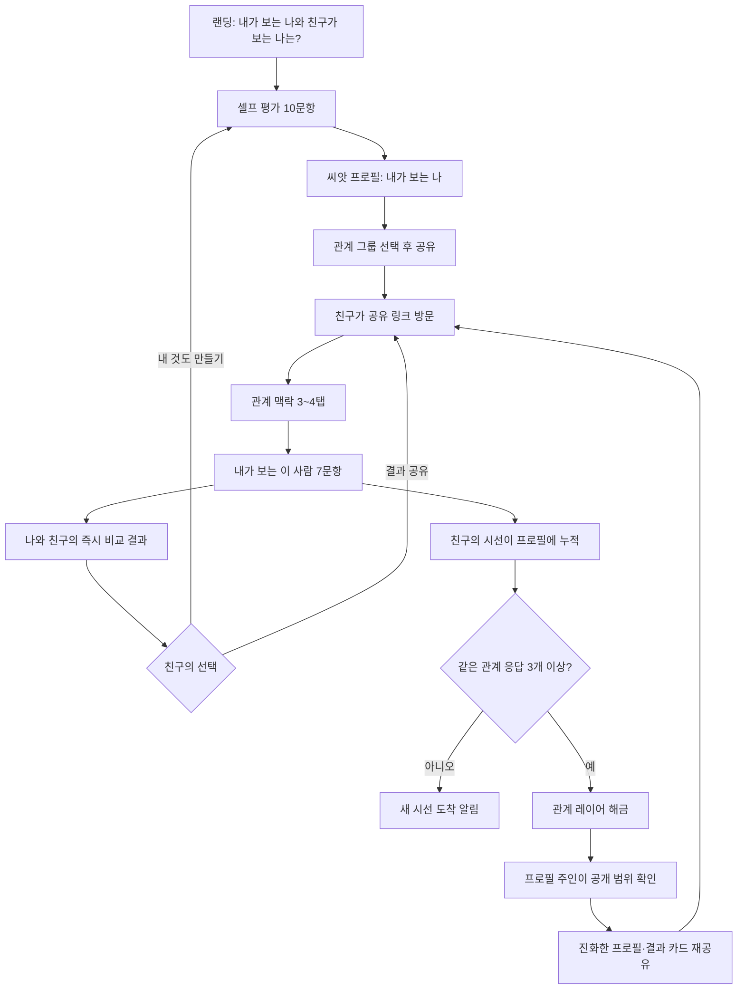

# 살아 있는 소셜 프로필 제품 흐름 기획

작성일: 2026-07-14  
상태: 제품 방향 v2  
이전 방향과의 차이: `친구가 내 정답을 맞히는 우정 퀴즈`가 아니라 `내가 보는 나와 관계별로 사람들이 보는 나가 쌓이는 프로필`을 만든다.

## 1. 제품 정의

### 한 문장

내가 작성한 셀프 평가와, 나를 서로 다른 시기와 관계에서 만난 사람들이 남긴 시선이 레이어로 쌓이며 계속 진화하는 소셜 프로필.

### 사용자에게 보여줄 문장

> 내가 보는 나와, 사람들이 보는 나는 얼마나 다를까?

### 제품이 충족해야 하는 욕망

- 나는 나를 표현하고 싶다.
- 다른 사람들이 나를 어떻게 보는지 알고 싶다.
- 누가 나에게 관심을 가지고 답했는지 확인하고 싶다.
- 친구에 대해 내가 알고 있는 모습을 전달하고 싶다.
- 흥미로운 결과를 SNS에 공유하고 싶다.
- 시간이 지나며 달라진 나를 기록하고 싶다.

## 2. 핵심 제품 결정

### 이 서비스는 정답 퀴즈가 아니다

친구의 답을 `맞음/틀림`으로 채점하지 않는다. 같은 질문에 대해:

- `내가 보는 나`
- `친구가 보는 나`
- `관계 집단이 보는 나`

를 나란히 보여준다. 같은 답이면 `서로 같은 모습으로 보고 있음`, 다르면 `관점 차이`로 표현한다.

### 프로필은 하나의 평균 점수가 아니다

초등학교 친구, 대학 친구, 직장동료가 보는 모습은 서로 다를 수 있다. 전체 평균으로 뭉개지 않고 관계와 시기별 레이어를 보존한다.

### 친구의 참여는 짧아야 한다

프로필 주인은 질문을 계속 답하며 백문백답을 쌓지만, 친구는 한 번에 약 1분, 7문항만 답한다.

### 공유되는 것은 서비스가 아니라 사용자다

공유 카드의 주어는 항상 서비스명이 아니라 사람이어야 한다.

> 초등학교 친구들이 보는 나와 직장동료가 보는 나는 이렇게 다르다.

## 3. 핵심 데이터 단위

이 제품의 핵심 데이터는 단순한 `답변`이 아니라 `맥락이 붙은 시선`이다.

```text
시선 Observation
├─ 누구에 대한 시선인가: profile owner
├─ 어떤 관계인가: 동창 / 친구 / 직장동료 / 가족 / 연인 / 온라인
├─ 언제부터 알았는가: 생애 단계 + 알고 지낸 기간
├─ 어느 시기의 모습을 봤는가: 과거 / 현재 / 둘 다
├─ 현재 친밀도는 어떤가
├─ 각 성향 질문에 어떻게 답했는가
├─ 선택적 기억 한 문장
├─ 공개 동의 범위
└─ 작성 시점
```

이 맥락이 있어야 `오래된 친구와 최근 친구가 보는 나`, `학교에서의 나와 회사에서의 나`를 비교할 수 있다.

## 4. 전체 순환 구조



## 5. 사용자 역할

### 프로필 주인

- 셀프 평가를 작성한다.
- 관계별 공유 링크를 만든다.
- 새로 들어온 시선을 확인한다.
- 어떤 집계 결과를 공개할지 선택한다.
- 시간이 지나며 셀프 평가와 질문을 추가한다.

### 친구·기여자

- 프로필 주인과의 관계 맥락을 선택한다.
- 자신이 보는 프로필 주인의 모습을 답한다.
- 셀프 평가와 자신의 관점 차이를 확인한다.
- 자신의 이름 공개 여부와 자유답변 공개 여부를 선택한다.
- 결과를 보고 자기 프로필을 만들 수 있다.

## 6. 최초 사용자 흐름

### 화면 1 — 랜딩

목표: 서비스 설명보다 결과에 대한 호기심을 만든다.

핵심 카피:

> 나는 나를 제대로 알고 있을까?  
> 10개의 질문에 답하고 친구들이 보는 나와 비교해보세요.

주요 요소:

- 실제 결과 카드 예시 한 장
- 예상 소요 시간 `약 2분`
- CTA `내가 보는 나 만들기`
- 가입 불필요 안내

첫 화면에서 100문항, 광고, 결제, 심리분석 정확성을 언급하지 않는다.

### 화면 2 — 시작 정보

최소 입력:

- 닉네임
- 프로필 이미지 또는 이모지: 선택
- 연령·성별·학교·회사명: 수집하지 않음

익명 세션을 먼저 만들고, 복구 계정 연결은 프로필 발행 이후에 제안한다.

### 화면 3 — 셀프 평가 10문항

한 화면에 한 질문을 보여주고 상단에 `3/10` 진행률을 표시한다. 답을 누르면 다음 문항으로 이동하되 이전 문항 수정이 가능해야 한다.

질문은 고정 유형 결과를 만드는 MBTI식 문항이 아니라, 타인이 실제 행동으로 관찰할 수 있는 양극형 문장으로 구성한다.

| 차원 | 왼쪽 예시 | 오른쪽 예시 |
|---|---|---|
| 새로운 관계 | 먼저 말을 거는 편 | 먼저 분위기를 보는 편 |
| 감정 표현 | 표정과 말에 드러나는 편 | 속으로 정리하는 편 |
| 계획 | 미리 계획해야 편함 | 상황에 따라 바꾸는 편 |
| 갈등 | 바로 이야기하는 편 | 시간을 두고 이야기하는 편 |
| 위로 | 감정을 충분히 들어줌 | 해결 방법을 같이 찾음 |
| 책임 | 자연스럽게 앞장서는 편 | 옆에서 빈틈을 채우는 편 |
| 자기 공개 | 생각을 쉽게 말하는 편 | 친해져야 말하는 편 |
| 변화 | 새로운 것을 먼저 시도 | 익숙해진 뒤 시도 |
| 연락 | 생각날 때 바로 연락 | 용건이 있을 때 연락 |
| 관계 깊이 | 여러 사람과 넓게 지냄 | 적은 사람과 깊게 지냄 |

각 질문은 5점 척도로 저장한다. 결과에는 우열이나 정상 범위를 붙이지 않는다.

### 화면 4 — 씨앗 프로필

셀프 평가가 끝나면 친구 응답이 없어도 즉시 가치가 생겨야 한다.

표시 내용:

- `내가 보는 나` 한 줄 요약
- 10개 차원 중 특징이 뚜렷한 3개
- 셀프 프로필 카드
- 프로필 상태 `씨앗 프로필`
- CTA `친구가 보는 나 추가하기`

문구 예시:

> 나는 새로운 관계에서는 천천히 다가가지만, 가까운 사람에게는 생각을 솔직하게 표현하는 편이에요.

AI 요약 대신 규칙 기반 템플릿으로 시작한다.

### 화면 5 — 관계 그룹 선택과 공유

프로필 주인이 누구에게 공유하는지 먼저 선택한다.

- 오래된 친구
- 학교 친구
- 대학 친구
- 직장동료
- 현재 가까운 친구
- 온라인 친구
- 가족
- 연인
- 직접 만들기

선택에 따라 공유 링크에 그룹 식별자가 포함된다. 친구는 링크 방문 후 관계를 확인하거나 수정할 수 있다.

공유 카드 예시:

> 오래전부터 나를 본 너는 지금의 나를 어떻게 생각해?

> 회사에서의 나는 어떤 사람으로 보여?

공유 방식:

- 모바일 공유 시트
- 카카오톡 공유
- 링크 복사
- 인스타 스토리용 9:16 이미지 저장

## 7. 친구 참여 흐름

### 화면 6 — 친구 진입

친구에게 회원가입을 요구하지 않는다.

첫 화면:

> 민수가 보는 민수와, 내가 보는 민수는 얼마나 비슷할까?

노출 정보:

- 닉네임과 프로필 이미지
- `약 1분 · 7문항`
- 개별 답변 공개 방식 안내
- CTA `내가 보는 민수 남기기`

프로필 전체 답변은 참여 전에 모두 보여주지 않는다. 공개된 셀프 특징 한두 개만 티저로 제공한다.

### 화면 7 — 관계 맥락 입력

최대 4번의 탭으로 끝낸다.

#### 처음 알게 된 시기

- 초등학교 이전
- 중·고등학교
- 대학·학교 이후
- 첫 직장 이전
- 현재 직장·최근
- 온라인에서
- 기억나지 않음

#### 관계 유형

- 동창
- 친구
- 직장동료
- 가족
- 연인·전 연인
- 온라인 친구
- 기타

#### 알고 지낸 기간

- 1년 미만
- 1~3년
- 4~9년
- 10년 이상

#### 현재 친밀도

- 가끔 소식만 아는 사이
- 가끔 연락하는 사이
- 자주 연락하거나 만나는 사이
- 무엇이든 말할 수 있는 사이

정확한 학교명, 회사명, 만난 날짜는 받지 않는다.

### 화면 8 — `내가 보는 이 사람` 7문항

셀프 평가 10차원 중 7개를 균형 있게 배정한다. 질문은 친구 관점으로 바꾼다.

> 내가 보는 민수는 새로운 모임에서…  
> 먼저 말을 건다 ◀︎ 1 2 3 4 5 ▶︎ 분위기를 먼저 살핀다

답변 직후에는 정답 여부를 표시하지 않는다. 7문항을 모두 마친 뒤 비교 결과에서 공개한다.

친구에게 같은 질문을 반복 요청할 수 있으므로, 향후 응답 시에는 아직 답하지 않은 차원을 우선 배정한다.

### 화면 9 — 선택적 기억 한 문장

필수가 아니다.

질문 예시:

> 민수가 가장 민수답다고 느꼈던 순간이 있다면 한 문장으로 남겨주세요.

동의 선택:

- 프로필 주인만 보기
- 익명으로 프로필 공개 허용
- 내 이름과 함께 공개 허용

자유답변은 자동 공개하지 않는다.

### 화면 10 — 친구의 즉시 결과

친구가 참여한 직후에도 보상이 있어야 한다.

표시 내용:

- 7개 중 관점이 가장 비슷한 2개
- 가장 다르게 본 1개
- 셀프 평가와 친구 관점 나란히 보기
- 결과 카드 저장·공유
- CTA `이번엔 내 프로필 만들기`

표현 원칙:

- `5개 맞힘` 대신 `5가지 모습을 비슷하게 봤어요`
- `틀림` 대신 `서로 다르게 보고 있어요`
- 관계의 좋고 나쁨이나 진짜 친구 여부를 판단하지 않음

## 8. 프로필 진화 규칙

### 단계 0 — 씨앗

조건: 셀프 평가 10개 완료

프로필에 보이는 것:

- 내가 보는 나
- 셀프 특징 3개
- 친구 시선 모집 CTA

### 단계 1 — 첫 시선

조건: 친구 응답 1개

프로필 주인에게 비공개로 보여주는 것:

- 새로운 시선이 도착했다는 활동 카드
- 나와 친구가 비슷하게 본 차원
- 다르게 본 차원

한 사람의 답을 집단 결과처럼 공개하지 않는다.

### 단계 2 — 관계 레이어

조건: 같은 관계 그룹에서 최소 3명 응답

해금되는 것:

- `대학 친구들이 보는 나` 같은 집계 레이어
- 셀프 평가와 그룹 평균 비교
- 그룹 내 응답 분포
- 공개 가능한 관계 결과 카드

### 단계 3 — 여러 겹의 나

조건: 서로 다른 관계 그룹 2개 이상이 각각 3명 이상

해금되는 것:

- 관계 그룹 간 비교
- `학교에서의 나 vs 회사에서의 나`
- `오래된 친구 vs 최근 친구`
- 가장 일관된 모습과 가장 달라지는 모습

### 단계 4 — 변화하는 나

조건: 셀프 평가를 서로 다른 시점에 2회 이상 작성하거나, 충분한 기간을 두고 새 응답이 축적됨

해금되는 것:

- 과거의 내가 본 나와 현재의 내가 본 나
- 과거 관계와 최근 관계의 시선 차이
- 시간에 따른 차원별 변화

셀프 평가 재작성은 기존 값을 덮어쓰지 않고 `Self Snapshot`으로 보존한다.

## 9. 프로필 정보 구조

### 1. 프로필 헤더

- 닉네임·프로필 이미지
- 현재 한 줄 설명
- 프로필 상태: 씨앗 / 첫 시선 / 여러 겹 / 변화 중
- 누적 기여자 수
- 대표 공유 CTA

### 2. 내가 보는 나

- 최신 셀프 스냅샷
- 특징이 뚜렷한 차원
- 직접 답한 백문백답 중 공개 항목

### 3. 사람들이 보는 나

- 최소 인원 조건을 충족한 전체 집계
- 셀프와 가장 비슷한 점
- 셀프와 가장 다른 점

### 4. 관계별 레이어

- 오래된 친구
- 학교 친구
- 직장동료
- 온라인 친구
- 가족·연인 등

각 레이어는 응답자 3명 이상일 때만 공개 가능하다.

### 5. 시기별 타임라인

- 과거 관계가 기억하는 나
- 최근 관계가 보는 나
- 셀프 평가가 바뀐 지점
- 새 관계 레이어가 열린 시점

### 6. 기억 조각

- 친구들이 남긴 선택적 한 문장
- 프로필 주인이 공개를 승인한 것만 표시
- 원작성자의 공개 동의 범위를 넘길 수 없음

### 7. 다음 진화 CTA

프로필마다 부족한 레이어를 기반으로 다른 공유 이유를 제공한다.

> 오래전의 나를 아는 친구가 아직 부족해요.

> 직장 밖의 나를 아는 사람의 시선을 추가해보세요.

## 10. 공개 범위

공개 단위는 프로필 전체만이 아니라 섹션과 카드 수준이어야 한다.

- 나만 보기
- 링크를 받은 사람에게 공개
- 전체 공개
- 특정 관계 레이어 숨기기

기본 정책:

- 개별 친구의 성향 응답: 프로필 주인에게만 공개
- 관계 그룹 집계: 3명 이상일 때 공개 가능
- 자유답변: 양쪽 동의 후 프로필 주인이 승인해야 공개
- 기여자 이름: 기여자가 직접 허용한 경우에만 공개
- 셀프 답변: 프로필 주인이 항목별로 선택

## 11. 프로필을 진화시키는 이벤트

프로필은 숫자만 증가하면 안 된다. 새 응답이 들어올 때 의미 있는 변화가 발생해야 한다.

| 이벤트 | 프로필 변화 | 주인에게 주는 알림 |
|---|---|---|
| 첫 친구 응답 | 첫 시선 카드 생성 | 새로운 시선이 도착했어요 |
| 같은 그룹 3명 | 관계 레이어 생성 | 대학 친구들이 보는 내가 열렸어요 |
| 두 번째 그룹 3명 | 그룹 비교 생성 | 학교와 회사에서의 내가 이렇게 달라요 |
| 새 공통점 발견 | 대표 특징 갱신 후보 | 세 관계에서 공통으로 나타난 모습이 있어요 |
| 큰 관점 차이 발견 | 나도 몰랐던 나 카드 | 친구들은 당신을 생각보다 더 단호하게 봐요 |
| 셀프 평가 재작성 | 시간 비교 생성 | 6개월 전의 나와 지금의 내가 달라졌어요 |

결과 갱신은 단순한 평균의 미세 변화마다 알리지 않는다. 새 레이어 해금, 의미 있는 차이, 새로운 공통 패턴처럼 설명 가능한 변화만 이벤트로 만든다.

## 12. 공유 루프

### 루프 A — 최초 자기표현

셀프 평가 → 씨앗 프로필 카드 → 친구 공유

### 루프 B — 친구의 호기심

친구 링크 방문 → 내가 보는 그 사람 답변 → 즉시 비교 → 내 프로필 만들기

### 루프 C — 관계 레이어 완성

`대학 친구 응답 1명 부족` → 특정 단톡방 공유 → 레이어 해금 → 결과 재공유

### 루프 D — 프로필 진화

새로운 관점 차이 발견 → 프로필 주인 재방문 → 공개 승인 → 새로운 결과 카드 공유

### 루프 E — 시간

졸업, 입사, 이직, 생일, 연말 등 → 셀프 스냅샷 재작성 → 과거와 현재 비교 공유

## 13. 공유 카드 유형

### 셀프 카드

> 내가 생각하는 나는 이런 사람이에요.

### 친구 모집 카드

> 오래전부터 나를 아는 너는 나를 어떻게 기억해?

### 관점 차이 카드

> 나는 낯을 많이 가린다고 생각하지만 친구들은 나를 인싸로 봐요.

### 관계 비교 카드

> 초등학교에서는 사고뭉치, 회사에서는 침착한 해결사.

### 시간 변화 카드

> 1년 전의 나는 즉흥적이었고, 지금의 나는 계획을 더 중요하게 생각해요.

### 공통 인식 카드

> 어느 시기에 만났든 친구들은 나를 고민을 잘 들어주는 사람으로 기억해요.

모든 카드는 9:16 스토리 이미지, 1:1 피드 이미지, 링크 미리보기를 지원한다.

## 14. 분석과 결과 생성

### MVP 계산 방식

- 각 차원의 셀프 점수: 1~5
- 친구 관점: 1~5
- 관계 그룹별 평균과 분포
- 셀프와 그룹 차이: 절댓값
- 관계 그룹 간 차이: 그룹 평균 차이
- 공통 인식: 여러 그룹이 같은 방향이며 최소 표본 조건 충족
- 변화: 서로 다른 시점의 셀프 스냅샷 또는 그룹 점수 차이

AI를 사용하지 않고 계산과 문장 템플릿으로 결과를 만든다.

### 공개 가능한 최소 조건

- 그룹 평균: 응답자 3명 이상
- 그룹 간 비교: 각 그룹 3명 이상
- 시간 변화: 비교할 스냅샷 2개 이상
- 자유답변 키워드 집계: MVP에서는 제공하지 않음

### 표현 금지

- 진짜 친구·가짜 친구 판정
- 좋은 성격·나쁜 성격 판정
- 심리 진단 또는 과학적 정확성 주장
- 한 명의 답변을 집단 의견처럼 표현
- 응답자의 신원을 추측하게 만드는 문구

## 15. 재방문 구조

이 서비스는 매일 사용하는 피드형 SNS가 아니다. 의미 있는 관계 이벤트가 생길 때 돌아오는 프로필형 서비스다.

재방문 이유:

- 새로운 친구 시선 도착
- 관계 레이어 해금
- 그룹 비교 생성
- 공개 승인 요청
- 셀프 스냅샷 갱신 시기
- 새 질문팩 공개

초기에는 푸시 알림보다 웹 내 활동함과 선택적 이메일·카카오 알림을 우선 검토한다.

## 16. 친구 참여 후 자기 프로필 전환

친구의 결과 화면에서 자기 프로필 생성을 자연스럽게 연결한다.

> 민수와 나는 7가지 중 5가지를 비슷하게 봤어요.  
> 친구들은 나를 어떻게 보고 있을까요?

CTA:

- `내가 보는 나 만들기`
- 기존 응답은 새 프로필 데이터로 자동 복사하지 않음
- 새 프로필 시작 시 다시 10문항을 직접 답하도록 함

## 17. MVP 범위

### 포함

- 모바일 웹
- 익명 셀프 평가 10문항
- 씨앗 프로필
- 관계별 공유 링크
- 친구 관계 맥락 입력
- 친구 관점 7문항
- 즉시 셀프·친구 비교
- 관계 그룹별 집계
- 응답자 3명 기준 관계 레이어
- 프로필 공개 범위
- SNS 결과 카드
- 친구의 자기 프로필 전환
- 삭제·신고·요청 제한
- 핵심 퍼널 이벤트

### 제외

- 광고와 결제
- 전체 피드와 팔로우
- 댓글·DM·익명 자유질문
- AI 성격 분석
- 이름을 건 친구별 순위
- 100문항 일괄 작성
- 네이티브 앱
- 학교·회사 실명 기반 그룹
- 자유답변 자동 요약
- 정교한 장기 변화 분석

## 18. MVP 화면 목록

1. 랜딩
2. 닉네임 시작
3. 셀프 평가 10문항
4. 씨앗 프로필 결과
5. 관계 그룹·공유 카드 선택
6. 친구 링크 진입
7. 관계 맥락 입력
8. 친구 관점 7문항
9. 선택적 기억 한 문장
10. 친구 즉시 비교 결과
11. 내 프로필
12. 관계 레이어 상세
13. 활동함
14. 공개 범위 관리
15. 신고·삭제

## 19. 핵심 이벤트

- `self_assessment_started`
- `self_assessment_completed`
- `seed_profile_viewed`
- `share_group_selected`
- `share_clicked`
- `shared_link_opened`
- `relationship_context_completed`
- `friend_observation_started`
- `friend_observation_completed`
- `friend_result_viewed`
- `contributor_profile_started`
- `relationship_layer_unlocked`
- `profile_evolution_viewed`
- `evolution_card_shared`
- `visibility_changed`
- `memory_approved`
- `profile_deleted`
- `report_submitted`

## 20. 성공 지표

### 활성화

- 셀프 평가 시작 대비 완료율
- 완료까지 걸린 시간
- 씨앗 프로필 조회율

### 공유

- 프로필 발행 대비 공유율
- 작성자당 생성한 관계 링크 수
- 공유 링크당 고유 방문자 수

### 친구 참여

- 링크 방문 대비 관계 맥락 완료율
- 관계 맥락 완료 대비 7문항 완료율
- 친구 결과 조회율

### 바이럴

- 친구 참여자 중 자기 프로필 시작률
- 친구 참여자 중 자기 프로필 발행률
- 프로필 한 개가 만든 신규 프로필 수

### 프로필 진화

- 친구 응답 1개 이상을 받은 프로필 비율
- 관계 레이어 1개 이상 해금 비율
- 두 개 관계 레이어 해금 비율
- 첫 응답 이후 프로필 주인 재방문율
- 진화 결과 카드 재공유율

### 제안하는 초기 판단 기준

아래는 시장 평균이 아니라 내부 go/no-go 기준이다.

- 셀프 평가 완료율 60% 이상
- 발행 프로필 공유율 50% 이상
- 친구 링크 방문 대비 관점 응답 완료율 35% 이상
- 완료한 친구의 자기 프로필 발행률 20% 이상
- 프로필당 평균 친구 완료 응답 3개 이상
- 프로필당 신규 프로필 생성 수 0.7 이상이면 반복 개선, 1.0 이상이면 자생 바이럴 가능성 확인

## 21. 안전과 신뢰

### 집단 익명성

- 관계 레이어는 3명 이상일 때만 공개
- 기여자가 1~2명인 그룹은 `응답이 모이는 중`으로만 표시
- 그룹 필터를 조합해 한 사람을 역추적할 수 없도록 제한

### 응답권

- 기여자는 익명·이름 공개를 선택
- 자유답변 공개 동의를 선택
- 제출 후 삭제 요청 가능

### 프로필 주인의 권리

- 전체 프로필과 관계 레이어 숨김
- 공개 결과 승인
- 악성 자유답변 신고·삭제
- 전체 데이터 삭제

### 질문 정책

- 외모, 재산, 성적 경험, 정신건강 진단 등 민감 평가를 MVP 질문에서 제외
- 첫 학교, 어머니 성함, 첫 반려동물처럼 보안 질문에 쓰일 수 있는 개인정보를 수집하지 않음
- 부정적 평가보다 관찰 가능한 중립적 행동을 묻음

## 22. 수익화 경계

첫 관계 경험과 기본 프로필은 무료로 유지한다.

향후 유료 후보:

- 추가 질문팩
- 프로필·공유 카드 테마
- 연말 또는 시기별 프로필 리포트
- 장기 변화 아카이브 내보내기
- 커플·동창·팀 등 특별 관계팩
- 광고 제거

결제하면 특정 친구의 비공개 응답이나 신원을 볼 수 있게 하는 기능은 만들지 않는다.

## 23. 단계별 출시

### 0단계 — 질문과 결과 문장 검증

- 셀프 문항 10개 확정
- 친구 문항 7개 흐름 확정
- 관계 맥락 선택지 확정
- 규칙 기반 결과 문장 작성
- 10명을 대상으로 설명 없이 완료 가능한지 테스트

### 1단계 — 가짜 데이터 프로토타입

- 셀프 평가
- 씨앗 프로필
- 관계별 공유
- 친구 관점 입력
- 관계별 프로필 결과

실제 저장 없이 전체 감정 흐름부터 검증한다.

### 2단계 — 비공개 기능형 MVP

- 실제 익명 세션과 데이터 저장
- 공개 범위와 집단 임계치
- 공유 링크·이미지
- 이벤트 분석
- 삭제·신고·요청 제한

### 3단계 — 50명 시드 베타

- 서로 다른 최소 3개 친구 집단으로 테스트
- 오래된 친구와 최근 친구가 모두 있는 사용자를 우선 모집
- 가장 큰 이탈 지점 한 곳과 가장 공유되는 결과 카드 한 종류를 확인

### 4단계 — 200개 프로필 판단

- 바이럴 계수
- 프로필당 친구 응답 수
- 관계 레이어 해금률
- 진화 카드 재공유율

이 네 가지가 확인되기 전에는 광고·결제·피드를 개발하지 않는다.

## 24. 수용 조건

- 사용자는 가입 없이 셀프 평가 10문항을 완료할 수 있다.
- 셀프 평가만으로 씨앗 프로필과 공유 카드가 생성된다.
- 사용자는 관계 그룹을 선택해 서로 다른 공유 링크를 만들 수 있다.
- 친구는 가입 없이 관계 맥락과 관점 7문항을 완료할 수 있다.
- 친구는 셀프 평가와 자신의 관점을 맞음·틀림 없이 비교할 수 있다.
- 친구 응답은 관계와 시기 맥락을 포함해 저장된다.
- 같은 관계 그룹에 3명 이상 모이면 집계 레이어가 생성된다.
- 개별 응답은 공개 프로필에 노출되지 않는다.
- 프로필 주인이 집계 결과와 자유답변 공개 여부를 제어할 수 있다.
- 서로 다른 관계 그룹의 차이를 별도 레이어로 보존한다.
- 셀프 평가를 다시 작성해도 이전 스냅샷이 보존된다.
- 진화한 결과를 SNS 카드로 다시 공유할 수 있다.
- 친구 결과 화면에서 자기 프로필 생성으로 전환할 수 있다.
- 삭제·신고·요청 제한이 동작한다.
- 전체 퍼널과 진화 이벤트를 측정할 수 있다.

## 25. 주요 제품 위험과 대응

### 친구 퀴즈 복제품처럼 보임

- 점수, 정답, 친구 순위를 전면에 두지 않는다.
- 첫 결과부터 `셀프 관점과 친구 관점 차이`를 보여준다.
- 프로필과 공유 카드에서 관계·시기 레이어를 핵심으로 표현한다.

### 친구에게 설문 노동처럼 느껴짐

- 친구 흐름을 관계 맥락 포함 1분 안에 끝낸다.
- 한 화면 한 질문, 큰 탭 선택지, 명확한 진행률을 사용한다.
- 제출 직후 비교 결과를 제공해 친구에게도 즉시 보상한다.

### 응답이 적어 프로필이 비어 보임

- 셀프 평가만으로도 완성도 있는 씨앗 프로필을 제공한다.
- 첫 친구 응답은 비공개 개인 비교로 즉시 보여준다.
- 3명 집계가 필요한 이유와 남은 인원을 명확히 안내한다.

### 관계 평가가 상처를 줌

- 좋고 나쁨이 없는 양극형 행동 질문만 사용한다.
- 개별 점수, 진짜 친구 판정, 부정적 순위를 제공하지 않는다.
- 자유답변은 자동 공개하지 않는다.

### 작은 그룹에서 응답자가 추측됨

- 3명 미만은 집계 결과를 공개하지 않는다.
- 여러 필터를 조합해 한 사람만 남는 조회를 막는다.
- 이름과 자유답변은 기여자 동의가 있어야 공개한다.

### 한 번 공유한 뒤 돌아오지 않음

- 새 관계 레이어, 새로운 공통점, 셀프 스냅샷 변화처럼 설명 가능한 진화 이벤트를 만든다.
- 관계별로 다른 공유 이유를 제공한다.
- 게시물 피드가 아니라 관계 이벤트 기반 재방문을 측정한다.

## 26. 검증 시나리오

### 질문 검증

- 사용자가 각 문항을 성격의 우열이 아니라 행동 차이로 이해한다.
- 프로필 주인과 친구가 같은 문항을 각자의 관점에서 답할 수 있다.
- 동일 사용자가 다시 답했을 때 기존 셀프 스냅샷이 보존된다.

### 공개 범위 검증

- 친구 응답 1~2개는 공개 프로필에서 집계로 노출되지 않는다.
- 같은 그룹에 세 번째 응답이 들어오면 관계 레이어가 생성된다.
- 자유답변은 기여자 동의와 프로필 주인 승인 전까지 공개되지 않는다.
- 프로필 주인이 레이어를 숨기면 공유 링크에서도 즉시 사라진다.

### 전체 E2E 검증

- 새 사용자 셀프 평가 → 씨앗 프로필 → 관계 링크 공유
- 새 브라우저에서 친구 진입 → 관계 맥락 → 관점 7문항 → 즉시 비교
- 친구 응답 뒤 프로필 주인 활동함 갱신
- 같은 그룹 3명 완료 뒤 관계 레이어 해금
- 진화 카드 공유 → 신규 친구 진입
- 친구 결과 → 자기 프로필 생성
- 프로필·응답 삭제와 신고

### 분석 검증

- 퍼널 이벤트 수가 실제 프로필·응답 레코드 수와 표본 기준으로 일치한다.
- 공유 유입을 원래 프로필과 관계 그룹에 연결할 수 있다.
- 프로필 한 개당 신규 프로필 생성 수를 계산할 수 있다.
- 미세한 점수 변화가 진화 이벤트로 과도하게 생성되지 않는다.

## 27. 가장 먼저 만들어야 할 세로 슬라이스

첫 구현은 아래 한 줄만 완성한다.

> 셀프 평가 10개 → 씨앗 프로필 → `오래된 친구` 링크 공유 → 친구 관계 맥락 → 친구 관점 7개 → 즉시 비교 → 프로필에 첫 시선 누적

관계 그룹 집계, 타임라인, 추가 질문팩을 동시에 만들지 않는다. 먼저 한 명의 친구 응답이 프로필 주인에게 충분히 재미있는지, 그 친구가 자기 프로필을 만들고 싶어지는지 검증한다.

## 28. 제품의 최종 형태

이 서비스가 커졌을 때의 프로필은 자기소개 페이지가 아니라 개인의 관계 아카이브가 된다.

> 내가 말하는 나  
> 오래된 친구가 기억하는 나  
> 최근 친구가 발견한 나  
> 회사에서 보이는 나  
> 어느 관계에서도 변하지 않는 나  
> 시간이 지나며 달라진 나

사용자는 게시물을 계속 생산하지 않아도 된다. 사람들의 시선과 자신의 새로운 답변이 들어올 때마다 프로필이 한 겹씩 추가되고, 그 변화 자체가 다시 공유할 콘텐츠가 된다.
