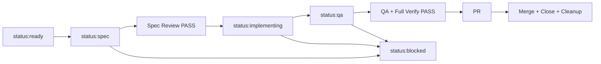

# GYEOP GitHub 작업 워크플로우

## 원칙

- GitHub Issue와 `status:*` 라벨을 작업 상태의 기준으로 사용한다.
- GitHub Project는 설정된 경우 이슈를 추가하는 가시화 레이어로 사용한다.
- 한 이슈는 한 worktree, 한 branch, 한 spec, 한 PR로 처리한다.
- 구현 전에 스펙 검토를 통과하고, PR 전에 독립 QA와 전체 검증을 통과한다.

## 상태



## 환경 설정

하네스는 `origin`에서 `owner/repo`를 자동 감지한다. 원격이 없거나 다른 저장소를 대상으로 할 때 환경 변수를 사용한다.

```bash
export GYEOP_GITHUB_REPO=owner/gyeop
export GYEOP_GITHUB_OWNER=owner
export GYEOP_GITHUB_PROJECT_NUMBER=1
export GYEOP_MAIN_BRANCH=main
```

토큰을 `.env`나 저장소에 기록하지 않는다. 인증은 사용자의 `gh auth` 세션을 사용한다.

## 일감 등록

1. `$gyeop-issue-writer`로 한 PR 크기의 이슈를 작성한다.
2. `scripts/task-harness doctor`로 GitHub 연결을 확인한다.
3. `scripts/task-harness label-sync`로 관리 라벨을 동기화한다.
4. REST `gh api repos/<owner>/<repo>/issues`로 이슈를 생성한다.
5. Project가 설정되어 있으면 `scripts/task-harness project-add <issue-number>`를 실행한다.
6. 실행 가능한 이슈에는 `status:ready`를 부여한다.

## 일감 가져오기와 처리

```bash
scripts/task-harness queue
scripts/task-harness start <issue-number>
scripts/task-harness spec <issue-number>
```

`start`가 출력한 `worktree` 경로로 이동한 뒤 `spec`과 이후 작업을 실행한다. `$gyeop-spec-writer`로 `docs/specs/issue-<number>.md`를 완성하고 독립 검토 결과를 기록한다.

```bash
scripts/task-harness spec-check docs/specs/issue-<number>.md
scripts/task-harness status <issue-number> status:implementing
```

검토된 스펙만 구현한다. QA 결과는 `docs/temp/qa/issue-<number>.md`에 작성한다.

```bash
scripts/task-harness status <issue-number> status:qa
scripts/task-harness qa-check docs/temp/qa/issue-<number>.md
./scripts/run-ai-verify --mode full
scripts/task-harness pr <issue-number>
```

필수 CI가 성공하고 PR이 mergeable일 때만 병합한다.

```bash
scripts/task-harness merge <pr-number>
scripts/task-harness close <issue-number>
scripts/task-harness cleanup <issue-number>
```

`cleanup`은 병합 후 기본 checkout으로 돌아온 다음 실행한다.

## 검토 게이트

- Spec P0/P1 발견 사항이 하나라도 있으면 구현하지 않는다.
- QA P0/P1 발견 사항이 하나라도 있으면 PR을 만들거나 병합하지 않는다.
- `./scripts/run-ai-verify --mode full`이 실패하면 완료로 보고하지 않는다.
- 제품 방향, secret, billing, destructive data, 외부 접근이 필요하면 `status:blocked`와 이유를 남긴다.

## 연결 상태 확인

`scripts/task-harness doctor`로 현재 checkout의 `origin`, GitHub 인증, worktree, 템플릿, 검증 스크립트를 확인한다. Project 환경 변수가 없으면 Project 동기화만 건너뛰고 `status:*` 라벨을 작업 상태의 기준으로 사용한다.
