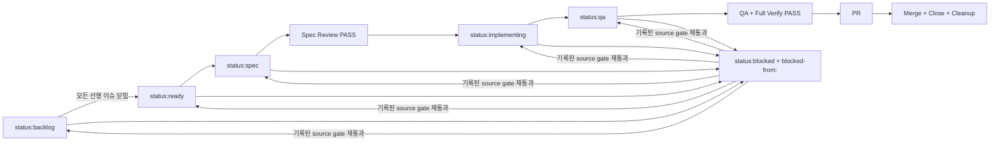

# GYEOP GitHub 작업 워크플로우

## 원칙

- GitHub Issue와 `status:*` 라벨을 작업 상태의 기준으로 사용한다.
- GitHub Project는 설정된 경우 이슈 라벨을 한국어 field로 동기화하는 가시화 레이어로 사용한다.
- 한 이슈는 한 worktree, 한 branch, 한 spec, 한 PR로 처리한다.
- 구현 전에 스펙 검토를 통과하고, PR 전에 독립 QA와 전체 검증을 통과한다.

## 상태



열린 workflow 이슈는 `status:backlog|ready|spec|implementing|qa|blocked` 중 정확히 하나만 가져야 한다. `status:blocked`에는 복귀할 상태를 나타내는 `blocked-from:backlog|ready|spec|implementing|qa`가 정확히 하나 있어야 하며, 다른 상태에는 `blocked-from:*`가 없어야 한다. 누락·중복·잘못된 조합은 mutation 전에 실패한다.

정상 전이는 `backlog -> ready -> spec -> implementing -> qa`뿐이다. 모든 단계는 `blocked`로 갈 수 있지만 기록된 출처로만 복귀하고 그 단계의 gate를 다시 통과해야 한다. `qa`는 라벨 명령으로 완료하거나 되돌리지 않고 merge·close 증거로만 끝낸다. 같은 non-blocked 상태 요청도 해당 gate를 다시 확인한 뒤 PUT 없이 `changed: false`를 반환한다. 같은 blocked 요청은 exact status·provenance만 확인하며 출처 단계 artifact의 유효성을 뜻하지 않는다.

## 환경 설정

하네스는 host가 정확히 `github.com`인 `origin` URL에서 `owner/repo`를 자동 감지한다. 환경 변수는 자동 감지 값을 명시적으로 보정할 때만 사용하며, `resume`·`pr`·`merge`·`close`·`cleanup`에서는 설정값이 `origin`의 모든 fetch URL과 push URL repository에 정확히 같아야 한다. `resume`은 각 Git mutation 전후와 반환 직전, 나머지 명령은 전체 검증·local cleanup처럼 긴 단계 뒤의 remote/GitHub mutation 직전에 이를 다시 검사한다. 별도 `remote.origin.pushurl`이 다른 저장소를 가리키거나 원격이 없는 상태에서는 이 다섯 명령이 fail-closed한다.

```bash
export GYEOP_GITHUB_REPO=aroido/gyeop
export GYEOP_GITHUB_OWNER=aroido
export GYEOP_GITHUB_PROJECT_NUMBER=5
export GYEOP_MAIN_BRANCH=main
```

토큰을 `.env`나 저장소에 기록하지 않는다. 인증은 사용자의 `gh auth` 세션을 사용한다.

### GitHub Project 동기화

GitHub Issue의 `status:*` 라벨이 workflow source of truth다. Project 값은 상태 전이를 승인하거나 거부하는 입력으로 사용하지 않는다. Project가 설정되면 `status`, `start`, `resume`, `reconcile`, `close`가 라벨 또는 검증된 완료 증거를 반영하고, Project 호출 뒤 기존 issue·artifact·Git gate를 다시 통과해야 성공한다. Project number가 없으면 automatic hook은 `skipped`로 끝나며 기존 workflow를 막지 않는다. 명시적 `project-add`와 `project-sync`는 설정이 없으면 non-zero로 실패한다.

`doctor`는 설정된 Project의 owner·number·node, update 권한, `Status`, `작업 상태`, `우선순위`, `작업 유형` field와 모든 required option을 mutation 없이 검사한다. field와 option ID는 실행 시 exact name으로 찾으며 저장소에 고정하지 않는다.

| Issue label 또는 완료 증거 | 기본 `Status` | `작업 상태`      |
| -------------------------- | ------------- | ---------------- |
| `status:backlog`           | `Todo`        | `선행 작업 대기` |
| `status:ready`             | `Todo`        | `준비`           |
| `status:spec`              | `In Progress` | `스펙 작성`      |
| `status:implementing`      | `In Progress` | `구현 중`        |
| `status:qa`                | `In Progress` | `품질 검증`      |
| `status:blocked`           | `In Progress` | `차단`           |
| 검증된 `close` 완료        | `Done`        | `완료`           |

`priority:p0|p1|p2`는 `P0|P1|P2`, `type:planning|design|frontend|backend|data|safety|qa|ops`는 `기획|디자인|프론트엔드|백엔드|데이터|안전|QA|운영`으로 동기화한다. priority 또는 type label이 없으면 해당 field를 비우며, 같은 분류가 중복되거나 알 수 없는 prefixed label이면 Project write 전에 실패한다.

```bash
scripts/task-harness project-add <issue-number>
scripts/task-harness project-sync <issue-number>
```

Project membership은 모든 page를 조회해 판정하며 `project-add`만 누락 item을 추가한다. 열린 이슈의 `project-add`는 membership과 네 field를 함께 맞춘다. 닫힌 이슈에서는 완료를 추정하지 않고 membership만 보장한다. `project-sync`는 열린 exact workflow 이슈의 기존 item만 동기화하며 닫힌 이슈나 missing item을 수정하지 않는다.

여러 field write는 하나의 transaction이 아니다. 일부만 반영되거나 최종 확인이 실패해도 issue label과 Git 상태를 rollback하지 않고 `workflowChanged`, 확인 가능한 authoritative status, 반영이 확인된 field, `projectSynced: false`, ordered recovery command를 error JSON에 남긴다. 열린 existing item은 `project-sync`, 열린 missing item은 `project-add`, 완료 existing item은 같은 `close <issue> <pr>`, 완료 missing item은 `project-add`로 membership을 보장한 뒤 같은 `close`를 재실행한다.

## 일감 등록

1. `$gyeop-issue-writer`로 한 PR 크기의 이슈를 작성한다.
2. `scripts/task-harness doctor`로 GitHub 연결과 설정된 Project 권한·schema를 확인한다.
3. `scripts/task-harness label-sync`로 `status:*`와 `blocked-from:*` 관리 라벨을 동기화한다.
4. REST `gh api repos/<owner>/<repo>/issues`로 이슈를 생성한다.
5. Project가 설정되어 있으면 `scripts/task-harness project-add <issue-number>`로 item을 추가하고 현재 label field를 동기화한다.
6. 모든 등록 이슈에 정확히 하나의 `status:*` 라벨을 부여한다.
   - 선행 이슈가 모두 닫힌 실행 가능 작업: `status:ready`
   - 선행 이슈를 기다리는 계획된 작업: `status:backlog`
   - 외부 입력이나 제품 결정이 필요한 작업: `status:blocked`와 복귀할 단계의 `blocked-from:*`

`status:backlog`는 요구사항 미정 상태가 아니다. 본문과 완료 기준은 실행 가능하게 작성하되, 선행 이슈가 모두 닫힌 것을 확인한 다음 `scripts/task-harness status <issue-number> status:ready`로 승격한다. 하네스도 본문의 `### 선행 이슈`에 연결된 이슈가 하나라도 열려 있으면 승격을 거부한다. `scripts/task-harness queue`는 `status:ready`만 반환한다.

### 선행 이슈 수동 정합화

```bash
scripts/task-harness reconcile
```

`reconcile`은 명시적으로 실행할 때만 동작한다. 첫 mutation 전에 열린 backlog 검색의 모든 page를 수집하고, issue number로 중복 제거·오름차순 정렬하며 PR 항목은 제외한다. page 수집이 하나라도 실패하면 label write 없이 non-zero로 끝난다.

결과 JSON은 항상 `promoted`, `waiting`, `skipped`, `errors` 배열을 포함한다. 선행 이슈가 하나 이상이고 모두 닫혔으면 `promoted`, 하나라도 열려 있으면 `waiting`, 선행 이슈가 없으면 `skipped`, malformed state/body나 조회·write·응답 검증 실패는 `errors`다. 개별 오류 뒤에도 나머지 안전한 항목은 처리하지만 `errors`가 하나라도 있으면 JSON을 출력한 뒤 non-zero로 끝낸다. Project가 설정된 승격은 `준비`와 `Todo`도 동기화한다. label 승격 뒤 Project가 실패한 항목은 `promoted`와 중복하지 않고 `errors`에만 authoritative `status:ready`와 원인별 `project-add|project-sync` 복구 명령을 남긴다. 재실행 시 이미 ready이고 ready gate가 유효한 항목은 label을 다시 쓰지 않고 `changed: false`로 보고한다. page 수집 중 외부 actor가 backlog label을 바꾸면 GitHub offset 결과가 움직일 수 있으므로 결과를 검토하고 `reconcile`을 다시 실행해 수렴시킨다.

## 일감 가져오기와 처리

```bash
scripts/task-harness queue
scripts/task-harness start <issue-number>
scripts/task-harness resume <issue-number>
scripts/task-harness spec <issue-number>
```

새 작업은 `start`, 중단 작업은 `resume`을 사용한다. 명령이 출력한 canonical `worktree` 경로로 이동한 뒤 `spec`과 이후 작업을 실행한다. `$gyeop-task` 흐름으로 `docs/specs/issue-<number>.md`를 완성하고 독립 검토 결과를 기록한다.

`start`는 첫 Git mutation 전에 열린 이슈의 exact `status:ready` 또는 재실행 가능한 exact `status:spec`, blocked provenance 부재, 예상 branch/path를 확인한다. worktree 생성 뒤 status 또는 Project write가 실패하면 안전한 부분 상태를 자동 삭제하지 않는다. 같은 `start` 또는 `resume`으로 검증·재사용하며, Project 호출 뒤 exact spec status와 checkout gate를 다시 확인해야 성공한다.

### 중단 작업 이어받기

`resume`은 이슈 status를 바꾸거나 branch를 fast-forward·rewind·force-move하지 않는다. 다음 세 경우만 허용한다.

- `reused`: 등록된 exact task worktree가 같은 shared repository, branch, HEAD와 clean 상태다.
- `restored-local`: target이 없고 exact local branch가 있어 pinned SHA로 worktree만 복원한다.
- `restored-remote`: local branch와 target이 없고 검증된 explicit origin URL의 remote branch만 있어 pinned commit을 fetch·검증하고 compare-and-create로 local ref와 worktree를 복원한다.

재개 전에는 open issue의 exact `ready|spec|implementing|qa` 또는 유효한 blocked 상태, 모든 page에서 조회한 같은 repository/base/head의 merged PR 부재, origin 설정·명시적 fetch URL, local/remote SHA-or-absent, worktree registry, canonical target과 shared Git common directory를 고정한다. 첫 mutation 전·각 mutation 후·Project 동기화 후 성공 직전에 다시 검사한다.

merged PR, cleanup quarantine, dirty/wrong branch·HEAD·repository worktree, 빈 directory·file·symlink를 포함한 target 충돌, local/remote SHA 불일치, origin·issue·ref·registry drift에서는 delete·reset·rollback 없이 실패한다. 부분 실패 JSON의 `expectedSha`, `localRef`, `registeredWorktree`, `targetExists`로 상태를 확인한 뒤 원인을 고치고 재실행한다.

```bash
scripts/task-harness spec-check docs/specs/issue-<number>.md
scripts/task-harness status <issue-number> status:implementing
```

검토된 스펙만 구현한다. QA 결과는 `docs/temp/qa/issue-<number>.md`에 작성한다.

```bash
scripts/task-harness status <issue-number> status:qa
scripts/task-harness qa-check docs/temp/qa/issue-<number>.md
scripts/task-harness pr <issue-number>
```

개발 중에는 변경 범위의 빠른 테스트만 실행하고, 전체 검증은 최종 clean commit에서 PR 직전에 한 번 실행한다. 성공한 전체 검증은 shared Git directory에 commit SHA marker로 기록된다. `pr`과 `merge`는 현재 HEAD와 marker SHA가 정확히 같을 때 결과를 재사용하고, marker가 없을 때만 안전하게 전체 검증을 한 번 실행한다. 제품 변경에서 task harness 파일이 바뀌지 않았으면 full verify의 장시간 harness regression suite도 생략한다.

`resume`·`pr`·`merge`·`close`·`cleanup`은 설정된 GitHub repository와 local `origin`의 모든 fetch·push URL에서 파싱한 repository가 정확히 같아야 시작한다. fork, 별도 push URL, 잘못된 환경 변수로 GitHub 증거와 git mutation 대상이 갈리면 fail-closed한다.

`pr`은 열린 이슈에 정확히 `status:qa` 하나가 있고 blocked provenance가 없는지 full verify marker 확인 전·후, push 직전, PR 생성 직전, ready-for-review write 직전에 다시 확인한다. 최초 검사가 실패하면 verify·push·GitHub write를 실행하지 않고, ready 직전 drift면 draft를 닫지 않고 남겨 재실행으로 복구한다. 이어 예상 branch, clean working tree, spec·QA gate를 검사한다. exact HEAD marker가 없을 때만 전체 검증을 실행하며, 확인 전후의 branch, working tree, HEAD와 QA artifact 원문이 같아야 한다. PR 본문은 첫 line 전체가 exact `Closes #<issue>`이고 colon 형식을 포함한 그 밖의 GitHub closing keyword reference가 없어야 하며, 통과한 HEAD를 `- 검증 HEAD: <sha>`로 기록한다. 후보가 추가·교체되거나 둘 이상이거나 어느 조건이라도 다르면 local upstream과 원격을 변경하지 않고 실패한다. origin fetch·push URL도 push 직전에 다시 검사한다. 검증된 SHA만 push하고 remote head를 대조한 뒤 기존 PR을 재조회하거나 새 draft PR을 만든다. 검증된 draft만 ready로 전환하고 다시 조회해 non-draft 상태를 확인한다. ready 전환 성공 여부를 네트워크 오류로 확정할 수 없으면 PR을 닫지 않고 실패해 다음 재실행에서 복구한다. 유효한 기존 non-draft PR은 재실행 성공으로 반환한다.

이슈 worktree에서 다음 명령을 실행한다. 아직 병합되지 않은 PR의 `merge`는 CI 대기 전·CI 통과 후·merge write 직전에 열린 이슈의 exact `status:qa`와 blocked provenance 부재를 확인한다. 이미 병합된 PR 재실행만 repository·issue 관계, head SHA, merge SHA를 읽어 검증한 뒤 이슈가 닫혀 있어도 write 없이 `alreadyMerged: true`로 성공할 수 있다. 이 예외로 branch를 복원하거나 다른 gate를 건너뛰지 않는다.

`merge`는 open·non-draft·mergeable PR, `main` base, 현재 저장소와 예상 branch의 head, clean working tree와 PR head SHA가 일치하는지 먼저 검사하고 `base.sha`와 QA artifact 원문을 고정한다. PR 본문의 검증 HEAD가 현재 head와 같고 이름이 `verify`인 CI check가 성공한 경우에만 checkout·QA gate와 고정한 원문을 다시 확인하고 PR을 재조회해 `base.sha`, head SHA, repository·branch·lifecycle이 그대로인지 검사한다. merge API 직전에 PR을 한 번 더 조회해 같은 snapshot을 검증하고, 검증한 head SHA를 지정해 병합한다. GitHub API는 expected `base.sha`를 조건부 인자로 받지 않으므로 마지막 조회 뒤 base 갱신 경쟁은 branch protection과 GitHub mergeability 판정에 의존하는 잔여 위험이다.

```bash
scripts/task-harness merge <pr-number>
```

병합 성공 뒤 기본 checkout으로 돌아와 아래 순서로 실행한다. 두 명령 모두 `<issue-number>`와 같은 이슈를 닫는 병합된 `<pr-number>`를 요구하며, 다른 repository·base·head·close clause 또는 미병합 PR이면 아무것도 변경하지 않고 실패한다.

```bash
scripts/task-harness close <issue-number> <pr-number>
scripts/task-harness cleanup <issue-number> <pr-number>
```

`close`는 이슈·PR·merge SHA가 들어간 고정 completion marker를 comment에 먼저 한 번만 기록하고, 이슈가 열려 있을 때만 닫는다. closed GET을 확인한 뒤에만 Project를 `완료`와 `Done`으로 동기화한다. comment·close·Project 중간 실패 뒤 같은 `close`를 재실행해도 marker를 찾아 중복 comment 없이 남은 단계만 수행한다. Project item까지 없으면 `project-add <issue-number>`로 닫힌 이슈의 membership만 보장한 뒤 검증된 같은 `close <issue-number> <pr-number>`를 재실행한다.

`cleanup`은 기본 checkout이 clean `main`인지 확인하고 GitHub 병합 증거를 읽은 뒤 origin fetch·push URL을 다시 검사해 `origin/main`을 fetch한다. 이어 PR merge commit 포함 여부와 대상 worktree·local·remote·remote-tracking ref 및 branch config 원문을 모두 먼저 검사한다. worktree에는 tracked/untracked 변경이 없어야 하고, ignored 경로는 Git의 NUL 구분 literal path 그대로 판정한다. `.DS_Store`, `*.tsbuildinfo`, `node_modules/`, `.next/`, `dist/`, `coverage/`, `playwright-report/`, `test-results/`, `supabase/.temp/`, `supabase/.branches/`, `docs/temp/`, `.omx/`만 disposable generated allowlist로 허용하며 그 밖의 ignored 경로는 사용자 산출물로 간주해 실패한다.

모든 preflight가 통과한 경우에만 local `main`을 fast-forward하고, target worktree를 다시 검사해 제거한다. local branch는 expected SHA와 config snapshot을 재확인한 뒤 task별 deterministic quarantine branch로 worktree-aware rename한다. 원래 ref가 재생성되지 않았고 quarantine ref가 expected SHA이며 어느 worktree도 두 ref를 사용하지 않고 config가 예상대로 이동했는지 다시 확인한 뒤, quarantine ref를 expected-SHA compare-and-swap으로 삭제한다. 삭제 직후에도 worktree를 다시 검사하며 경쟁이 보이면 ref와 원래 branch를 복구하거나 두 ref를 보존한 채 실패해 새 commit을 강제 삭제하지 않는다. 중단 뒤 재실행은 deterministic quarantine ref를 인식해 이어서 정리한다. remote branch 삭제 직전에 origin fetch·push URL을 다시 검사하고 expected SHA의 force-with-lease로 삭제한다. 이어 remote-tracking ref와 대상 branch/quarantine config를 정리해 각 자원의 부재를 즉시 확인한다. remote branch가 이미 없는 재실행은 정상이며 남은 local 자원만 계속 정리한다.

Git은 worktree registry, ref, branch config, working tree 파일, remote 설정을 하나의 원자 transaction으로 묶지 않는다. 따라서 같은 이슈 branch에 대한 수동 checkout·commit·ref/config 변경, tracked·untracked·ignored 파일 생성·변경, `origin` URL 변경을 `pr`·`cleanup`과 동시에 실행하지 않는다. `merge` 중에는 PR base/body/lifecycle을 수동 편집하지 않는다. 하네스는 각 경계 재검사와 복구를 수행하지만 최종 검사와 다음 git/GitHub 명령 사이의 짧은 경쟁을 완전히 제거할 수는 없으며, 예상 밖 외부 경쟁은 성공으로 숨기지 않고 남은 상태와 함께 실패한다.

## 검토 게이트

- Spec P0/P1 발견 사항이 하나라도 있으면 구현하지 않는다.
- QA P0/P1 발견 사항이 하나라도 있으면 PR을 만들거나 병합하지 않는다.
- Spec은 열 시작 위치의 `Status`, `Reviewer Agent`, `Review Status`, `P0/P1 Findings`가 각각 정확히 한 번이고 값이 `Reviewed`, 유효 reviewer, `PASS`, `0`이어야 한다.
- QA는 열 시작 위치의 `Reviewer Agent`, `Status`, `P0/P1 Findings`가 각각 정확히 한 번이고 값이 유효 reviewer, `PASS`, `0`이어야 한다. focused check 또는 manual evidence를 검증 섹션에 기록한다.
- 이슈 연결 증거는 본문 첫 line 전체가 정확히 `Closes #<issue-number>`이고 그 밖의 GitHub closing keyword reference가 없어야 한다.
- PR full verification marker 확인 또는 merge 전후 QA artifact 원문이 달라지거나 QA gate가 다시 실패하면 진행하지 않는다.
- `./scripts/run-ai-verify --mode full`이 실패하면 완료로 보고하지 않는다.
- CI 결과가 없거나 pending·실패 결과가 하나라도 있으면 병합하지 않는다.
- 병합된 PR과 이슈의 연결을 확인할 수 없으면 이슈를 닫거나 worktree·branch를 정리하지 않는다.
- 제품 방향, secret, billing, destructive data, 외부 접근이 필요하면 `scripts/task-harness status <issue-number> status:blocked`로 현재 출처 provenance를 함께 기록하고 차단 이유를 별도로 남긴다.

## 연결 상태 확인

`scripts/task-harness doctor`로 현재 checkout의 `origin`, GitHub 인증, worktree, 템플릿, 검증 스크립트와 설정된 Project update 권한·schema를 확인한다. Project 환경 변수가 없으면 automatic hook은 Project 호출 없이 `skipped`를 보고하고 `status:*` 라벨을 작업 상태의 기준으로 사용한다. 설정이 있으면 `project-add`·`project-sync`와 상태 전이 hook의 결과에서 `projectSynced` 및 부분 실패 복구 명령을 확인한다. 성공 JSON이나 실제 readback 증거 없이 보드가 동기화됐다고 보고하지 않는다.
