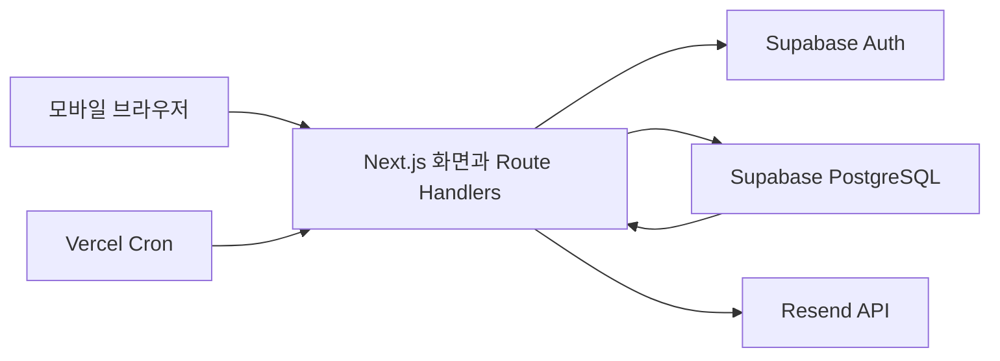

# GYEOP P0 개발 기준 v0.1

Status: Reviewed  
Review Status: PASS  
Reviewer Agent: development_plan_review  
작성일: 2026-07-15

## 1. 목적

이 문서는 활성 제품 SSOT를 실제 구현 이슈로 나누기 위한 P0 기술 기준이다. 공통 아키텍처와 데이터·보안 경계를 고정하되, 개별 GitHub 이슈의 상세 구현은 `docs/specs/issue-<number>.md`에서 다시 검토한다.

우선순위는 다음과 같다.

1. 주인 10장 완료와 저장
2. 공개·1:1 링크 생성
3. 무가입 방문자의 관계 선택과 필수 3장 응답
4. 제출 후 즉시 비교와 동일 팩 시작
5. 실제 응답 기반 비공개 프로필 축적
6. 이메일 알림과 핵심 퍼널 측정

## 2. SSOT와 적용 범위

충돌 시 다음 순서를 따른다.

1. `docs/product/core-feature-priority.md`
2. `docs/product/question-pack-spec.md`
3. `docs/product/decision-log.md`
4. `docs/product/full-product-plan.md`
5. 이 문서

구현 스펙은 `AGENTS.md`, `.codex/AGENTS.md`, `docs/engineering/github-task-workflow.md`, `scripts/task-harness`도 함께 따른다. 화면 경계는 다음 목업을 입력으로 사용하되 제품 SSOT와 충돌하면 SSOT를 우선한다.

- `docs/assets/mockups/01-product-overview.png`
- `docs/assets/mockups/02-end-to-end-flow.png`
- `docs/assets/mockups/03-perspective-stack-profile.png`
- `docs/assets/mockups/04-profile-evolution.png`
- `docs/assets/mockups/05-share-card-system.png`
- `docs/assets/mockups/06-friend-contribution-flow.png`

P0에는 `오래된 친구팩` 하나만 포함한다. 사용자 팩 제작, 공개 프로필 링크, 팩 탐색, 결제, 광고, 자유 텍스트, 댓글, DM, 점수·순위, AI 생성·요약은 구현하지 않는다.

## 3. 기술 결정

| 영역 | 결정 | 이유 |
|---|---|---|
| 웹 애플리케이션 | Next.js 16 App Router, TypeScript strict | 모바일 화면과 서버 API를 한 저장소·한 배포 단위로 유지한다. |
| 런타임 | Node.js 24 LTS | Next.js와 E2E 도구가 지원하는 LTS를 고정한다. |
| 패키지 관리 | pnpm, `packageManager`와 lockfile 고정 | 로컬과 CI 설치 결과를 일치시킨다. |
| UI | React Server Components 우선, 필요한 카드 상호작용만 Client Component | 전송 JavaScript와 상태 범위를 줄인다. |
| 스타일 | CSS Modules와 CSS custom properties | 별도 UI 프레임워크·런타임 스타일 의존성을 만들지 않는다. |
| 데이터·인증 | Supabase PostgreSQL, Auth, SQL migration, RLS | 데이터베이스와 이메일 매직 링크 인증을 한 관리형 경계로 묶는다. |
| 입력 검증 | Zod | 모든 HTTP 신뢰 경계에서 동일한 스키마를 사용한다. |
| 배포 | Vercel Node.js Functions | Next.js 표준 배포와 preview URL을 사용한다. |
| 이메일 | Supabase Auth + Resend | 매직 링크와 P0 응답 도착 이메일을 한 발송 제공자로 운영한다. |
| 단위 테스트 | Node.js `node:test` | 순수 도메인 로직에 별도 테스트 프레임워크를 추가하지 않는다. |
| DB 테스트 | Supabase CLI + pgTAP | migration, constraint, RLS, SQL 함수를 실제 PostgreSQL에서 검증한다. |
| E2E | Playwright Chromium 모바일 프로젝트 | 핵심 루프를 실제 브라우저에서 한 번에 검증한다. |

P0에서는 ORM, Redis, 별도 API 서버, 메시지 브로커, 전역 상태 라이브러리, 마이크로서비스, 실시간 구독, 업로드 스토리지를 만들지 않는다. 집계는 PostgreSQL에서 요청 시 계산하고, 측정된 성능 문제가 생길 때만 materialized view나 캐시를 추가한다.

의존성의 정확한 patch 버전은 기반 이슈의 첫 커밋에서 고정한다. major 버전 변경은 별도 이슈로 다룬다.

## 4. 전체 구조



원칙은 다음과 같다.

- 브라우저는 데이터베이스 테이블을 직접 읽거나 쓰지 않는다.
- Supabase publishable/anon key는 Auth session 처리에만 사용한다. `anon`·`authenticated` role의 모든 application table `SELECT`·`INSERT`·`UPDATE`·`DELETE`와 mutation RPC `EXECUTE`를 회수한다.
- 모든 데이터 요청은 Next.js Route Handler가 Origin·Zod·rate limit과 owner session 또는 비밀 token을 검증한 뒤 서버 전용 RPC wrapper로 전달한다.
- `SUPABASE_SECRET_KEY` client는 `import 'server-only'`를 선언한 `lib/db/internal-rpc.ts` 한 파일에서만 만들고 raw client를 export하지 않는다. 이 module은 이름이 고정된 RPC 함수만 export하며 `.from()` 직접 table 접근을 금지한다.
- 다중 행·다중 테이블 변경은 Route Handler의 연속 API 호출이 아니라 한 PostgreSQL RPC transaction으로 완료한다.

client와 권한은 세 종류로 고정한다.

| client | 자격 | 허용 범위 |
|---|---|---|
| Supabase SSR Auth client | publishable/anon key + 사용자 JWT | 로그인·세션 조회만 허용, Data API 사용 금지 |
| internal RPC wrapper | server-only secret key | 검증된 actor ID 또는 token hash와 함께 허용 목록 RPC만 호출 |
| notification worker | 같은 internal RPC wrapper | Cron 인증 뒤 알림 claim·완료 RPC만 호출 |

모든 `SECURITY DEFINER` 함수는 `search_path = ''`, schema-qualified table name, 최소 owner를 사용한다. `PUBLIC`, `anon`, `authenticated`의 기본 `EXECUTE` 권한을 회수하고 server secret role에만 grant한다. actor가 필요한 RPC는 Route Handler가 검증한 user ID를 받고 함수 내부에서 대상 row 소유권을 다시 검사한다.

검증 script는 `SUPABASE_SECRET_KEY`와 secret client 생성이 `lib/db/internal-rpc.ts` 밖에 없는지, 해당 module에 `.from(` 호출이 없는지, `anon`·`authenticated`의 table read/write·mutation RPC가 모두 거절되는지 확인한다. 공개 key로 Data API나 RPC를 직접 호출하는 우회 테스트도 CI에 포함한다.

## 5. 저장소 구조

```text
app/
  (public)/                 시작·인증 화면
  (owner)/                  주인 셀프 응답·프로필 화면
  i/[linkId]/               방문자 초대·응답·결과 화면
  responses/manage/         비밀 관리 링크 철회 화면
  api/                      Route Handlers
components/                 화면에서 두 번 이상 쓰는 UI만 배치
lib/
  auth/                     Supabase SSR 세션
  db/                       생성된 DB 타입과 SQL 호출
  domain/                   배정·상태 전이·검증 규칙
  email/                    Resend REST 호출
  security/                 토큰·rate limit·로그 삭제 규칙
supabase/
  migrations/               스키마·RLS·함수
  seed.sql                   오래된 친구팩 1개와 카드 10장
  tests/                     pgTAP
tests/
  unit/                      `node:test`
  e2e/                       Playwright 핵심 루프
```

한 파일에서만 쓰는 타입·함수·컴포넌트는 그 파일 가까이에 둔다. 공용 추상화는 두 곳 이상의 실제 중복이 생긴 뒤 만든다.

## 6. 환경과 배포

| 환경 | 애플리케이션 | 데이터 |
|---|---|---|
| local/test | 로컬 Next.js | Supabase CLI 로컬 stack |
| preview/staging | Vercel Preview | 별도 staging Supabase project |
| production | Vercel Production | production Supabase project |

필수 환경 변수는 다음과 같다.

- `NEXT_PUBLIC_SUPABASE_URL`
- `NEXT_PUBLIC_SUPABASE_ANON_KEY`
- `SUPABASE_SECRET_KEY` — 서버 전용 RPC wrapper에서만 사용
- `APP_URL`
- `RESEND_API_KEY` — 서버 전용
- `EMAIL_FROM`
- `RATE_LIMIT_SECRET` — 서버 전용, 단기 abuse key 파생용
- `CRON_SECRET` — 서버 전용

`.env.example`에는 이름과 설명만 두고 실제 값은 커밋하지 않는다. local은 `.env.local`, preview·production은 각 배포 환경의 secret store를 사용한다.

DB migration은 로컬 reset과 CI를 통과한 뒤 staging, production 순서로 적용한다. P0 migration은 additive change를 기본으로 하며, 데이터 삭제·column rename은 별도 migration과 복구 절차 없이는 허용하지 않는다.

## 7. 화면과 URL

| 경로 | 사용자 | 책임 |
|---|---|---|
| `/` | 모두 | 오래된 친구팩 소개와 `팩 열어보기` |
| `/play/[playId]` | 예비 주인 | 셀프 10장, 진행률, 자동 저장, 완료 |
| `/auth/sign-in` | 예비 주인 | 이메일 매직 링크 요청 |
| `/auth/callback` | 주인 | 세션 생성과 완료 draft claim |
| `/me` | 주인 | 팩별 셀프 응답, 시선 수, 표본 상태, 최근 변화 |
| `/me/plays/[playId]` | 주인 | 링크 생성·비활성화와 팩 상세 |
| `/i/[linkId]#k=...` | 방문자 | 일반 초대 맥락, 관계·시점, 3장, 비교, 선택 2장 |
| `/responses/manage#token=...` | 방문자 | 본인 응답 철회 |

동일 팩 시작 CTA는 `/play/new?pack=old-friend`로 직접 연결한다. 탐색 화면을 거치지 않는다.

주인 셀프 draft는 `playId`와 별도 비밀 draft token으로 보호한다. 최초 `POST /api/plays`는 인증 없이 허용하되 rate limit을 적용하고 새 token을 발급한다. 유효한 draft cookie가 있으면 새 play 대신 기존 draft를 반환한다. P0는 브라우저당 활성 draft 하나만 지원한다.

draft cookie는 `HttpOnly`, `Secure`, `SameSite=Lax`, `Path=/`, 7일 TTL이다. 이메일 인증 후 `claim_play` RPC가 play row를 잠그고 `owner_id IS NULL`, `status = 'answered'`, token hash 일치를 확인한 뒤 현재 `auth.uid()`에 귀속시키고 token hash를 비우며 cookie를 삭제한다. 이미 claim됐거나 token이 다르면 `409`다.

P0는 Supabase SSR PKCE를 사용하며 다른 기기·다른 브라우저의 로그인과 draft 인계를 지원하지 않는다. 매직 링크 화면과 이메일에 `답변을 작성한 같은 기기·브라우저에서 열어주세요`를 안내한다. 다른 기기에서 열면 code exchange를 시도하지 않고 원래 브라우저 안내만 보여준다. 복수 draft와 cross-device handoff는 실제 이탈이 측정된 뒤 검토한다.

## 8. 핵심 데이터 모델

모든 기본키는 UUID, 시간은 UTC `timestamptz`, 사용자에게 보이는 문구와 내부 code는 분리한다.

### 8.1 테이블

| 테이블 | 핵심 필드와 제약 |
|---|---|
| `pack_templates` | `id`, unique `slug`, `title`, `target_relationship`, `sensitivity`, `status` |
| `pack_versions` | `id`, `template_id`, unique `(template_id, version)`, `published_at`; 발행 후 immutable |
| `pack_cards` | `id`, `pack_version_id`, `position` 1..10, `owner_prompt`, `visitor_prompt`, `option_a`, `option_b`, `is_signature`; `publish_pack_version`가 10장·Signature 1장을 검증한 뒤 발행 |
| `pack_plays` | `id`, `pack_version_id`, nullable `owner_id`, `draft_token_hash`, `status`, `answered_at`, `claimed_at`, `created_at` |
| `self_answers` | PK `(play_id, card_id)`, `pack_version_id`, `choice` A/B, `updated_at`; composite FK로 play와 card의 pack version 일치 보장 |
| `share_links` | `id`, unique `public_id`, `play_id`, `kind`, unique `secret_hash`, `status`, nullable `expires_at`, `consumed_response_id`, `consumed_at`, `created_at` |
| `visitor_responses` | `id`, `share_link_id`, `pack_version_id`, nullable `relationship_code`, nullable `known_since_code`, `status`, unique nullable `session_token_hash`, unique nullable `management_token_hash`, `submitted_at`, `withdrawn_at` |
| `visitor_assignments` | PK `(response_id, card_id)`, `pack_version_id`, `stage`, `position`; composite FK로 response와 card의 pack version 일치, response 안 카드 중복 금지 |
| `visitor_answers` | PK `(response_id, card_id)`, `choice` A/B, `updated_at`; assignment가 있는 카드만 허용 |
| `notification_jobs` | `id`, `owner_id`, `source_response_id`, `event_type`, `dedupe_key` unique, `status`, `attempts`, `available_at`, `lease_until`, `cancel_requested_at`, `delivered_at`, `last_error` |
| `analytics_events` | `id`, `event_name`, nullable 내부 ID, 제한된 `properties`, `occurred_at`; 응답 선택값·이메일·원문 토큰 금지 |
| `rate_limit_buckets` | `key_hash`, `action`, `window_start`, `count`, `expires_at`; 24시간 이내 삭제 |

### 8.2 상태

- `pack_plays.status`: `draft → answered → active → archived`
- `share_links.status`: `active → consumed | disabled | expired`
- `visitor_responses.status`: `draft → submitted → withdrawn | invalid`
- `notification_jobs.status`: `pending → sending → delivered | retry | failed | cancelled`

DB constraint와 transaction이 허용된 전이만 수행한다. 클라이언트가 보낸 상태 문자열을 그대로 저장하지 않는다. `publish_pack_version`만 version을 발행할 수 있고, 발행 시 카드 10장과 Signature 1장을 검사한다. 1:1 제출은 `submit_response`가 share row를 `FOR UPDATE`로 잠근 뒤 `consumed_response_id`가 비어 있을 때만 성공한다.

### 8.3 인덱스

- `share_links(public_id)`와 모든 secret/token hash unique index
- `self_answers(play_id)`
- `share_links(play_id, status)`
- `visitor_responses(share_link_id, status, submitted_at)`
- `visitor_responses(relationship_code, status)`
- `visitor_assignments(response_id, stage, position)`
- `notification_jobs(status, available_at)`
- `analytics_events(event_name, occurred_at)`

실제 query plan 없이 추가 복합 인덱스를 미리 만들지 않는다.

## 9. 원자적 도메인 규칙

### 9.1 주인 완료와 공유

1. 최초 생성은 `create_or_resume_play` RPC가 기존 draft를 확인하거나 play·draft token hash를 만든다.
2. 셀프 답변은 `save_self_answer` RPC의 upsert로 자동 저장한다.
3. `complete_play` RPC는 같은 pack version의 서로 다른 카드 10장을 확인한다. 익명 draft는 `answered`, 이미 인증된 owner play는 `active`로 바꾼다.
4. `claim_play` RPC는 row lock과 token 검증 후 `owner_id`를 연결하고 `answered → active`로 바꾸며 draft token을 폐기한다.
5. `owner_id`가 있고 `active`인 play만 링크 생성이 가능하다.
6. 링크에는 셀프 선택값을 포함하지 않는다.

### 9.2 방문자 필수 카드 배정

응답 시작 SQL 함수는 한 transaction에서 다음을 수행한다.

1. `start_response` RPC가 `share_links` 행을 잠그고 `public_id`·secret hash, `active`, 만료 여부, 1:1 소비 여부를 검사한다.
2. 새 `visitor_responses`와 session token hash를 만든다.
3. Signature 카드 1장을 배정한다.
4. 같은 play에서 `submitted` 상태인 응답의 비-Signature 카드별 표본 수를 계산한다.
5. 최소 표본 카드부터, 동률이면 `response_id + card_id` hash 순서로 중복 없이 2장을 선택한다.
6. 필수 assignment 3개를 저장하고 카드 문구만 반환한다.

선택 2장도 이미 배정·응답한 카드를 제외하고 같은 방식으로 배정한다. 결정적 동률 순서를 사용해 재시도 결과를 동일하게 만든다.

### 9.3 제출과 비교

1. `submit_response` RPC가 response와 share row를 잠그고 필수 assignment 3개 모두 A/B 응답이 있는지 확인한다.
2. 하나라도 빠지면 제출하지 않고 셀프 답을 반환하지 않는다.
3. 제출 성공과 1:1 `consumed_response_id` 기록은 같은 transaction에서 처리한다. 경쟁 제출 중 첫 transaction만 성공한다.
4. 제출 후에만 해당 방문자가 답한 카드의 셀프 선택을 반환한다.
5. 32-byte random management token을 한 번 발급하고 SHA-256 hash만 DB에 저장한다.
6. 알림 job과 분석 event를 같은 transaction에 기록한다.

### 9.4 철회

1. 브라우저는 URL fragment의 management token을 body로 전송한다. fragment와 raw token은 access log와 referrer에 들어가지 않는다.
2. `withdraw_response` RPC는 token hash가 일치하고 `submitted`인 응답만 잠근다.
3. `visitor_answers`와 `visitor_assignments`를 삭제하고 관계·시점·session token·management token을 `NULL`로 비식별화한다.
4. response tombstone에는 `id`, `share_link_id`, `status = 'withdrawn'`, 제출·철회 시각만 남긴다. 연결된 분석 event는 ID와 관계 property를 제거해 event 이름·시각만 남기고 pending/retry 알림 job은 `cancelled`로 바꾼다.
5. live query 집계에서 즉시 제외하고 1:1 링크는 닫힌 상태를 유지한다.
6. 같은 token 재사용은 `404`로 처리해 존재 여부를 노출하지 않는다.

### 9.5 RPC 목록과 transaction 경계

| RPC | role | 한 transaction의 책임 |
|---|---|---|
| `publish_pack_version` | internal migration/operator | 카드 수·Signature 검증과 발행 |
| `create_or_resume_play` | server wrapper | draft 생성 또는 재개 |
| `save_self_answer` | server wrapper | 소유 token/session 검증과 답변 upsert |
| `complete_play` | server wrapper | 10장 검증과 상태 전이 |
| `claim_play` | server wrapper | row lock, token 검증, owner 귀속, token 폐기 |
| `create_share_link` | server wrapper | owner·play 상태 검증과 public ID·secret hash 저장 |
| `rotate_share_link` | server wrapper | 기존 링크 disable과 새 secret link 생성을 원자 처리 |
| `disable_share_link` | server wrapper | owner 검증과 링크 상태 전이 |
| `get_invite_metadata` | server wrapper | public ID·secret 검증과 일반 팩 맥락 반환 |
| `start_response` | server wrapper | 링크 검증, response 생성, 필수 3장 배정 |
| `save_response_answer` | server wrapper | response session과 assignment 검증, 답변 upsert |
| `submit_response` | server wrapper | 3장 검증, 비교 허용, 1:1 소비, 관리 token·job·event 기록 |
| `assign_optional_cards` | server wrapper | 제출 상태 확인과 선택 2장 배정 |
| `withdraw_response` | server wrapper | token 검증, 응답 제거·비식별화, job 취소 |
| `get_owner_profile` | server wrapper | owner 검증과 권한별 집계 반환 |
| `get_private_1to1_comparison` | server wrapper | play owner 또는 response session 검증과 지정 카드 비교 반환 |
| `consume_rate_limit` | server wrapper | action·network/link key bucket 원자 증가와 허용 여부 반환 |
| `claim_notification_jobs` | server wrapper | stale lease 회수와 `SKIP LOCKED` batch claim |
| `finish_notification_job` | server wrapper | 전달·재시도·실패 상태 기록 |

## 10. API 경계

모든 endpoint는 JSON, UTF-8, same-origin을 기본으로 한다. mutation은 `Origin`을 검사하고 입력 크기 제한과 Zod 검증을 적용한다.

| Method / path | 인증 | 결과 |
|---|---|---|
| `POST /api/plays` | 없음, 기존 draft cookie 또는 owner session | 새 draft 발급 또는 기존 draft 재개 |
| `PUT /api/plays/[id]/answers/[cardId]` | draft cookie 또는 owner session | 셀프 답변 idempotent 저장 |
| `POST /api/plays/[id]/complete` | draft cookie 또는 owner session | 정확히 10장 검사 후 `answered` |
| `POST /api/plays/[id]/claim` | owner session | draft를 계정에 귀속 |
| `POST /api/plays/[id]/links` | owner session | 공개·1:1 링크 생성 |
| `PATCH /api/links/[id]` | owner session | 링크 비활성화 |
| `POST /api/links/[id]/rotate` | owner session | 기존 링크 disable과 새 링크 발급 |
| `POST /api/invites/[linkId]/metadata` | fragment secret, rate limited anonymous | 일반 팩 맥락과 링크 사용 가능 상태 |
| `POST /api/invites/[linkId]/responses` | fragment secret, rate limited anonymous | secret 검증, 관계·시점 저장과 필수 3장 배정 |
| `PUT /api/responses/[id]/answers/[cardId]` | response session cookie | 배정된 카드 답변 저장 |
| `POST /api/responses/[id]/submit` | response session cookie | 3장 제출, 비교, 관리 링크 발급 |
| `POST /api/responses/[id]/continue` | response session cookie | 선택 2장 배정 |
| `POST /api/responses/withdraw` | management token | 응답 철회 |
| `GET /api/me/responses/[id]` | owner session | 본인 play의 1:1 개별 비교 |
| `GET /api/internal/notifications/send` | `Authorization: Bearer CRON_SECRET` | 대기 이메일 batch claim·발송·재시도 |

표준 오류 body는 `{ "code": "...", "message": "사용자용 한글 문구" }`다. 내부 stack, SQL, 이메일, token, 응답 값은 반환하지 않는다.

## 11. 인증·토큰·권한

### 11.1 주인 인증

- P0는 Supabase 이메일 매직 링크만 사용한다.
- `@supabase/ssr` PKCE를 사용하고 Next.js 서버가 session cookie를 갱신한다.
- 인증 callback의 redirect 대상은 allowlist로 제한한다.
- owner session이 있어도 `owner_id = auth.uid()`와 RLS를 모두 통과해야 한다.
- draft claim은 인증을 시작한 같은 브라우저의 PKCE verifier와 유효 draft cookie가 모두 있을 때만 실행한다.

### 11.2 익명 토큰

- draft, share secret, response session, management token은 `crypto.randomBytes(32)`의 base64url 값이다.
- DB에는 SHA-256 hash만 저장한다.
- share URL은 `/i/{public_id}#k={secret}` 형식이다. 서버·preview crawler가 받는 path에는 secret이 없고, Client Component가 fragment secret을 request body로 전송한다.
- draft cookie는 7일, response session cookie는 24시간 TTL이며 둘 다 `HttpOnly`, `Secure`, `SameSite=Lax`, `Path=/`다.
- draft cookie는 claim 직후 삭제한다. response session은 제출 직후 회전하고 결과·선택 응답 접근에만 사용하며 TTL 뒤 폐기한다.
- management token은 제출 직후 한 번 보여주고 URL fragment와 현재 브라우저 저장소에만 둔다.
- share·management fragment, cookie, request body를 로그에 기록하지 않는다. path와 로그에는 secret이 아닌 public ID·내부 request ID만 남긴다.

### 11.3 권한표

| 데이터 | 미제출 방문자 | 제출 방문자 | 주인 | 운영자·팩 제작자 |
|---|---:|---:|---:|---:|
| 공개 팩 문구 | 허용 | 허용 | 허용 | 허용 |
| 주인의 셀프 선택 | 금지 | 본인이 답한 카드만 | 본인 play 전체 | 금지 |
| 공개 링크 개별 방문자 선택 | 본인 draft만 | 본인 응답만 | 금지 | 금지 |
| 관계별 집계 | 금지 | 금지 | 공개 링크 응답이 이중 최소 표본 충족 시 | 금지 |
| 1:1 비교 | 금지 | 본인 응답만 | 해당 private link 결과만 | 금지 |
| 계정 이메일 | 금지 | 금지 | 본인 이메일만 | 제한된 Auth 운영자만 |
| raw share secret | 링크 보유 브라우저만 | 링크 보유 브라우저만 | 생성 직후 복사본만 | 저장·조회 금지 |
| raw draft·response·management secret | 해당 브라우저만 | 해당 브라우저만 | 해당 owner draft token만 | 저장·조회 금지 |

## 12. 프로필 집계

P0에는 별도 aggregate table을 만들지 않는다.

- 유효 시선: `visitor_responses.status = 'submitted'`인 공개·1:1 완료 응답
- 주인용 비공개 전체 시선 수: 모든 유효 시선 수
- 관계 레이어: 공개 링크에서 같은 `relationship_code`의 유효 응답 3건 이상
- 질문 선택 수: 공개 링크의 공개 가능한 관계에서 같은 카드 응답 3건 이상
- 부족 상태: 값을 반환하지 않고 현재 `n/3`만 반환
- 1:1 응답: 전체 시선 수에는 포함하고 해당 주인·방문자만 보는 개별 비교로 분리하며 관계·질문 집계에서는 제외
- 민감 관계: 공개 집계에서 제외
- 최근 변화: `새 시선`, `새 관계`, `집계 공개 가능` 같은 파생 상태만 반환

owner profile SQL 함수는 공개 링크의 raw 방문자 row나 개별 선택을 반환하지 않는다. 1:1 상세 RPC는 해당 play owner와 해당 response session에만 지정된 카드 비교를 반환한다. P0 방문자는 자신의 비교 외 어떤 관계 집계도 볼 수 없다. 집계 query p95가 300ms를 넘거나 한 play의 유효 응답이 10,000건을 넘을 때 materialized aggregate를 별도 이슈로 검토한다.

## 13. 알림과 분석

### 13.1 이메일 알림

다음 event만 보낸다.

- 첫 번째 유효 응답
- 처음 등장한 관계의 유효 응답
- 한 play의 세 번째 유효 응답

본문에는 방문자 이름, 관계, 카드, A/B 선택을 넣지 않는다. `프로필에서 새 시선을 확인해보세요`와 owner URL만 포함한다.

- Vercel Cron은 5분마다 `GET /api/internal/notifications/send`를 호출하며 P0 목표는 event 발생 후 10분 안에 첫 시도 95%다.
- `CRON_SECRET` bearer 검증 후 `claim_notification_jobs`가 `FOR UPDATE SKIP LOCKED`로 최대 20건을 claim하고 10분 lease를 건다.
- 다음 실행은 만료된 `sending` lease를 `retry`로 회수한다. Vercel invocation 자체의 재시도에 의존하지 않는다.
- job은 1·5·15·30·60분 간격으로 최대 5번 시도하고 이후 `failed`로 남겨 구조화 로그와 운영 지표에 기록한다.
- Resend 요청의 `Idempotency-Key`는 `gyeop-notification-{job_id}`로 고정한다. 모든 시도는 Resend의 24시간 중복 방지 기간 안에서 끝낸다.
- submit·withdraw는 play row를 잠가 threshold 전후 count를 직렬화한다. `dedupe_key`는 `{event_type}:{play_id}:{trigger_response_id}`여서 철회로 count가 내려간 뒤 새 응답이 threshold를 다시 넘으면 새 job을 만들 수 있다.
- withdraw가 `pending`·`retry` job을 만나면 `cancelled`로 바꾼다. `sending` job에는 `cancel_requested_at`을 기록하고 worker가 Resend 호출 직전에 source response 상태를 다시 확인한다.
- 확인 직후 철회와 외부 API 전달이 경쟁하면 일반 문구 이메일 한 건은 도착할 수 있다. 본문에 응답·관계 정보가 없으므로 이를 허용하고 추가 재시도는 중단한다.
- DB `dedupe_key`는 같은 제품 event의 job 중복 생성을 막고 Resend key는 외부 전달 중복을 막는다.
- production 배포 전 Vercel 요금제가 5분 Cron을 지원하는지 확인한다. 지원하지 않으면 beta를 열지 않고 배포 구성을 먼저 결정한다.

### 13.2 분석 event

- `pack_opened`
- `self_answer_saved`
- `self_pack_completed`
- `share_link_created`
- `invite_opened`
- `relationship_selected`
- `visitor_response_started`
- `visitor_required_submitted`
- `comparison_viewed`
- `same_pack_start_clicked`
- `optional_answers_started`
- `profile_viewed`
- `response_withdrawn`

event에는 내부 UUID, link kind, pack version, relationship code처럼 허용된 값만 넣는다. 이메일, display name, IP, user agent 원문, token, A/B 선택은 넣지 않는다.

## 14. 개인정보·보안·악용 방지

- 모든 public schema table에 RLS를 켜고 migration test로 정책 부재를 실패 처리한다.
- invite·submit·withdraw endpoint는 link/response 단위와 단기 네트워크 hash 단위 fixed-window rate limit을 적용한다.
- production은 Vercel이 덮어쓴 신뢰 가능한 forwarded IP만 사용하고 직접 origin 접근을 막는다. `node:net.isIP`로 정규화하며 IPv6는 `/64` prefix 단위로 묶는다.
- 네트워크 식별자는 `RATE_LIMIT_SECRET`, UTC 날짜, 정규화한 IP를 HMAC 처리하며 24시간 안에 삭제한다.
- SQL upsert 한 문장으로 bucket count를 원자 증가시킨다. 초과 응답은 `429`와 `Retry-After`를 반환한다.
- CSP, HSTS, `Referrer-Policy: no-referrer`, `X-Content-Type-Options: nosniff`를 설정한다.
- 공개 링크 미리보기와 로그에 셀프·방문자 선택값을 포함하지 않는다.
- 관리 token은 GET만으로 상태를 바꾸지 않고 확인 후 POST로 철회한다.
- 분석·이메일 실패 로그에는 event ID와 오류 code만 남긴다.
- 최소 이용 연령, 미성년자 정책, 보관·완전 삭제 기간이 확정되기 전에는 production beta를 열지 않는다.

초기 limit은 `owner draft 생성 5회/시간/network`, `invite metadata 60회/분/network+link`, `response 시작 10회/10분/network+link`, `answer 저장 120회/10분/response`, `submit 10회/10분/response`, `withdraw 5회/시간/network`다. 각 Route Handler는 도메인 RPC 전에 `consume_rate_limit`을 호출한다. staging abuse test에서 정상 사용자 오탐이 1%를 넘으면 수치를 조정한다.

P0의 DB 기반 rate limit은 단일 PostgreSQL의 저트래픽 전제다. rate-limit transaction이 병목이 되거나 분산 공격이 관측되면 Vercel Firewall 또는 전용 edge limiter로 교체한다.

## 15. 성능·접근성

- beta 전 lab budget: production build를 Lighthouse mobile, Fast 4G, 4× CPU slowdown으로 3회 측정한 중앙 LCP 2.5초 이하
- beta 후 RUM budget: 실제 모바일 방문의 LCP p75 2.5초 이하
- 카드 저장 API: staging DB에 응답 1,000건을 seed하고 동시 사용자 10명·요청 200회에서 p95 300ms 이하
- 카드 전환은 optimistic UI로 150ms 이내 반응
- 터치 target 최소 44×44 CSS px
- 모든 선택은 button과 명확한 accessible name 사용
- 키보드 조작, focus 표시, `prefers-reduced-motion`, WCAG AA 대비 지원
- 필수 흐름에서 가로 스크롤 금지
- JavaScript 실패·저속 네트워크 시 저장 실패와 재시도 상태를 숨기지 않음

측정 script와 장치·네트워크 설정을 저장소에 커밋해 같은 조건으로 재실행할 수 있게 한다.

## 16. 테스트와 CI

### 16.1 필수 자동 검증

- `pnpm format:check`
- `pnpm lint`
- `pnpm typecheck`
- `pnpm test`
- `pnpm supabase:reset`
- `pnpm test:db`
- `pnpm build`
- `pnpm test:e2e --project=mobile-chromium`
- `./scripts/run-ai-verify --mode full`

### 16.2 최소 핵심 시나리오

1. 9장으로는 완료·링크 생성 불가, 10장으로 가능
2. 공개 링크에서 서로 독립된 방문자 응답 생성
3. 1:1 링크 첫 제출 후 두 번째 제출 차단
4. Signature 1장과 최소 표본 2장 중복 없이 배정
5. 필수 3장 전 모든 UI·API에서 셀프 선택 비공개
6. 제출 후 본인이 답한 카드만 비교 가능
7. 동일 팩 CTA가 바로 새 셀프 flow 시작
8. 관계 2건에서는 집계 숨김, 3건에서 공개
9. 관계는 3건이지만 특정 카드가 2건이면 그 카드 수치 숨김
10. 철회 후 전체·관계·질문 집계 감소와 관리 token 재사용 차단
11. 1:1 철회 후 기존 링크는 계속 닫힘
12. 팩 제작자·다른 owner·익명 요청의 raw 응답 접근 차단
13. 이메일·로그·분석에 응답 값과 token이 없음
14. 동시 1:1 제출 두 건 중 한 건만 성공
15. `anon` table 직접 접근과 허가되지 않은 RPC 실행 차단
16. Cron 중복 호출·worker 중단 후에도 lease 회수와 Resend idempotency로 중복 메일 방지
17. 다른 기기에서 연 매직 링크는 draft를 claim하지 않고 원래 브라우저 안내 표시

GitHub Actions는 pull request와 `main` push에서 실행한다. PR 병합 조건은 모든 필수 check와 로컬 full verify 통과다.

## 17. 구현 순서와 이슈 경계

| 순서 | 수직 결과 | 선행 조건 |
|---:|---|---|
| 1 | Next.js·Supabase local stack·GitHub Actions 기반 | 없음 |
| 2 | 발행된 오래된 친구팩 10장 seed와 schema·RLS·RPC 보안 테스트 | 1 |
| 3 | 익명 owner draft 생성·7일 복구와 이메일 매직 링크 claim | 1, 2 |
| 4 | 주인 10장 카드 UI·자동 저장·완료 gate | 3 |
| 5 | 재사용 공개 링크 생성·비활성화·secret fragment 진입 | 4 |
| 6 | 단일 사용 1:1 링크 생성과 동시 제출 차단 기반 | 4 |
| 7 | 방문자 관계·시점 선택과 24시간 response session | 5, 6, 최종 한글 문구 |
| 8 | Signature 1장 + 최소 표본 2장 transaction 배정 | 7 |
| 9 | 필수 3장 저장·제출·해당 카드 즉시 비교·동일 팩 새 owner 시작 | 8 |
| 10 | 비교 후 선택 2장 추가 응답 | 9 |
| 11 | 비밀 관리 링크 발급·응답 실제 제거·철회 tombstone | 9 |
| 12 | 주인용 전체 시선 수와 공개 링크 이중 최소 표본 프로필 | 9, 11 |
| 13 | 해당 주인·방문자만 보는 1:1 개별 비교 | 9, 11 |
| 14 | 이메일 알림 outbox·5분 worker·중복 방지 | 3, 9 |
| 15 | 전체 P0 event 누락·금지 payload를 점검하는 funnel 검증 | 3~14 |
| 16 | production secret·migration·rollback 배포 runbook | 1~15, 정책 차단점 해소 |
| 17 | 고정 환경의 모바일 성능·접근성 release 검증 | 1~16 |
| 18 | 권한·token·rate limit·로그 삭제 독립 보안 QA | 1~16 |

각 행은 한 PR 후보이며 `$gyeop-issue-writer`가 실제 파일 경계와 테스트 전략을 확인한 뒤 더 작게만 분할할 수 있다. 화면·API 이슈마다 해당 event, 권한, rate limit, 모바일 접근성 기준을 같은 PR에 포함하고 마지막 검증 이슈로 미루지 않는다. 각 구현 이슈는 시작 후 `docs/specs/issue-<number>.md` 리뷰를 통과해야 한다.

## 18. 차단점과 후속 결정

다음은 GitHub 이슈로 등록하되 결정 전 관련 production 작업을 `status:blocked`로 둔다.

- 최소 이용 연령과 미성년자 데이터 정책
- 공개·1:1 공유 링크 만료 기본값과 데이터 보관·완전 삭제 기간
- Vercel production 요금제의 5분 Cron 지원 여부

다음은 구현 중 확정 가능하며 전체 착수를 막지 않는다.

- 관계와 알게 된 시점의 최종 한글 문구
- North Star 최종 채택 여부
- 공개 링크 OS 공유 메뉴의 플랫폼별 우선순위

## 19. 공통 완료 기준

- 활성 제품 SSOT의 P0 승인 기준을 API와 E2E 테스트로 추적할 수 있다.
- 모든 상태 전이와 배정·제출·철회가 transaction 또는 DB constraint로 보호된다.
- 미제출 방문자와 권한 없는 사용자는 셀프·방문자 선택값을 받을 수 없다.
- raw token과 응답 값이 로그·분석·이메일에 남지 않는다.
- migration으로 local DB를 빈 상태에서 재현할 수 있다.
- preview와 production이 서로 다른 DB와 secret을 사용한다.
- CI와 `./scripts/run-ai-verify --mode full`이 통과한다.

## 20. 스펙 검토

- Reviewer Agent: `development_plan_review`
- Review Status: PASS
- P0 Findings: 0
- P1 Findings: 0
- P2 Findings: 0
- Review Notes: 인증 전 draft, RPC 권한, 공개·1:1 노출, 철회, token, 알림 재시도를 독립 검토하고 모든 지적을 반영했다.

## 21. 공식 참고 문서

- [Next.js App Router 설치와 지원 환경](https://nextjs.org/docs/app/getting-started/installation)
- [Node.js 릴리스와 LTS 상태](https://nodejs.org/en/about/previous-releases)
- [Supabase Next.js 서버 인증](https://supabase.com/docs/guides/auth/server-side/nextjs)
- [Supabase Passwordless 이메일 인증](https://supabase.com/docs/guides/auth/auth-email-passwordless)
- [Supabase Row Level Security](https://supabase.com/docs/guides/database/postgres/row-level-security)
- [Supabase Database Functions](https://supabase.com/docs/guides/database/functions)
- [Supabase API 보안](https://supabase.com/docs/guides/api/securing-your-api)
- [Supabase local development와 migration](https://supabase.com/docs/guides/local-development)
- [Supabase DB 테스트와 lint](https://supabase.com/docs/guides/local-development/cli/testing-and-linting)
- [Playwright 설치와 CI](https://playwright.dev/docs/intro)
- [Resend API](https://resend.com/docs/api-reference/introduction)
- [Resend Idempotency Keys](https://resend.com/docs/dashboard/emails/idempotency-keys)
- [Vercel Cron Jobs 관리](https://vercel.com/docs/cron-jobs/manage-cron-jobs)
