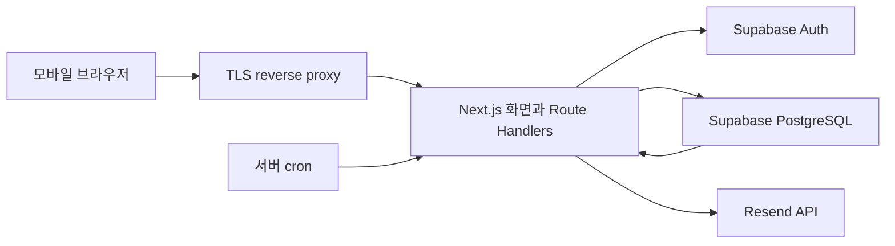

# GYEOP P0 개발 기준 v0.4

Status: Reviewed
Review Status: PASS
Reviewer Agent: development_plan_review, issue_backlog_review, issue17_spec_review
작성일: 2026-07-18

## 1. 목적

이 문서는 활성 제품 SSOT를 실제 구현 이슈로 나누기 위한 P0 기술 기준이다. 공통 아키텍처와 데이터·보안 경계를 고정하되, 개별 GitHub 이슈의 상세 구현은 `docs/specs/issue-<number>.md`에서 다시 검토한다.

우선순위는 다음과 같다.

1. 주인 10장 완료와 저장
2. 공개·1:1 링크 생성
3. 무가입 방문자의 관계 선택과 필수 3장 응답
4. 제출 후 즉시 비교와 동일 팩 시작
5. 실제 응답 기반 비공개 프로필 축적
6. 핵심 퍼널 측정. 이메일 알림은 production beta 재승인 후보다.

## 2. SSOT와 적용 범위

충돌 시 다음 순서를 따른다.

1. `docs/product/core-feature-priority.md`
2. `docs/product/question-pack-spec.md`
3. `docs/product/decision-log.md`
4. `docs/product/full-product-plan.md`
5. 이 문서

구현 스펙은 `AGENTS.md`, `.codex/AGENTS.md`, `docs/engineering/github-task-workflow.md`, `scripts/task-harness`도 함께 따른다. 화면 경계는 다음 목업을 입력으로 사용하되 제품 SSOT와 충돌하면 SSOT를 우선한다.

- `docs/assets/mockups/01-product-overview.png`
- `docs/assets/mockups/02-end-to-end-flow.png`
- `docs/assets/mockups/03-perspective-stack-profile.png`
- `docs/assets/mockups/04-profile-evolution.png`
- `docs/assets/mockups/05-share-card-system.png`
- `docs/assets/mockups/06-friend-contribution-flow.png`

P0에는 `오래된 친구팩` 하나만 포함한다. 사용자 팩 제작, 공개 프로필 링크, 팩 탐색, 결제, 광고, 자유 텍스트, 댓글, DM, 점수·순위, AI 생성·요약은 구현하지 않는다.

### 2.1 검증 단계별 적용

| 단계 | 현재 상태 | owner 계약 | 완료 gate |
|---|---|---|---|
| 비공개 재미 검증 | active | 이메일·Auth 없이 play-bound 256-bit capability cookie, 같은 브라우저 7일 inactivity 복구, 유실·만료 뒤 복구 없음 | 주인 응답·공유, 방문자 비교·새 주인 전환, 누적 프로필 재공유의 재미 |
| production beta 재승인 | inactive candidate | 이메일 매직 링크 계정 연결, 알림, 계정 삭제·미귀속 Auth cleanup, cross-device 정책 | 연령·보관·backup·SMTP·운영 책임 재승인 뒤 별도 활성화 |

이 문서에 남아 있는 Auth registration/claim, 이메일·notification, account deletion/Cron 상세는 두 번째 행의 후보 설계다. `비공개 재미 검증` 구현·Project 완료 gate에는 적용하지 않으며, active 구간과 충돌할 때는 이 절과 `docs/product/core-feature-priority.md`의 무이메일 same-browser 계약을 우선한다.

## 3. 기술 결정

| 영역 | 결정 | 이유 |
|---|---|---|
| 웹 애플리케이션 | Next.js 16 App Router, TypeScript strict | 모바일 화면과 서버 API를 한 저장소·한 배포 단위로 유지한다. |
| 런타임 | Node.js 24 LTS | Next.js와 E2E 도구가 지원하는 LTS를 고정한다. |
| 패키지 관리 | pnpm, `packageManager`와 lockfile 고정 | 로컬과 CI 설치 결과를 일치시킨다. |
| UI | React Server Components 우선, 필요한 카드 상호작용만 Client Component | 전송 JavaScript와 상태 범위를 줄인다. |
| 스타일 | CSS Modules와 CSS custom properties | 별도 UI 프레임워크·런타임 스타일 의존성을 만들지 않는다. |
| 데이터·인증 | active: Supabase PostgreSQL, SQL migration, RLS, play-bound capability cookie. beta candidate: Supabase Auth | 비공개 재미 검증은 계정 없이 DB capability로 최소화하고, 이메일 매직 링크는 재승인 전까지 비활성으로 남긴다. |
| 입력 검증 | Zod | 모든 HTTP 신뢰 경계에서 동일한 스키마를 사용한다. |
| 배포 | 개인 Linux 서버의 단일 Next.js Node.js 프로세스 | `next start`를 `systemd`로 감독하고 TLS reverse proxy 뒤에서 실행한다. P0는 container·orchestrator·다중 instance를 추가하지 않는다. |
| 이메일 | Supabase Auth custom SMTP + Resend REST | 매직 링크와 P0 응답 도착 이메일의 발송 경로·도메인·한도를 분리해 승인한다. 같은 Resend team을 쓰면 Auth 최대 burst를 뺀 REST headroom을 강제한다. |
| 단위 테스트 | Node.js `node:test` | 순수 도메인 로직에 별도 테스트 프레임워크를 추가하지 않는다. |
| DB 테스트 | Supabase CLI + pgTAP | migration, constraint, RLS, SQL 함수를 실제 PostgreSQL에서 검증한다. |
| E2E | Playwright Chromium 모바일 프로젝트 | 핵심 루프를 실제 브라우저에서 한 번에 검증한다. |

P0에서는 ORM, Redis, 별도 API 서버, 메시지 브로커, 전역 상태 라이브러리, 마이크로서비스, 실시간 구독, 업로드 스토리지를 만들지 않는다. 집계는 PostgreSQL에서 요청 시 계산하고, 측정된 성능 문제가 생길 때만 materialized view나 캐시를 추가한다.

의존성의 정확한 patch 버전은 기반 이슈의 첫 커밋에서 고정한다. major 버전 변경은 별도 이슈로 다룬다.

## 4. 전체 구조



원칙은 다음과 같다.

- 브라우저는 데이터베이스 테이블을 직접 읽거나 쓰지 않는다.
- Supabase publishable/anon key는 Auth session 처리에만 사용한다. `anon`·`authenticated` role의 모든 application table `SELECT`·`INSERT`·`UPDATE`·`DELETE`와 mutation RPC `EXECUTE`를 회수한다.
- 모든 데이터 요청은 Next.js Route Handler가 Origin·Zod·rate limit과 owner session 또는 비밀 token을 검증한 뒤 서버 전용 RPC wrapper로 전달한다.
- 비공개 재미 검증의 owner session은 Auth UID가 아니라 `__Host-gyeop-owner` cookie의 play id와 관리 secret hash다. 모든 owner-scoped RPC는 같은 transaction 안에서 `private.authorize_owner_play_capability`를 호출하며 다른 play id로 재사용하는 cross-play 요청을 거절한다.
- `SUPABASE_SECRET_KEY` client는 `import 'server-only'`를 선언한 `lib/db/internal-rpc.ts` 한 파일에서만 만들고 raw client를 export하지 않는다. 이 module은 이름이 고정된 RPC 함수와 정확히 두 Auth Admin entrypoint `deleteAuthUser`, `resolveNotificationRecipient`만 export하며 `.from()` 직접 table 접근을 금지한다. `auth.admin.deleteUser(uid, false)` hard delete는 전자, `auth.admin.getUserById`는 후자 안에서만 허용하고 soft-delete `true`·동적 인자를 금지한다. delete wrapper는 dispatcher/user 입력의 UID가 아니라 유효한 Auth deletion `job_id + lease proof`를 검증하고 전역 DB permit을 얻은 뒤 UID 한 건만 삭제하며, recipient wrapper도 유효한 sending job ID·lease proof를 검증한 뒤 이메일 한 건만 일시 반환한다.
- 다중 행·다중 테이블 변경은 Route Handler의 연속 API 호출이 아니라 한 PostgreSQL RPC transaction으로 완료한다.

client와 권한은 세 종류로 고정한다.

| client | 자격 | 허용 범위 |
|---|---|---|
| Supabase SSR Auth client | publishable/anon key + 사용자 JWT | 로그인·세션 조회만 허용, Data API 사용 금지 |
| internal server wrapper | server-only secret key | 검증된 actor ID/token hash 또는 current job-bound proof와 함께 허용 목록 RPC 호출, Auth 사용자 한 건 삭제와 leased notification job의 recipient 한 건 조회 |
| Cron dispatcher·worker | 같은 internal RPC wrapper | reverse proxy를 우회한 loopback 호출의 단일 Cron 인증과 허용 schedule 분기 뒤 expire·claim·resolve·prepare·limit·finish 등 schedule별 고정 allowlist만 호출 |

모든 `SECURITY DEFINER` 함수는 `search_path = ''`, schema-qualified table name, 최소 owner를 사용한다. `PUBLIC`, `anon`, `authenticated`의 기본 `EXECUTE` 권한을 회수하고 server secret role에만 grant한다. actor가 필요한 RPC는 Route Handler가 검증한 user ID를 받고 함수 내부에서 대상 row 소유권을 다시 검사한다. 인증 owner를 바꾸는 Route는 RPC 직전 `auth.getUser()`를 다시 검증하고 retained `ACCOUNT_DELETE_REAUTH_KEYRING` reader 각각으로 `(account-delete-recovery-actor, uid)` HMAC 후보를 계산한다. UID와 `(key_version, hash)` 후보만 request-scoped internal wrapper로 넘기며 signing key는 RPC·DB에 전달하지 않는다. 이 호출은 queue/background retry로 재사용하지 않고 30초 Route/RPC deadline을 넘기면 새 `auth.getUser()`부터 다시 시작한다.

검증 script는 `SUPABASE_SECRET_KEY`와 secret client 생성이 `lib/db/internal-rpc.ts` 밖에 없는지, 해당 module에 `.from(` 호출이 없는지, `auth.admin.deleteUser`·`auth.admin.getUserById`가 각각 허용된 named wrapper 밖에 없는지, 다른 `auth.admin.*` 사용과 raw client export가 없는지 확인한다. `deleteUser`의 두 번째 인자는 literal `false`만 허용한다. delete·recipient wrapper 모두 current job ID·lease proof 검증, stale/cross-job proof와 arbitrary UID/bulk 입력 거부를 gate로 둔다. delete wrapper가 `prepare_auth_deletion_call`의 permit+identity success와 `call_before` 여유를 확인하지 않거나 denied/error/expired 결과에서 `deleteUser`를 호출하면 CI를 실패시킨다. UID의 process-memory 사용은 검증된 `auth.getUser()` actor를 domain RPC와 owner-mutation recovery 후보 derivation에 전달하거나 명시된 server-only identity RPC result를 해당 named Auth wrapper로 한 번 넘기는 경우만 허용한다. 모든 인증 owner mutation wrapper가 fresh actor UID와 retained reader별 recovery 후보를 함께 전달하고 RPC가 lifecycle fence 아래 retained tombstone·current adopted-owner anchor를 검사하는지 static gate로 확인한다. DB UID 저장은 `pack_plays.owner_id`, 정책상 유지 중인 `notification_jobs.owner_id`, `auth_registration_states.auth_user_id`, active `auth_deletion_jobs.auth_user_id`로 한정하고, 외부 HTTP/Cron 응답·그 밖의 DB column·log에는 raw proof·UID·email을 남기지 않는다. 또한 `anon`·`authenticated`의 table read/write·mutation RPC가 모두 거절되는지 검사한다. PostgreSQL catalog를 전수 검사해 future migration이 RLS 없는 application table, 열린 default privilege, 빈 `search_path`가 아닌 `SECURITY DEFINER` 함수를 추가하면 CI를 실패시킨다. 공개 key로 Data API나 RPC를 직접 호출하는 우회 테스트도 CI에 포함한다.

## 5. 저장소 구조

```text
app/
  (public)/                 시작·인증 화면
  (owner)/                  주인 셀프 응답·프로필 화면
  i/[publicId]/             방문자 초대·응답·결과 화면
  responses/manage/         비밀 관리 링크 철회 화면
  api/                      Route Handlers
components/                 화면에서 두 번 이상 쓰는 UI만 배치
lib/
  auth/                     Supabase SSR 세션
  db/                       생성된 DB 타입과 SQL 호출
  domain/                   배정·상태 전이·검증 규칙
  email/                    Resend REST 호출
  security/                 토큰·rate limit·로그 삭제 규칙
supabase/
  migrations/               스키마·RLS·함수
  seed.sql                   오래된 친구팩 1개와 카드 10장
  tests/                     pgTAP
tests/
  unit/                      `node:test`
  e2e/                       Playwright 핵심 루프
```

한 파일에서만 쓰는 타입·함수·컴포넌트는 그 파일 가까이에 둔다. 공용 추상화는 두 곳 이상의 실제 중복이 생긴 뒤 만든다.

## 6. 환경과 배포

| 환경 | 애플리케이션 | 데이터 |
|---|---|---|
| local/test | 로컬 Next.js | Supabase CLI 로컬 stack과 Mailpit |
| PR 검증 | GitHub Actions build·test와 reviewer의 임시 수동 실행; Cron 설치 없음, signed manual smoke만 허용 | staging Supabase의 격리된 QA fixture |
| staging | 개인 서버의 별도 hostname·Unix user·port·release directory·`systemd` service | 별도 staging Supabase project |
| production | 개인 서버의 별도 hostname·Unix user·port·release directory·`systemd` service | production Supabase project |

staging과 production은 같은 물리 서버를 사용할 수 있지만 Unix user, listen port, root-owned 환경 파일, release directory, hostname, Supabase project를 분리한다. production secret을 staging service나 PR 검증에 주입하지 않는다. 각 Next.js 프로세스는 loopback에만 bind하고 외부 트래픽은 TLS reverse proxy만 통과시킨다. 같은 host를 쓸 때는 두 app service를 서로 다른 systemd cgroup에 두고 환경별 숫자형 `MemoryMax=`·`TasksMax=`·`CPUQuota=`를 승인한다. production에는 `MemoryMin=`과 더 높은 `CPUWeight=`·`IOWeight=`로 최소 여유를 예약하고 staging은 그 예약을 침범하지 않는 hard cap을 가진다. staging build도 off-host에서 수행하거나 같은 제한의 transient scope에서만 실행한다. release·cache·app log는 환경별 고정 크기 filesystem/project quota로 묶고 production 최소 free-space floor를 staging deploy 전에 검사한다. 단순 directory·사전 headroom 확인만으로 격리를 대체하지 않는다.

reverse proxy는 요청 크기·timeout·보안 header를 적용하고 외부 `Forwarded`, 모든 `X-Forwarded-*`, `X-Real-IP`, `X-Gyeop-Origin-Verify`를 제거한다. 그 뒤 `X-Forwarded-For=<확인한 client IP 한 개>`, `X-Forwarded-Host=<환경별 설정 hostname>`, `X-Forwarded-Proto=https`, `X-Forwarded-Port=443`, `X-Gyeop-Origin-Verify=<환경별 proxy-origin 증명값>`을 각각 정확히 한 값으로 다시 쓴다. client IP chain·comma-list와 duplicate header를 전달하지 않으며 앱도 이 다섯 header의 누락·중복·comma-list·예상값 불일치를 거부한다. streaming Route는 buffering 없이 전달한다. 앱은 `X-Gyeop-Origin-Verify`를 base64url decode한 32-byte 값이 `ORIGIN_PROXY_SECRET`과 constant-time 일치하는 요청에서만 public Route와 forwarded IP를 신뢰한다. `/api/internal/cron`은 이 public proxy 경계 대신 별도 `CRON_SECRET` 계약만 허용한다.

proxy-origin credential은 환경별 정확히 32 random bytes를 CSPRNG로 생성해 padding 없는 base64url로 encoding하고, 다른 app secret과 분리된 환경별 전용 파일 하나에 current·next 값만 둔다. 파일은 root-owned `0640`, 환경별 origin group read-only이며 reverse proxy user와 해당 app user만 그 group에 속한다. reverse proxy는 전체 app 환경 파일을 읽지 않는다. 회전은 app next-reader 추가·재시작 → proxy writer 전환·reload → new origin/health smoke → old reader 제거·app 재시작 → old credential 거부와 new credential 정상 smoke 순서다. 마지막 재시작 전 실패는 old writer로, 이후 실패는 old reader·writer를 함께 복구하고 app을 다시 시작한다. 해당 header와 값은 proxy access log·app log에 남기지 않는다.

IPv4·IPv6 loopback owner-match firewall은 환경별 app port에 reverse proxy user와 같은 환경 app user만 연결하도록 허용하고 다른 local UID를 reject한다. 이 규칙은 cross-environment slow/malformed connection도 앱 도달 전에 차단한다. root 운영 경로 외 예외는 두지 않으며 persistent firewall config를 재부팅 때 app service보다 먼저 복원하고 denial probe를 통과시킨다.

`NEXT_PUBLIC_*` 값은 `next build` 때 고정되므로 staging과 production은 같은 commit SHA라도 각 대상 Supabase project의 public 값으로 별도 build artifact를 만든다. `NEXT_DEPLOYMENT_ID`는 build 전에 알 수 있는 환경·commit SHA·public-config fingerprint에서 결정해 build에 고정하고 이전 client의 navigation을 hard reload로 수렴시킨다. canonical output digest 순서는 `deployment ID 결정 → next build → immutable payload digest 계산 → digest별 cache 경로 연결 → release manifest 기록`으로 고정한다. digest 입력은 정렬된 상대 경로별 file type·mode·symlink target·file SHA-256이며, mutable `.next/cache` 경로 자체와 그 target, release manifest, `current` symlink, 외부 runtime state는 제외한다. 같은 규칙으로 재계산했을 때만 artifact를 승인한다. release metadata에는 commit SHA, 대상 환경, output build digest, deployment ID, public 변수 이름·값 fingerprint만 기록하고 raw 값과 server secret은 남기지 않는다. server-only secret은 build에 주입하지 않고 실행 시 환경 파일로만 제공한다.

배포 artifact는 환경별 commit SHA·build digest를 가진 immutable release directory에 만든다. release directory는 deploy owner의 `0755`, `current` symlink와 그 parent directory는 deploy owner만 교체 가능하게 한다. `systemd` unit·Cron file은 root-owned `0644`, Cron wrapper는 root-owned `0755`, reverse-proxy config는 root-owned `0640`으로 고정한다. app service user는 deploy group에 넣지 않고 어떤 운영 파일도 수정할 수 없다. service는 `WorkingDirectory`를 환경별 `current`로 두고 명시적 환경별 `User=`·`Group=`으로 root가 아닌 계정에서 실행하며 `NoNewPrivileges=true`, `PrivateTmp=true`, `ProtectSystem=strict`, `ProtectHome=true`, `Restart=on-failure`, `RestartSec=5s`를 적용한다. `Wants=`·`After=network-online.target`과 persistent firewall 선행 gate를 둔다. host inventory를 기준으로 staging·production의 `MemoryMax=`·`TasksMax=`·`CPUQuota=` 숫자, production `MemoryMin=`, 두 환경의 `CPUWeight=`·`IOWeight=`를 runbook에 기록하고 cgroup 적용값과 OOM/crash 재시작을 probe한다.

Next.js가 쓰는 `.next/cache`만 release 밖의 환경·build-digest별 state directory에 연결하고 `ReadWritePaths=`로 그 경로만 service user에게 쓰기를 허용한다. 이 경로와 symlink는 앞의 canonical digest 대상에서 항상 제외하므로 digest가 자기 이름이나 mutable cache에 의존하지 않는다. 사용자 데이터·secret은 cache에 저장하지 않으며 서로 다른 build가 cache directory를 공유하지 않는다. release·cache·app log의 합계는 환경별 disk quota를 넘지 못하고 staging quota가 production free-space floor를 침범하면 staging build·deploy를 중단한다. rollback은 이전 release와 해당 cache를 함께 연결해 smoke하고, current·previous 외 오래된 cache는 별도 bounded cleanup한다.

배포는 `current` symlink를 원자 교체한 뒤 단일 `next start` service를 재시작한다. health gate는 canonical 제외 규칙으로 current immutable payload digest를 다시 계산하고 release manifest의 환경·commit SHA·build digest·deployment ID, service의 실제 working directory, TLS 응답을 기대값과 대조한다. dispatcher 총 예산 60초를 끝낼 수 있도록 종료 시 `SIGTERM`과 최소 75초 `TimeoutStopSec`을 허용한다. 실패하면 직전 호환 release·cache로 symlink를 되돌리고 다시 시작한다. Docker, Kubernetes, 별도 배포 플랫폼은 P0 범위가 아니다.

Supabase 기본 SMTP는 local 탐색 외 staging·production 전달 경로로 사용하지 않는다. staging·production은 승인된 custom SMTP, 별도 Auth 발신 domain/from, project-wide email 한도와 사용자별 cooldown을 적용한다. Auth SMTP와 notification REST가 같은 Resend team을 쓰면 Supabase Auth 최대 burst와 app-side 매직 링크 rate limit을 포함한 headroom을 notification 승인 RPS에서 제외하고 staging에서 합산 부하를 검증한다. headroom을 증명할 수 없으면 별도 provider team/credential로 격리한다.

필수 환경 변수는 다음과 같다.

- `NEXT_PUBLIC_SUPABASE_URL`
- `NEXT_PUBLIC_SUPABASE_ANON_KEY`
- `NEXT_DEPLOYMENT_ID` — 환경·commit SHA·public-config fingerprint 기반의 pre-build version-skew 식별자
- `SUPABASE_SECRET_KEY` — 서버 전용 RPC wrapper에서만 사용
- `APP_URL`
- `RESEND_API_KEY` — 서버 전용
- `EMAIL_FROM`
- `NOTIFICATION_FINGERPRINT_KEYRING` — 서버 전용 versioned key set, canonical email payload fingerprint 검증용
- `NOTIFICATION_FINGERPRINT_ACTIVE_VERSION` — 새 job이 사용할 key version. add-reader → switch-writer → active job drain → retire 순서로 회전
- `RATE_LIMIT_SECRET` — 서버 전용, 단기 abuse key 파생용
- `ORIGIN_PROXY_SECRET` — 환경별 정확히 32 random bytes를 CSPRNG로 생성해 padding 없는 base64url로 encoding한 전용 proxy-origin credential의 current·next reader. staging·production 값은 분리하고 다른 app secret 파일과 공유하지 않음
- `ACCOUNT_DELETE_REAUTH_KEYRING` — 서버 전용 versioned HMAC key set, account-delete context/freshness cookie, `recovery_actor` lookup, job-stable status receipt, 모든 인증 owner mutation의 resurrection guard 후보 파생용
- `ACCOUNT_DELETE_REAUTH_ACTIVE_VERSION` — 새 account-delete context/freshness cookie, `recovery_actor`, status receipt writer version. add-reader → switch-writer → 10분 cookie TTL+clock skew 및 해당 version을 참조하는 nonterminal/유효 completed recovery/receipt job drain query 0 → expired receipt prune 확인 → retire 순서로 회전
- `CRON_SECRET` — 32 random byte 이상 CSPRNG로 생성해 loopback Node Cron wrapper와 애플리케이션에만 주입하는 환경별 서버 전용 bearer. staging·production 값은 분리

`.env.example`에는 이름과 설명만 두고 실제 값은 커밋하지 않는다. local은 `.env.local`, staging·production은 root-owned `0640` 환경 파일을 각 환경의 service group에만 읽기 허용해 `systemd` service와 같은 Unix user의 Cron wrapper에 주입한다. secret 값은 crontab, command line, log에 직접 기록하지 않는다.

DB migration은 로컬 reset과 CI를 통과한 뒤 staging, production 순서로 적용한다. P0 migration은 additive change를 기본으로 하며, 데이터 삭제·column rename은 별도 migration과 복구 절차 없이는 허용하지 않는다.

## 7. 화면과 URL

비공개 재미 검증에서 active owner 경로는 `/`, `/play/new?pack=old-friend`, `/play/[playId]`, `/me`, `/me/plays/[playId]`, `/i/[publicId]#k=...`와 `POST /api/plays`, `GET /api/plays/[playId]`, `PUT /api/plays/[playId]/answers/[cardId]`, `POST /api/plays/[playId]/complete`, `POST /api/plays/[playId]/links`, `GET /api/me/profile`, `POST /api/me/profile/events`, `GET /api/me/plays/[playId]/links`, `POST /api/me/plays/[playId]/share-events`, `PATCH /api/links/[linkId]`, `POST /api/links/[linkId]/rotate`, `POST /api/invites/[publicId]/metadata`, `DELETE /api/me/session`이다. `/play/old-friend`는 새 bootstrap URL로 redirect한다. 아래 `/auth/*`, account-delete, email/Cron 경로는 production beta candidate이며 현재 검증 gate에는 포함하지 않는다.

| 경로 | 사용자 | 책임 |
|---|---|---|
| `/` | 모두 | 오래된 친구팩 소개와 `팩 열어보기` |
| `/play/[playId]` | 예비 주인 | 셀프 10장, 명시적 이전·나가기, 순서 보존 자동 저장 상태, 재시도, 완료·새로고침 복구 |
| `/auth/sign-in` | 예비 주인 | 이메일 매직 링크 요청 |
| `/auth/callback` | 주인 | 세션 생성과 완료 draft claim |
| `/auth/account-delete/callback` | 주인 | same-browser 기존-user 매직 링크 재로그인과 삭제 전용 freshness 증거 발급 |
| `/me` | 주인 | 팩별 셀프 응답, 시선 수, 표본 상태, 최근 변화 |
| `/me/plays/[playId]` | 주인 | 링크 생성·비활성화와 팩 상세 |
| `/me/settings` | 주인 | 계정 삭제 확인과 보관 정책 안내 |
| `/account-deletion/status` | 삭제 요청자 | owner session 없이 status receipt cookie만으로 generic pending·retry·completed 복구 |
| `/i/[publicId]#k=...` | 방문자 | secret을 서버 path에 노출하지 않는 일반 초대 맥락; 관계·시점과 응답 시작은 후속 방문자 이슈에서 연결 |
| `/responses/manage#token=...` | 방문자 | 본인 응답 철회 |

동일 팩 시작 CTA는 `/play/new?pack=old-friend`로 직접 연결한다. 탐색 화면을 거치지 않는다.

주인 셀프 draft는 play 하나에 결합한 `__Host-gyeop-owner=v1.<playId>.<32-byte base64url secret>` cookie로 보호한다. DB에는 `SHA-256("gyeop-owner-play-v1" || 0x00 || raw secret)`만 저장한다. 최초 cookie 없는 `POST /api/plays`만 active published pack과 원자 create quota를 확인해 새 play를 만들고, 유효 cookie는 같은 play를 반환한다. malformed·tampered·expired·revoked cookie를 새 play로 조용히 교체하지 않는다.

cookie는 `HttpOnly`, `Secure`, `SameSite=Lax`, `Path=/`, `Domain` 없음이며 성공한 read/save/complete/resume마다 DB server time의 7일 inactivity window를 갱신한다. DB `management_expires_at`이 최종 권한이다. P0는 브라우저당 owner play 하나만 지원하고 이메일·다른 기기·운영자 복구나 secret 재발급을 제공하지 않는다. 이메일 Auth claim과 cross-device 정책은 production beta 재승인 후보다.

## 8. 핵심 데이터 모델

모든 기본키는 UUID, 시간은 UTC `timestamptz`, 사용자에게 보이는 문구와 내부 code는 분리한다.

### 8.1 테이블

| 테이블 | 핵심 필드와 제약 |
|---|---|
| `pack_templates` | `id`, unique `slug`, `title`, `target_relationship`, `sensitivity`, `status` |
| `pack_versions` | `id`, `template_id`, unique `(template_id, version)`, `published_at`; 발행 후 immutable |
| `pack_cards` | `id`, `pack_version_id`, `position` 1..10, `owner_prompt`, `visitor_prompt`, `option_a`, `option_b`, `is_signature`; `publish_pack_version`가 10장·Signature 1장을 검증한 뒤 발행 |
| `pack_plays` | `id`, `pack_version_id`, nullable unique `management_secret_hash`, `last_active_at`, `management_expires_at`, nullable `management_revoked_at`, `status` (`draft|completed`), `current_position`, nullable `completed_at`, timestamps; play id+hash capability와 서버 시각만 권한 판정 |
| `self_answers` | PK `(pack_play_id, card_id)`, `pack_version_id`, `choice` (`a|b`), timestamps; composite FK로 play와 card의 pack version 일치, completed parent의 insert/update/delete 금지 |
| `share_links` | `id`, unique `public_id`, `pack_play_id`, `kind`, unique `secret_hash`, `status` (`active|disabled|expired`), nullable `expires_at`, timestamps; #24가 nullable unique `consumed_response_id`, `consumed_at`을 추가하고 소비된 1:1도 rollback 호환 상태 `disabled`로 저장 |
| `visitor_responses` | `id`, `share_link_id`, `pack_version_id`, nullable `relationship_code`, nullable `known_since_code`, `status`, unique nullable `session_token_hash`, `session_expires_at`, unique nullable `management_token_hash`, `created_at`, `submitted_at`, `withdrawn_at`; session 만료는 서버 시각으로만 판정 |
| `visitor_assignments` | PK `(response_id, card_id)`, `pack_version_id`, `stage`, `position`; composite FK로 response와 card의 pack version 일치, response 안 카드 중복 금지 |
| `visitor_answers` | PK `(response_id, card_id)`, `choice` A/B, `updated_at`; assignment가 있는 카드만 허용 |
| `notification_payload_versions` | `id`, `event_type`, `from_address`, `subject_template`, `body_template`, `owner_url_template`, `created_at`; append-only, raw 수신자 없음, public role 접근 금지, 마지막 참조 job의 `terminal_at + 24시간` 전 삭제 금지 |
| `notification_jobs` | `id`, `owner_id`, nullable unique `source_response_id`, 대표 `event_type`, `status`, `logical_attempts`, nullable `retry_kind` (`same_attempt`/`next_attempt`), `available_at`, `lease_until`, nullable `lease_token_hash`, `cancel_requested_at`, nullable `send_prepared_at`, `payload_version_id`, `fingerprint_key_version`, nullable `request_fingerprint`, `created_at`, `send_deadline_at`, `delivered_at`, nullable `terminal_at`, `last_error_code`; terminal 전이는 `terminal_at` 원자 기록. 직접 ID/fingerprint 제거 뒤에도 최소 참조 tombstone (`id`, `status`, `terminal_at`, `payload_version_id`, `fingerprint_key_version`)은 `terminal_at + 24시간`까지 유지, 겹친 milestone priority coalescing, provider 원문 오류·raw 수신자 금지 |
| `notification_provider_controls` | provider별 singleton, `state` (`active`/`quota_paused`), nullable unique `pause_id` (pause epoch UUID), nullable `pause_reason` (`daily_quota_exceeded`/`monthly_quota_exceeded`/`unknown_429`), `paused_at`, nullable `resume_after`, nullable `resolved_at`; 매 pause CAS가 새 pause_id를 발급, 사용자 ID·수신자·provider 원문 오류 금지, exact current pause ID+reason의 운영자 resume만 허용 |
| `auth_registration_states` | `auth_user_id` PK, `created_at`; Auth user 생성 trigger가 넣고 유효한 same-browser answered-draft `claim_play`만 제거, raw email 금지, Auth 삭제 시 cascade |
| `analytics_events` | `id`, `event_name`, nullable `owner_play_id`, `share_link_id`, `visitor_response_id`, 제한된 `properties`, `occurred_at`; subject 조합과 properties는 event별 exact allowlist. 관계·시점·응답 선택값·이메일·원문 토큰 금지. 철회·삭제 시 연결 subject를 제거 |
| `rate_limit_buckets` | `key_hash`, `action`, `window_start`, `count`, `expires_at`; 24시간 이내 삭제 |
| `auth_deletion_jobs` | `id`, nullable `auth_user_id`, `reason` (`owner_request`/`unclaimed_auth`), `status`, `attempts`, `available_at`, nullable `lease_until`, nullable `lease_token_hash`, owner-request 전용 nullable unique `recovery_actor_hash`·`status_receipt_hash`, `recovery_actor_key_version`·`status_receipt_key_version`, nullable `status_receipt_expires_at`, `created_at`, nullable `completed_at`, nullable `last_error_code`; non-null UID partial unique. recovery hash는 verified UID의 domain-separated HMAC인 pseudonymous lookup key이며 active `auth_user_id` 지정 column 외 recovery용 UID/email 사본 금지. Auth 삭제 성공 시 UID·proof 제거, recovery hash와 receipt hash/version은 completed receipt 만료 뒤 job과 함께 정리. nonterminal receipt는 만료·cleanup하지 않고 완료 시 expiry를 `completed_at+24시간` 이상으로 set/extend, 사용자 내용 금지 |
| `auth_deletion_call_permits` | `id`, nullable `job_id` (`ON DELETE SET NULL`), `reason`, `acquired_at`, `lease_until`, nullable `released_at`; UID·proof 없음, `released_at IS NULL`인 job당 active permit 최대 1, release/job 완료 뒤에도 `max(acquired_at + 5분, lease_until)` 전 삭제 금지 |

P0는 팩 하나뿐이므로 presentation metadata를 DB schema로 확장하지 않는다. immutable static config를 `old-friend` slug에 매핑해 `mood_label`, `estimated_minutes`, `default_share_kind` (`public|one_to_one`), `cover_asset_path`를 저장한다. 추천 관계·민감도는 `pack_templates`, 질문 수는 발행된 카드 10장에서 derive한다. 값과 사용자 문구는 사람이 승인한 `old-friend-v1` 문서와 seed trace로 고정한다. 같은 문서는 실제 승인 cover asset의 path·format·origin/license 또는 승인된 CSS-only variant의 exact render recipe를 소유해야 하며, AI 생성 자산을 암묵적으로 만들지 않는다. runtime은 미등록 slug, 승인 trace가 없는 variant, 없는 cover asset에서 build를 실패시킨다. 홈은 `default_share_kind`를 최초 추천으로 표시하고 링크 생성 화면도 그 종류를 초기 선택하되, owner가 제출 전에 공개·1:1 중 다른 종류로 바꿀 수 있다. creator/remix/per-card presentation tag는 P1 이후다.

### 8.2 상태

- `pack_plays.status` active 비공개 검증: `draft → completed`; 완료 뒤 self answer는 불변이다. `answered|active|archived`와 Auth claim 상태는 production beta 후보 재승인 전까지 inactive다.
- `share_links.status`: `active → disabled | expired`; #24의 1:1 소비도 `disabled`와 내부 `consumed_response_id`·`consumed_at` binding으로 표현하며 새 public status를 추가하지 않는다
- `visitor_responses.status`: active 비공개 검증은 `draft → submitted → withdrawn`; `invalid`는 production beta 후보
- `notification_jobs.status`: `pending → sending → delivered | retry | failed | cancelled`; `retry_kind=same_attempt`는 ambiguous transport, typed `rate_limit_exceeded`, quota pause 뒤 재개처럼 provider가 받지 않은 같은 payload 재생이라 논리 횟수를 보존하고 `next_attempt`만 다음 claim에서 증가
- `notification_provider_controls.state`: `active → quota_paused → active`; quota error가 pause를 원자 기록하고 승인된 운영자 resume만 active 복귀
- `auth_deletion_jobs.status`: `pending/retry → deleting → completed/retry`; stale `deleting` lease는 worker가 새 proof로 회수하고, 한 번 enqueue된 `unclaimed_auth` 사용자는 application owner로 되살리지 않는다
- `auth_deletion_jobs.attempts`: claim, DB-declared permit denial, prepare transaction rollback에는 증가하지 않고 `prepare_auth_deletion_call`이 permit·UID·call_before를 함께 commit할 때만 원자 증가. prepare 응답 유실은 commit 여부가 불명이라 attempt 보존을 가정하지 않고 lease 만료 뒤 회수한다

DB constraint와 transaction이 허용된 전이만 수행한다. 클라이언트가 보낸 상태 문자열을 그대로 저장하지 않는다. `publish_pack_version`만 version을 발행할 수 있고, 발행 시 카드 10장과 Signature 1장을 검사한다. 1:1 제출은 `submit_response`가 share row를 `FOR UPDATE`로 잠근 뒤 `consumed_response_id`가 비어 있을 때만 성공한다. response session을 받는 모든 RPC는 저장된 `session_expires_at > clock_timestamp()`를 검사하며 cookie 만료값을 권한 근거로 신뢰하지 않는다.

### 8.3 인덱스

- `share_links(public_id)`와 모든 secret/token hash unique index
- `self_answers(play_id)`
- `pack_plays(draft_expires_at) WHERE owner_id IS NULL`
- `share_links(pack_play_id, status, created_at desc)`
- `visitor_responses(share_link_id, status, submitted_at)`
- `visitor_responses(relationship_code, status)`
- `visitor_responses(session_expires_at) WHERE session_token_hash IS NOT NULL`
- `visitor_assignments(response_id, stage, position)`
- `notification_jobs(status, available_at)`
- `notification_jobs(source_response_id) WHERE source_response_id IS NOT NULL` unique index
- `auth_deletion_jobs(status, available_at)`과 non-null `auth_user_id` partial unique index
- `auth_deletion_call_permits(acquired_at)`, `(lease_until) WHERE released_at IS NULL`, job당 active partial unique index
- `analytics_events(event_name, occurred_at)`
- `analytics_events(owner_play_id, event_name, occurred_at) WHERE owner_play_id IS NOT NULL`
- `analytics_events(share_link_id, event_name, occurred_at) WHERE share_link_id IS NOT NULL`
- `analytics_events(visitor_response_id) WHERE visitor_response_id IS NOT NULL`

실제 query plan 없이 추가 복합 인덱스를 미리 만들지 않는다.

### 8.4 방문자 관계·시점 registry

관계 code는 `old_friend|school_friend|coworker|romantic|family|online_friend|social_follower|other` exact 8개다. 알게 된 시점 code는 `under_one_year|one_to_three_years|three_to_five_years|five_to_ten_years|ten_years_or_more|not_sure` exact 6개이며 현재 시각 기준 `<1`, `>=1 <3`, `>=3 <5`, `>=5 <10`, `>=10`, `unknown`의 비중첩 구간이다. response DB에는 code를 저장하지만 analytics properties에는 관계·시점 code를 저장하지 않는다. 사용자용 한글 label과 exact 경계 문구는 `docs/product/question-pack-spec.md` §7에서 derive한다. 저장된 시점 code는 선택 당시 구간이며 자동 변경하지 않는다.

## 9. 원자적 도메인 규칙

### 9.1 주인 완료와 공유

1. 최초 cookie 없는 `create_or_resume_play` RPC만 active current published pack, 원자 생성 quota, 새 play id와 관리 secret hash를 같은 transaction에서 확정한다. 유효 cookie는 새 row 없이 같은 play를 resume한다.
2. 모든 owner read/save/complete/link RPC는 같은 transaction에서 play id+관리 secret hash의 live capability를 검증한다. DB `management_expires_at`이 최종 권한이며 성공한 접근만 DB server time 기준 7일 inactivity window를 다시 시작한다.
3. 셀프 답변은 `save_owner_answer` RPC가 같은 frozen pack version card만 idempotent upsert한다. UI는 순서 보존 queue로 한 번에 하나의 save를 보내고 실패한 head가 성공하기 전 완료하지 않는다.
4. `complete_owner_play` RPC는 같은 pack version의 서로 다른 valid card 10장을 확인하고 `draft → completed`로 원자 전이한다. 완료 뒤 self answer는 불변이다.
5. `completed` play와 같은 capability만 후속 링크 생성·회전·비활성 RPC를 호출할 수 있다. 링크에는 셀프 선택값이나 관리 secret을 포함하지 않는다.
6. 생성·회전 직후 current browser memory에만 있는 공개·1:1 전체 URL은 native Web Share 또는 clipboard로 전달한다. reload 뒤에는 sanitized row만 남으므로 공유 control을 복구하지 않고 atomic 재발급으로 안내한다.

이메일 Auth registration/claim, UID owner anchor, account deletion lifecycle fence는 production beta candidate다. private 재미 검증 owner RPC에 섞지 않으며 재승인 전까지 현재 완료 gate에 적용하지 않는다.

### 9.2 방문자 필수 카드 배정

응답 시작 SQL 함수는 한 transaction에서 다음을 수행한다. 요청에 같은 link의 유효·미만료 response session이 있으면 새 row와 rate-limit bucket을 만들지 않고 기존 response, 고정 assignments, 저장한 방문자 선택을 idempotent하게 반환한다. 다음 단계는 유효한 기존 session이 없을 때만 실행한다.

구현 순서는 #22가 공개 링크의 관계·시점·24시간 response/session과 원자 `response_start` quota를 먼저 만들고, #23이 같은 `start_response`를 `public|one_to_one` validation과 필수 assignment 3장까지 확장한다. #24는 이미 생성·배정된 1:1 response의 제출 시 소비만 소유한다. 아래 1~6은 #23 완료 뒤의 최종 transaction 계약이다.

1. `start_response` RPC가 `share_links` 행을 잠그고 `public_id`·secret hash, `active`, 만료 여부, 1:1 소비 여부를 검사한다.
2. 새 `visitor_responses`와 session token hash를 만들고 DB 서버 시각 기준 `session_expires_at = clock_timestamp() + interval '24 hours'`를 고정한다. cookie `Max-Age`는 이 시한을 넘지 않게 설정한다.
3. Signature 카드 1장을 배정한다.
4. 같은 play에서 `submitted` 상태인 필수 assignment의 비-Signature 카드별 표본 수를 계산한다. session 만료와 source link 상태는 이미 제출된 표본을 제거하지 않고 draft·withdrawn·invalid만 제외한다.
5. 모든 비-Signature 후보를 표본 수 오름차순으로 정렬하고, 동률은 `SHA-256("gyeop-required-assignment-v1" || 0x00 || response_id || 0x00 || card_id)` byte 순서로 푼 뒤 앞의 2장을 선택한다. 최소 표본 그룹이 1장뿐이면 그 카드 다음에 차순위 최소 표본 카드를 사용한다.
6. 필수 assignment 3개를 저장하고 카드 문구만 반환한다.

같은 response의 저장된 배정은 재시도 때 다시 계산하지 않는다. 선택 2장도 이미 배정·응답한 카드를 제외하고 같은 방식으로 배정한다. 결정적 동률 순서를 사용해 재시도 결과를 동일하게 만든다.

### 9.3 제출과 비교

1. `submit_response` RPC가 response와 share row를 잠그고 필수 assignment 3개 모두 A/B 응답이 있는지 확인한다.
2. 하나라도 빠지면 제출하지 않고 셀프 답을 반환하지 않는다.
3. 제출 성공과 1:1 `consumed_response_id` 기록은 같은 transaction에서 처리한다. 경쟁 제출 중 첫 transaction만 성공한다.
4. 제출 후에만 해당 방문자가 답한 카드의 셀프 선택을 반환한다.
5. 브라우저가 submit 직전 Web Crypto로 32-byte management token을 만들고 현재 브라우저 저장소에 pending 상태로 보관한 뒤 request body로 보낸다. Route는 padding 없는 canonical base64url과 decoded 32-byte 길이를 검사하고 `SHA-256(UTF8("gyeop-visitor-management-v1") || 0x00 || raw 32 bytes)`를 계산한다. RPC에는 exact 32-byte hash만 전달해 다시 길이를 검사하고 DB에는 그 hash만 저장한다. raw token을 SQL/RPC argument로 전달하지 않는다.
6. 분석 event를 같은 transaction에 기록한다.
7. 비교 화면은 같은 항목·다른 항목, 관계·알게 된 시점을 보여준다. 다른 선택이 있으면 Signature 차이를 우선하고, 없으면 팩 순서상 첫 차이를 `가장 흥미로운 차이`로 고른다. 세 카드가 모두 같으면 차이를 생성하지 않는다.
8. P0 response session cookie는 submit 때 회전하지 않고 DB에 저장한 24시간 TTL 동안 비교·선택 2장 접근에 유지한다. `save_response_answer`, `submit_response`, `assign_optional_cards`, 방문자용 `get_visitor_response`는 모두 같은 서버 만료 시한을 검사한다. 따라서 commit 뒤 HTTP 응답과 `Set-Cookie`가 유실되어도 아직 만료되지 않은 기존 cookie와 pending management token으로 duplicate submit을 복구할 수 있다.

초기 제출·철회 구현은 notification table 없이 완결한다. 이메일 알림 이슈가 `notification_jobs` migration과 함께 `submit_response`·`withdraw_response`를 교체해 job 생성·취소를 같은 transaction에 추가한다. 이 교체본은 `pack_plays → share_links → visitor_responses → notification_jobs`의 고정 lock order를 지키고, 제출 상태 전이와 job insert 또는 철회 상태 전이와 job cancel을 각각 한 transaction으로 commit한다. 어느 쪽의 notification write라도 실패하면 response 상태 변경까지 전부 rollback한다. play lock은 서로 다른 response의 동시 submit·withdraw와 threshold 하강·재통과를 직렬화한다. 따라서 응답 철회 이슈가 아직 존재하지 않는 알림 schema를 선행 구현하지 않는다.

### 9.4 철회

1. 브라우저는 URL fragment의 management token을 body로 전송한다. fragment와 raw token은 access log와 referrer에 들어가지 않는다.
2. `withdraw_response` RPC는 token hash가 일치하고 `submitted`인 응답만 잠근다.
3. `visitor_answers`와 `visitor_assignments`를 삭제하고 관계·시점·session token·management token을 `NULL`로 비식별화한다.
4. response tombstone에는 `id`, `share_link_id`, `status = 'withdrawn'`, 제출·철회 시각만 남긴다. 연결된 분석 event는 ID와 관계 property를 제거해 event 이름·시각만 남긴다.
5. live query 집계에서 즉시 제외하고 1:1 링크는 닫힌 상태를 유지한다.
6. 같은 token 재사용은 `404`로 처리해 존재 여부를 노출하지 않는다.

### 9.5 보관 cleanup과 owner 계정 삭제

정확한 기간은 보관 정책 이슈에서 확정하고, 그 전 구현 이슈는 `status:backlog`를 유지한다.

1. 공개·1:1 링크 만료, 익명 draft/session, rate-limit bucket, analytics event, notification job, 철회 tombstone은 table별 정책 기간과 trigger를 가진다. terminal notification job의 `owner_id`·`source_response_id` 직접 식별자는 별도 보존 기간·삭제/비식별화 trigger를 두고, keyed `request_fingerprint`는 수신 이메일의 pseudonymous identifier이므로 terminal 전이에서 `NULL`로 지운다. 직접 필드를 지운 뒤에도 최소 참조 tombstone (`id`, `status`, `terminal_at`, `payload_version_id`, `fingerprint_key_version`)과 FK는 `terminal_at + 24시간` 전에 삭제·절단하지 않는다. 그 뒤 job tombstone을 삭제하고, DB cleanup은 더 이상 보호된 참조가 없는 payload version row만 삭제한다. 배포 artifact와 서버 환경 파일의 fingerprint key reader는 같은 drain eligibility query가 0임을 운영자가 확인한 뒤 add-reader→switch-writer→drain→retire runbook으로 config에서 제거·재배포하며 DB cleanup RPC가 secret을 변경하지 않는다. 정상 retention cleanup은 참조 notification job이 terminal이 되기 전에 source response를 삭제하거나 `source_response_id`를 비식별화하지 않는다. 철회·owner 삭제만 response 상태 전이, job cancel 요청, 직접 ID/fingerprint 제거를 같은 transaction에서 처리하는 예외다.
2. 단일 `expire_retained_data` 호출의 총 작업 예산은 45초다. 첫 round에서 활성화된 모든 고정 category(후속 `unclaimed_auth`, `auth_deletion_permit_prune`, `auth_deletion_receipt_prune` 포함)를 oldest-due-first bounded chunk 하나씩 반드시 시도하고, 남은 예산만 500 row chunk fair round-robin에 쓴다. category별 query timeout·예외 격리로 한 category 실패가 나머지 첫 round를 막지 않으며 다음 일일 실행 또는 signed catch-up이 미처리 대상을 reconciliation한다. category별 `remaining_count`·`oldest_due_at`, 처리 건수, 오류 code만 기록하고 정책이 정한 물리 cleanup 최대 지연의 50%에서 경보, 시한 위반 예상 시 같은 고정 일일 분기의 signed catch-up을 반복하거나 검토된 schedule 증설을 적용한다. task·table·category·UID 입력은 받지 않는다.
3. `owner_id IS NULL`이고 `draft_expires_at`이 지난 `draft`·`answered` play는 `self_answers`와 draft token hash를 함께 cascade 삭제한다. 복구 가능한 7일 안의 다른 draft와 인증 owner play는 건드리지 않는다.
4. `session_expires_at`이 지난 미제출 `visitor_responses.status = 'draft'`는 assignment·answer·session hash와 함께 cascade 삭제한다. 제출 응답은 본문·집계를 확정된 보관 정책까지 유지하되 만료된 `session_token_hash`는 `NULL`로 제거한다.
5. public OTP가 새 Auth 사용자를 만들면 `auth.users` trigger가 `auth_registration_states(auth_user_id, created_at)`만 기록한다. 앱 DB에는 이메일을 복사하지 않는다.
6. registration state가 있는 신규 Auth UID의 유일한 application adoption은 유효한 same-browser `answered` draft의 `claim_play`다. state가 존재하면 owner-session `create_or_resume_play`와 다른 모든 owner mutation을 거부한다. claim은 state가 transaction 안에 실제 남아 있고 정책 grace 안이며 Auth deletion job이 아직 없을 때만 owner 귀속과 state 제거를 같은 transaction에서 완료한다. state가 없으면 claim을 거부하고, 일반 owner mutation은 기존 adopted-owner application anchor가 실제 있어야 한다. 따라서 Auth finish가 registration state와 UID를 지운 뒤 release된 cached claim/create 요청도 state 부재를 adoption으로 오인하지 않는다. grace는 Auth 사용자 생성 시각부터 최소 7일로 정해, Auth 생성보다 먼저 시작된 어떤 유효 7일 draft의 claim 가능 기간보다 먼저 끝나지 않게 한다. 정책 grace가 지났거나 job이 enqueue·claim된 뒤에는 claim을 비노출 오류로 거부해 삭제 예정 Auth 사용자를 되살리지 않는다.
7. 일일 retention 고정 분기의 단일 `expire_retained_data`는 기존 table category와 함께 고정 `unclaimed_auth`, `auth_deletion_permit_prune`, `auth_deletion_receipt_prune` category를 공정하게 순회한다. 첫째는 정책 grace가 지난 registration state를 잠그고 `auth_deletion_jobs(reason = 'unclaimed_auth')`를 idempotent하게 만든다. adoption과 enqueue가 같은 state를 잠그므로 grace 안 adoption이 먼저 끝나면 대상이 사라지고, grace 경과 또는 enqueue가 먼저 확정되면 adoption은 실패한다. 둘째는 released/expired permit을 `max(acquired_at + 5분, lease_until)` 뒤에만 bounded·idempotent 삭제한다. 셋째는 receipt가 만료된 completed `owner_request`만 oldest-due-first로 골라 recovery actor hash/version·receipt hash/version과 status tombstone을 함께 bounded·idempotent 삭제하며, receipt가 유효하거나 non-terminal인 job은 건드리지 않는다.
8. UID 기반 owner-mutating RPC(owner-session play 생성·셀프 저장/완료·`claim_play`·링크 생성/회전/비활성)와 `prepare_owner_account_deletion`은 fresh `auth.getUser()` UID와 retained account-delete reader별 recovery actor HMAC 후보를 server-only 인자로 받는다. transaction의 첫 domain 단계에서 동일한 UID 기반 PostgreSQL advisory transaction fence를 획득하고, owner mutation은 그 fence 아래 `auth_user_id = UID OR recovery_actor_hash IN candidates`인 retained nonterminal/completed `owner_request` tombstone을 상태와 무관하게 검사해 하나라도 있으면 거부한다. 이어 registration state를 검사하고, claim은 state가 실제 있을 때만, 나머지 owner mutation은 target/current `owner_id = UID` adopted-owner application anchor가 실제 남아 있을 때만 허용한다. `prepare_owner_account_deletion`만 같은 tombstone lookup을 기존 job/receipt 복구에 사용한다. fence 전에 삭제 여부를 판정하거나 owner row를 쓰지 않는다. 선행 write가 먼저 fence를 얻으면 commit 뒤 삭제가 모든 결과를 제거하고, 삭제가 먼저면 후행 write는 UID/recovery tombstone 또는 adopted-owner anchor 부재로 실패한다. finish가 job UID를 NULL로 지워도 retained recovery tombstone이 cached request를 막으며, receipt prune 뒤에는 Auth 사용자가 이미 hard-delete되어 새 `auth.getUser()`가 실패하고 30초 deadline을 지난 과거 request도 재사용되지 않는다.
9. 인증된 owner의 계정 삭제는 재인증 후 같은 lifecycle fence를 잡은 `prepare_owner_account_deletion` 한 transaction으로 play, self answer, share link, 연결된 visitor response·answer·assignment와 application 식별자를 제거하고 `auth_deletion_jobs(reason = 'owner_request')`를 만든다. Route는 verified evidence와 current Auth UID를 확인한 뒤 retained account-delete keyring reader version마다 `(account-delete-recovery-actor, uid)` HMAC 후보를 계산하고, 새 branch용 proposed job UUID와 active-version recovery actor hash를 만든다. 이어 `ACCOUNT_DELETE_REAUTH_KEYRING` active version으로 `(account-delete-status, job_id)`를 domain-separated HMAC해 32-byte raw receipt와 hash를 process memory에서 계산한다. `prepare_owner_account_deletion`에는 actor UID·recovery actor hash 후보/active version·proposed job ID·receipt hash·key version만 server-only로 전달하고 key/raw receipt는 전달하지 않는다. transaction은 lifecycle fence 아래 UID 또는 recovery actor hash 후보로 existing owner-request job을 먼저 찾는다. 없을 때만 current adopted-owner application row가 남아 있는지 다시 검사한다. owner row도 기존 job도 없으면 generic completed/no-new-job으로 끝내고, owner row가 있을 때만 proposed ID·active recovery hash/version·receipt hash/version과 정책상 최대 Auth deletion SLA+24시간보다 짧지 않은 provisional 만료를 저장하고, 새 job을 즉시 `deleting`으로 lease해 proof hash를 저장한다. nonterminal job은 이 시각을 지나도 receipt를 거부·cleanup하지 않으며 status polling은 cookie의 유효 시각을 동기화한다. 완료 시 expiry를 `completed_at+24시간` 이상으로 set/extend한다. 기존 job이면 completed로 UID가 NULL이어도 recovery hash로 같은 tombstone을 찾고 stored hash를 변경하지 않은 채 job ID·receipt key version만 Route에 반환하며 Route가 같은 domain input으로 동일 raw receipt를 다시 계산한다. Route memory에는 `job_id + raw proof` internal handoff와 raw receipt를 분리한다. proof는 Auth wrapper에만 전달하고 receipt만 `HttpOnly; Secure; SameSite=Lax; Path=/api/account-deletion` status cookie로 설정한다. Route 중단·실패는 5분 worker가 stale/retry 상태로 회수하며 `/account-deletion/status`는 owner session 없이 receipt로 새로고침 뒤 generic 상태를 복구한다. 삭제 transaction commit 뒤 HTTP 응답·Set-Cookie가 유실됐지만 Auth actor가 아직 살아 있는 중복 DELETE는 lifecycle fence 아래 UID 또는 recovery 후보로 retained nonterminal/completed owner-request job을 찾아 새 job·데이터를 만들지 않는다. 기존 또는 새 valid evidence의 모든 same-UID recovery는 같은 job receipt를 결정적으로 재발급하므로 동시 duplicate response 순서가 뒤집혀도 cookie가 유효하다. 기존 deletion lease가 없거나 stale일 때만 새 internal proof로 즉시 삭제를 재개하고 active lease면 status만 복구한다. Auth가 이미 hard-delete된 signed-out 요청은 계정 존재를 추정하지 않는 generic 완료 안내로 수렴한다.
10. Auth deletion job에는 UID, reason, status, attempts, `available_at`, nullable `lease_until`·`lease_token_hash`, owner-request recovery actor hash·key version과 status receipt hash·key version·만료, 생성·완료 시각, 오류 code만 일시 보관하고 이메일·응답 값은 넣지 않는다. 정상 제품 DB의 UID 저장은 `pack_plays.owner_id`, 정책상 유지 중인 `notification_jobs.owner_id`, `auth_registration_states.auth_user_id`, active `auth_deletion_jobs.auth_user_id` 네 지정 column으로 한정한다. owner 삭제 transaction은 앞의 두 column을 cascade/비식별화하고 Auth 삭제 finish는 뒤의 active job UID·proof를 제거하되 pseudonymous recovery actor hash/version과 completed status tombstone과 receipt hash는 `completed_at+24시간` 이상인 정책 만료까지 유지한다. receipt status는 UID·proof 없이 generic pending/retry/completed만 반환하고, nonterminal receipt는 만료로 거부하지 않으며 terminal expiry 뒤 hash/cookie를 제거한다. 삭제 예정 actor의 새 제품 데이터 mutation은 retained nonterminal/completed recovery tombstone이 있는 동안 거절하되 account-delete reauth와 동일 UID의 기존 retained job receipt 복구만 허용한다.
11. `claim_auth_deletion_jobs`는 row lease마다 opaque proof를 회전해 hash만 저장하고 worker memory에 `job_id + raw proof`만 한 번 반환한다. UID는 반환하지 않는다. `finish_auth_deletion_job(job_id, proof, result)`은 current `deleting` 상태·job binding·lease 만료·proof hash를 다시 검증하며 public role 실행 권한이 없다.
12. 모든 Route·Cron Auth Admin 삭제 직전에 단일 `prepare_auth_deletion_call(job_id, proof)` transaction이 current job/proof를 검증하고 전역 DB lock 아래 permit과 identity를 함께 준비한다. 먼저 같은 job의 `released_at IS NULL AND lease_until <= clock_timestamp()` permit을 `released_at = lease_until`로 원자 close해 active partial unique 충돌을 없앤다. 이 old row는 최근 5분 rolling count에는 계속 포함한다. 그 뒤 rolling 5분 permit 총 10개 미만, 미만료 active permit 2개 미만, 승인 reason별 reserved/minimum quota·borrowing 조건을 만족할 때만 새 UID 없는 permit row를 만들고 `attempts`를 1 증가시킨 뒤 해당 UID 한 건과 `call_before`를 server-only result로 반환한다. owner 즉시 요청과 중복 Cron invocation을 합산한다. 세 결과를 구분한다. (a) committed permit denial은 같은 transaction에서 proof/lease를 지우고 다음 permit horizon의 `pending/retry`·`available_at`으로 전이하며 attempts를 보존하고 UID/Admin은 0회다. (b) transaction abort 또는 transport-before-commit으로 commit되지 않았음이 확인된 오류는 DB 상태를 바꾸지 못하므로 기존 `deleting` proof/lease를 그대로 두고, caller UID/Admin 0회·attempt 보존 뒤 lease 만료 stale reclaim으로 수렴한다. (c) commit 뒤 RPC 응답이 유실된 `prepare_outcome_unknown`은 caller가 UID를 받지 못했으므로 Admin 0회지만 permit·attempt는 commit됐을 수 있다. denial로 즉시 재호출하지 않고 job/permit lease가 끝난 뒤 stale recovery가 expired permit을 close하고 새 proof로 수렴시킨다.
13. Auth Admin abort timeout < permit slot lease < Auth deletion job lease와 충분한 margin을 고정하고, `call_before = permit lease - abort timeout - margin`으로 계산한다. retry worker와 owner Route의 `deleteAuthUser(job_id, proof)`는 prepare success 직후 현재 시각이 `call_before`보다 이른지 다시 확인한 경우에만 반환 UID 한 건을 process memory에서 `deleteUser(uid, false)`로 전달한다. denied/error/expired/여유 부족이면 Admin을 호출하지 않는다. prepare success 뒤 call window가 닫힌 경우 같은 proof로 `finish_auth_deletion_job(result = 'not_called_call_window_expired')`을 호출해 permit을 release하고 provider failure와 구분된 retry 상태로 전이한다. raw proof·UID는 이 internal handoff만 허용하고 외부 HTTP/Cron 응답·승인된 네 column 밖 DB·log에 남기지 않는다. 삭제 성공과 Auth `user not found`를 같은 idempotent 성공으로 정규화하고, 다른 오류는 terminal 폐기하지 않고 `retry`로 유지하며 1·5·15·60분 뒤 최대 6시간 간격으로 재시도한다. 권한·구성 오류 또는 3회 연속 실패는 즉시 경보·운영 escalation한다.
14. `finish_auth_deletion_job`은 같은 proof로 active permit의 `released_at`을 기록한다. `not_called_call_window_expired`는 이미 증가한 attempt를 유지하되 provider failure와 별도 오류 code로 retry한다. 성공이면 job의 UID와 proof hash를 제거한다. `owner_request`는 pseudonymous recovery actor hash/version과 completed status tombstone·receipt hash/version을 receipt 만료까지 유지하고 그 뒤 함께 bounded cleanup하며, `unclaimed_auth`만 정책이 허용하면 즉시 최소 tombstone 삭제 대상이 될 수 있다. released permit은 job 완료·삭제와 무관하게 `max(acquired_at + 5분, lease_until)`까지 남아 rolling cap을 보존하고 그 뒤 `auth_deletion_permit_prune`이 idempotent prune한다. Auth 삭제 직후 DB finish 전에 process가 중단돼도 permit slot은 lease 만료로 회수되고 stale job 재실행은 새 proof를 사용하며, rolling 5분 call count는 보수적으로 유지한 채 `user not found`를 성공으로 처리해 같은 완료 상태로 수렴한다.
15. 단일 `GET /api/internal/cron` dispatcher는 `CRON_SECRET`과 허용된 `X-Gyeop-Cron-Schedule`을 검증한다. reverse proxy는 이 path의 외부 접근을 거부하고 서버 cron만 app loopback port로 직접 호출한다. 5분 schedule의 Auth worker는 invocation당 claim 최대 10건·45초 예산 안에서 정책/OPS가 승인한 reason별 peak를 처리하되, 실제 Auth Admin call의 전역 rolling 5분 10회·lease형 동시 2회는 owner Route와 모든 Cron worker가 공유하는 permit으로 강제한다. `owner_request` 최소 reserved/priority와 `unclaimed_auth` 최소 진전을 보장하고 빈 quota는 서로 빌리되, reason별 pending count·oldest due·overdue를 관측해 둘 다 정책 물리 삭제 SLA 안에 수렴시킨다. 요청 body·query에서 task나 UID를 받지 않고 Auth deletion RPC의 server secret role 외 실행 권한을 회수한다.
16. 방문자 management token 철회는 owner 계정 삭제와 독립적으로 유지한다.

### 9.6 RPC 목록과 transaction 경계

비공개 재미 검증의 owner RPC는 Auth actor·`owner_id`를 받지 않는다. 현재 cookie의 play id와 management hash를 받고 같은 transaction에서 `private.authorize_owner_play_capability`를 호출한다. 아래 표의 Auth actor·registration/claim 설명은 production beta candidate에만 적용한다.

| RPC | role | 한 transaction의 책임 |
|---|---|---|
| `publish_pack_version` | internal migration/operator | 카드 수·Signature 검증과 발행 |
| `get_published_pack` | server wrapper | slug로 published template/version과 공개 owner/visitor prompt·A/B·Signature·관계·민감도만 반환; self/visitor answer·draft·비발행 version 금지 |
| `create_or_resume_play` | server wrapper | existing play capability resume은 create quota를 소비하지 않는다. new branch는 active published pack을 먼저 검증한 뒤 `owner_draft_create` 5회/시간 bucket과 insert를 원자 처리하고 `created|pack_not_found|rate_limited`를 구분한다. |
| `get_owner_play` | server wrapper | private capability helper로 live·unexpired play를 잠그고 activity/expiry를 갱신한 뒤 owner-state allowlist만 반환 |
| `save_owner_answer` | server wrapper | capability와 같은 version card를 검증해 idempotent upsert, 위치·activity 갱신; completed play edit는 거절 |
| `complete_owner_play` | server wrapper | capability row lock 아래 exact 10장 검사, `draft→completed`, incomplete/retry의 activity 갱신 |
| `revoke_owner_play_session` | server wrapper | exact capability hash를 제거하고 revoke 시각을 남기는 idempotent logout |
| `claim_play` | production beta candidate | 이메일 Auth adoption 재승인 전 inactive |
| `create_share_link` | server wrapper | play id+관리 secret hash capability와 completed 상태 검증 뒤 public ID·secret hash 저장 |
| `rotate_share_link` | server wrapper | 같은 play capability 검증 뒤 기존 active 링크 disable과 새 secret link 생성을 원자 처리 |
| `disable_share_link` | server wrapper | 같은 play capability와 link 귀속 검증 뒤 링크 상태 전이 |
| `list_owner_share_links` | server wrapper | 같은 play capability·completed 상태 검증 뒤 `id/public_id/kind/status/expires_at`과 현재 `consumed_at=null`만 반환; secret/hash·응답 내용 금지 |
| `record_owner_share_action` | server wrapper | 같은 play capability·completed 상태·active public/1:1 link를 확인한 뒤 browser-reported `share_handoff_succeeded|share_link_copied`만 기록; properties는 DB-derived `packVersion|linkKind` exact 두 key |
| `record_owner_share_action_with_source` | server wrapper | 새 app의 share action 경계. 기존 검증에 더해 `null|profile_reshare`만 받고 null은 기존 두 key, profile 진입은 fixed `entrySource`가 추가된 exact 세 key를 기록. 별도 이름으로 4-argument rollback RPC와 PostgREST ambiguity 없이 공존 |
| `get_invite_metadata` | server wrapper | public ID·secret 검증과 일반 팩 맥락 반환 |
| `start_response` | server wrapper | #22는 공개 링크의 유효한 기존 session이면 response·저장 관계·시점을 idempotent 반환하고 없을 때만 response·서버 24시간 만료를 원자 생성. #23이 `public|one_to_one`과 필수 3장 assignment까지 같은 transaction으로 확장 |
| `save_response_answer` | server wrapper | 유효한 response session·만료·assignment 검증, 답변 upsert |
| `submit_response` | server wrapper | session 만료·3장 검증, 비교 허용, 1:1 소비, 관리 token·event 기록. 알림 이슈에서 고정 lock order로 response 제출과 source-response unique job 생성을 한 transaction에 추가 |
| `assign_optional_cards` | server wrapper | 유효 session·제출 상태 확인과 선택 2장 배정 |
| `get_visitor_response` | server wrapper | 유효·만료 전 response session 검증 뒤 assignments·저장한 방문자 선택·상태를 반환하고, submitted면 본인이 답한 카드에 한한 owner 선택·결정적 비교도 반환 |
| `withdraw_response` | server wrapper | token 검증, 응답 제거·비식별화. 알림 이슈에서 같은 lock order로 response 철회와 연결 job 취소를 한 transaction에 추가 |
| `get_owner_profile` | server wrapper | owner 검증과 권한별 집계 반환 |
| `record_owner_profile_event` | server wrapper | completed owner의 `profile_viewed`와 submitted public 시선이 1건 이상인 `profile_reshare_clicked`만 기록; 후자는 fixed `entrySource=profile_reshare`, 둘 다 visitor 식별자 없음 |
| `list_owner_1to1_responses` | server wrapper | owner actor·play 소유권 검증 뒤 1:1 response의 `id/share_link_id/status/relationship_code/known_since_code/submitted_at/withdrawn_at`만 반환; 선택값 금지 |
| `get_private_1to1_comparison` | server wrapper | play owner 검증과 지정 1:1 response 카드 비교 반환; visitor는 `get_visitor_response` 사용 |
| `consume_rate_limit` | server wrapper | action·network/link key bucket 원자 증가와 허용 여부 반환 |
| `claim_notification_jobs` | server wrapper | provider active일 때만 stale lease 회수와 `SKIP LOCKED` batch send claim; claim마다 opaque proof를 회전해 hash만 저장하고 raw proof·immutable payload-version fields·fingerprint key version만 worker에 한 번 반환, raw recipient/UID 제외. quota pause 중에는 send claim·proof 반환 0건이지만 proofless maintenance로 expired stale marker-NULL job은 lease/proof clear+same-attempt retry, prepared stale job은 marker 보존+lease/proof clear+same-attempt retry하고 deadline terminal sweep을 수행 |
| `resolve_notification_recipient_identity` | server wrapper | `job_id + raw lease proof`의 hash·sending status·lease expiry·job binding 검증 뒤 Auth UID 한 건만 반환 |
| `prepare_notification_send` | server wrapper | `job_id + proof + fingerprint`로 current lease/status/deadline/source submitted/cancel 상태를 원자 재검증하고 fingerprint NULL이면 CAS 저장, 기존 값이면 동일성 비교한 뒤 `send_prepared_at`을 기록하고 send permit만 반환. 취소가 선행됐으면 `cancelled`로 수렴 |
| `finish_notification_job` | server wrapper | 같은 `job_id + raw lease proof`를 요구해 provider 결과와 취소 경쟁 matrix에 맞는 delivered/cancelled/failed·재시도 상태 기록. quota/unknown 429는 provider pause CAS, terminal이면 `terminal_at` 원자 기록과 fingerprint·marker·lease hash 폐기 |
| `consume_resend_rate_limit` | internal Cron wrapper | 중복 worker를 합친 승인 team RPS pacing과 Retry-After 계산 |
| `resume_notification_provider` | internal operator | current pause ID/reason CAS, quota reset·plan upgrade·capacity 증거가 있을 때만 active 복귀; public/Cron 실행·사용자 입력 금지 |
| `resolveNotificationRecipient` | named server-only Auth wrapper | `resolve_notification_recipient_identity(job_id, proof)` 결과만 `getUserById`로 해석해 email 한 건을 일시 반환; 임의 UID·bulk 조회·저장·log 금지 |
| `expire_retained_data` | internal Cron wrapper | 고정 category별 만료·정리, `unclaimed_auth` enqueue, 기한 지난 Auth permit과 completed owner receipt tombstone prune을 한 fair loop로 처리 |
| `prepare_owner_account_deletion` | server wrapper | Route가 검증한 actor UID·retained key version별 recovery actor HMAC 후보, active recovery hash/version, proposed job ID·status receipt hash/version만 받아 lifecycle fence 아래 UID 또는 recovery hash로 기존 job 재사용, 없을 때만 application cascade+`owner_request` job 생성·즉시 lease; DB는 signing key/raw receipt를 받지 않고 기존 job이면 stored hash·version을 변경하지 않음 |
| `get_account_deletion_status` | server wrapper | opaque status receipt hash를 검증해 nonterminal은 expiry와 cookie를 연장하고, completed는 `completed_at+24시간` 이상인 만료 전 `pending|retry|completed`와 generic retry/error code만 반환; UID·proof·사용자 내용 금지 |
| `claim_auth_deletion_jobs` | internal Cron wrapper | reason별 공정성·stale lease 회수, proof hash 저장, `job_id + raw proof`만 반환 |
| `prepare_auth_deletion_call` | internal Auth wrapper | current proof 검증, 같은-job expired permit close, owner Route+Cron 합산 rolling 5분 10회·active 2 slot·reason quota·attempt 증가 원자 처리 후 UID 한 건+call_before internal 반환 |
| `finish_auth_deletion_job` | internal server wrapper | 같은 proof로 permit release, Auth 삭제 성공·이미 없음 완료 처리와 UID·proof hash 제거 |
| `deleteAuthUser` | named server-only Auth wrapper | prepare success·call_before 여유 뒤 job-bound UID 한 건만 삭제하고 성공·이미 없음을 정규화 |

## 10. API 경계

모든 endpoint는 JSON, UTF-8, same-origin을 기본으로 한다. mutation은 `Origin`을 검사하고 입력 크기 제한과 Zod 검증을 적용한다.

| Method / path | 인증 | 결과 |
|---|---|---|
| `GET /api/packs/[slug]` | 없음 | `get_published_pack` 공개 필드와 allowlisted P0 static presentation metadata만 반환 |
| `POST /api/plays` | cookie 없음 또는 play-bound owner cookie | 없음이면 active published pack의 새 draft 생성, valid면 같은 play resume, malformed/stale/expired면 generic 404 |
| `GET /api/plays/[playId]` | play-bound owner cookie | 같은 play capability의 셀프 선택·진행·완료 상태 복구 |
| `PUT /api/plays/[playId]/answers/[cardId]` | play-bound owner cookie | draft 셀프 답변 idempotent 저장 |
| `POST /api/plays/[playId]/complete` | play-bound owner cookie | 정확히 10장 검사 후 `draft→completed`; incomplete·retry는 결정적 결과 |
| `DELETE /api/me/session` | optional play-bound owner cookie | exact capability revoke 뒤 또는 missing/malformed 상태에서 idempotent 204와 cookie 삭제 |
| `POST /api/auth/magic-link` | 유효한 `answered` draft cookie + CAPTCHA | 앱 사전검사·rate limit 뒤 공개 Supabase Auth PKCE magic link 요청 |
| `POST /api/plays/[id]/claim` | owner session | draft를 계정에 귀속 |
| `POST /api/plays/[playId]/links` | owner capability cookie | static config의 `default_share_kind`를 초기 추천으로 쓰되 owner가 확정한 공개·1:1 종류로 링크 생성 |
| `GET /api/me/plays/[playId]/links` | owner capability cookie | sanitized 공개·1:1 링크 상태 목록; raw secret/hash 없음 |
| `PATCH /api/links/[linkId]` | owner capability cookie | 현재 owner play에 귀속된 링크 비활성화 |
| `POST /api/links/[linkId]/rotate` | owner capability cookie | 기존 active 링크 비활성화와 같은 kind의 새 one-time URL 발급 |
| `POST /api/me/plays/[playId]/share-events` | owner capability cookie | stale client의 exact `{event, linkId}`와 현재 `{event, linkId, entrySource:null|profile_reshare}`만 받아 active public/1:1 링크의 browser-reported share/copy 성공을 204/private no-store로 기록; URL·kind·channel·recipient 입력 금지 |
| `POST /api/invites/[publicId]/metadata` | fragment secret, network+public ID 기준 60회/분 | owner 이름·답 없이 일반 팩 맥락과 링크 사용 가능 상태만 반환 |
| `POST /api/invites/[publicId]/responses` | fragment secret, rate limited anonymous | #22 public session은 valid existing session이면 같은 response·관계·시점을 복구하고 없으면 24시간 session을 생성. #23이 public·1:1의 같은 assignment·saved progress 반환과 필수 3장 배정을 추가 |
| `GET /api/responses/[id]` | response session cookie | assignments·saved progress와 submitted own comparison 복구 |
| `PUT /api/responses/[id]/answers/[cardId]` | response session cookie | 배정된 카드 답변 저장 |
| `POST /api/responses/[id]/submit` | response session cookie + client management token | 3장 제출, 비교, 관리 token hash 연결 |
| `POST /api/responses/[id]/continue` | response session cookie | 선택 2장 배정 |
| `POST /api/responses/withdraw` | management token | 응답 철회 |
| `GET /api/me/profile` | owner session | 본인 play의 권한별 프로필 집계 |
| `POST /api/me/profile/events` | owner capability cookie | `profile_viewed|profile_reshare_clicked` exact event만 204/private no-store로 기록; reshare click은 submitted public 시선 1건 이상 eligibility를 DB에서 재검증 |
| `GET /api/me/plays/[id]/responses?kind=one_to_one` | owner session | 선택값 없는 1:1 response 상태 목록 |
| `GET /api/me/responses/[id]` | owner session | 본인 play의 1:1 개별 비교 |
| `POST /api/me/account/reauth` | owner session + CAPTCHA | 현재 owner email에 `shouldCreateUser:false` account-delete 전용 same-browser PKCE magic link 요청 |
| `DELETE /api/me/account` | 재인증된 owner session | live application 데이터 삭제, opaque status receipt HttpOnly cookie 설정, Auth 삭제 즉시 시도·retry job 연결 |
| `GET /api/account-deletion/status` | status receipt HttpOnly cookie | Auth 삭제 뒤에도 receipt 만료 전 generic pending/retry/completed 조회; UID/proof 없음 |
| `GET /api/internal/cron` | app loopback 직접 호출 + `Authorization: Bearer CRON_SECRET` + 허용된 `X-Gyeop-Cron-Schedule` | `*/5 * * * *`에는 이메일·Auth deletion batch, `17 3 * * *`에는 보관 cleanup·미귀속 Auth enqueue·permit prune·expired completed owner receipt/recovery prune만 고정 분기 |

표준 오류 body는 `{ "code": "...", "message": "사용자용 한글 문구" }`다. 내부 stack, SQL, 이메일, token, 응답 값은 반환하지 않는다.

## 11. 인증·토큰·권한

### 11.1 비공개 owner capability

- 비공개 재미 검증에서는 이메일 계정 없이 play 하나에만 묶인 32-byte management secret을 `__Host-gyeop-owner` HttpOnly cookie로 보관한다. cookie는 `v1.<play UUID>.<base64url secret>` 형식이며 `Secure; HttpOnly; SameSite=Lax; Path=/; Max-Age=604800`을 사용하고 `Domain`을 두지 않는다.
- DB에는 domain-separated SHA-256 hash와 `management_expires_at`만 저장한다. 모든 owner 조회·저장·완료·로그아웃 RPC는 같은 transaction 안에서 `private.authorize_owner_play_capability`를 정확히 한 번 호출해 play ID, secret hash, 만료·철회 상태를 함께 확인한다.
- 성공한 create·resume·read·save·complete는 DB 기준 7일 TTL을 갱신하고 같은 만료의 cookie를 다시 발급한다. 완료 후에도 같은 브라우저에서는 조회할 수 있지만 답은 수정할 수 없다. cookie가 없거나 만료·변조·철회되면 복구 수단은 없으며 다른 play의 cookie를 제시해도 존재 여부를 드러내지 않는 404로 거부한다.
- `DELETE /api/me/session`은 현재 capability를 철회하고 cookie를 삭제한다. cookie가 없거나 이미 철회된 요청도 같은 204로 끝나며 로그아웃 뒤에는 해당 play를 다시 관리할 수 없다.

### 11.2 production beta 주인 인증 후보 (inactive)

- P0는 Supabase 이메일 매직 링크만 사용한다.
- `@supabase/ssr` PKCE를 사용하고 Next.js 서버가 session cookie를 갱신한다.
- 앱의 draft-claim과 account-delete reauth magic-link Route는 공통 `magic_link_send` fixed window `5회/시간/network+context`를 외부 호출 전에 적용한다. context는 claim의 draft ID 또는 `auth.getUser()`로 검증한 Auth UID를 `RATE_LIMIT_SECRET`으로 일일 HMAC한 값이며 raw UID·email은 bucket·log에 남기지 않는다. draft branch는 유효한 `answered` draft를 요구한다. delete branch는 current adopted owner 또는 같은 Auth UID의 nonterminal `owner_request` job과 account-delete purpose를 요구하며, 후자는 기존 job receipt/status 복구만 허용하고 새 제품 데이터·job·attempt·active lease takeover를 금지한다. 둘 다 승인된 CAPTCHA challenge를 공개 Supabase Auth OTP endpoint에 전달한다. publishable key의 `/auth/v1/otp`는 직접 호출 가능하므로 이 앱 사전검사는 절대 보안 경계가 아니다. authoritative abuse boundary는 Supabase CAPTCHA, project-wide email 한도와 사용자별 cooldown이다. 유효한 challenge를 푼 직접 호출은 draft 없이도 이메일·PKCE 인증을 시작할 수 있다는 residual spam/capacity 위험을 OPS가 명시 승인해야 한다. 직접 호출만으로 draft cookie·token은 생성하거나 추측할 수 없으므로 사전에 가진 유효한 `answered` draft 없이는 claim할 수 없고 다른 브라우저·다른 draft 데이터에도 접근할 수 없다. 본인이 이미 가진 유효 draft는 정상 same-browser 규칙으로 claim할 수 있으므로 app `5회/시간`은 발송 보조 gate일 뿐이다.
- 인증 callback의 redirect 대상은 allowlist로 제한한다.
- Route Handler는 RPC 직전 `auth.getUser()`로 검증한 UID만 actor ID로 server-only RPC에 전달하고, owner mutation이면 retained account-delete reader별 recovery actor 후보를 함께 계산한다. `SECURITY DEFINER` 함수는 lifecycle fence 아래 retained owner-request tombstone 부재와 대상/current adopted-owner row의 `owner_id = p_actor_id`를 다시 검사한다. 30초를 넘긴 request나 transport retry는 actor 결과를 재사용하지 않고 fresh auth 검증부터 다시 시작한다. RLS는 공개 key의 direct Data API 접근을 막는 방어선이며 secret-role RPC의 owner 판정을 대신하지 않는다.
- draft claim은 인증을 시작한 같은 브라우저의 PKCE verifier와 유효 draft cookie가 모두 있을 때만 실행한다.
- 계정 삭제 재인증은 password update nonce용 `auth.reauthenticate()`를 일반 fresh-auth 증거로 재사용하지 않는다. `auth.getUser()` actor가 current adopted owner이거나 같은 UID의 nonterminal owner-request job을 가진 경우에만 검증된 Auth email로 `signInWithOtp`의 `shouldCreateUser:false`, account-delete 전용 allowlisted callback, same-browser Supabase SSR PKCE verifier를 사용한다. nonterminal-job branch는 receipt/status 복구 전용이며 새 제품 데이터·job·attempt·active lease takeover를 금지한다. 시작 Route는 `ACCOUNT_DELETE_REAUTH_KEYRING` active version으로 서명한 original-actor HMAC·purpose·nonce·key version의 10분 context를 `HttpOnly; Secure; SameSite=Lax; Path=/auth/account-delete/callback` cookie로 둔다. callback은 provider one-time PKCE code exchange와 context 검증을 마친 response에서 context cookie를 삭제한다. callback은 versioned reader와 constant-time MAC 비교로 context를 검증하고 새 session UID를 비교하며 다른 브라우저·다른 UID·purpose 혼동·중복 callback을 거부한 뒤 같은 keyring version 계약의 10분 account-delete signed bearer를 `HttpOnly; Secure; SameSite=Strict; Path=/api/me/account` cookie로 발급한다. bearer는 raw UID가 아닌 original-actor HMAC·새 session binding·purpose·nonce를 검증하고 URL/body/log에 넣지 않는다. provider PKCE code는 allowlisted callback query에서만 수신해 app/platform access log에서 redaction하고 exchange 직후 code 없는 same-origin URL로 303 redirect하며 재전파·저장하지 않는다. DELETE Route는 bearer를 검증해 actor·recovery hash 후보를 RPC에 전달하고, RPC가 lifecycle fence와 UID/recovery uniqueness로 job 하나를 원자 보장한다. commit/generic 완료 response가 freshness cookie를 삭제하되 응답 유실 replay는 의도적으로 같은 job/receipt에 idempotent하다. UID 또는 recovery actor hash 후보로 retained nonterminal/completed owner-request job이 없고 current adopted-owner row가 있을 때만 새 job을 하나 만들며, retained job이 있으면 기존 또는 새로 발급한 유효 fresh evidence 모두 그 job의 stored hash/version을 바꾸지 않는 receipt 재발급·status 복구만 허용하며 새 job·attempt·active lease takeover를 만들 수 없다. Supabase CAPTCHA, project-wide email 한도와 per-user cooldown을 그대로 적용하고 email·context/freshness 원문을 DB·analytics·log에 남기지 않는다.

### 11.3 비밀 token

- owner management secret, share secret, response session은 서버 `crypto.randomBytes(32)`의 base64url 값이다. 방문자 management token은 브라우저 Web Crypto로 같은 32-byte 형식을 만든다.
- DB에는 SHA-256 hash만 저장한다. 방문자 management token은 Route가 canonical base64url·decoded 32-byte를 검사한 뒤 `SHA-256(UTF8("gyeop-visitor-management-v1") || 0x00 || raw 32 bytes)`로 hash하고, RPC에는 raw가 아니라 exact 32-byte hash만 전달한다. raw bytes `00..1f`의 고정 hash vector는 `a3d92f51751e5ef82ff0d9ada678b4fdb3ab20a2fef6f4ac58a37e2ca775150d`이며 철회도 같은 helper와 version을 사용한다.
- share URL은 `/i/{public_id}#k={secret}` 형식이다. 서버·preview crawler가 받는 path에는 secret이 없고, Client Component가 fragment secret을 request body로 전송한다.
- owner cookie는 마지막 성공 요청부터 DB 서버 기준 7일, response session cookie는 생성 후 24시간 TTL이며 둘 다 `HttpOnly`, `Secure`, `SameSite=Lax`, `Path=/`다. owner cookie는 DB가 반환한 TTL과 `management_expires_at`을 각각 `Max-Age`와 `Expires`에 사용한다. network/browser clock 차이로 cookie가 DB expiry보다 잠시 오래 남을 수 있으며 DB `management_expires_at`만 최종 권한이다.
- 복원·변조한 owner cookie는 create/resume·save·complete에서 같은 비노출 오류로 거부한다. 만료된 anonymous play 데이터 정리는 보관 정책 이슈에서 확정한다. response session은 제출 때 회전하지 않고 결과·선택 응답 접근에만 사용하며 생성 후 서버 기준 24시간 TTL 또는 철회 시점에 폐기한다. 만료 cookie를 복원·변조해도 서버는 answer·submit·continue·visitor comparison을 동일한 비노출 오류로 거부한다.
- management token은 submit 전에 현재 브라우저 저장소에 pending 상태로 기록하고 같은 response의 모든 재시도에 같은 raw 값을 보낸다. 서버는 처음 저장한 hash와 같은 token의 duplicate submit만 idempotent하게 허용하고 raw 값을 저장·복구·재발급하지 않는다.
- 성공 응답 뒤 브라우저는 같은 raw token으로 관리 URL fragment를 만들고 pending 상태를 완료 상태로 바꾼다. 비교 화면은 `응답 관리 링크 복사` control을 제공하고 Clipboard API 성공·권한 거부/실패를 접근 가능한 status message로 알리며 실패 시 링크를 수동 선택·복사할 fallback을 보여준다. 사용자가 명시적으로 복사할 때만 clipboard에 전체 fragment URL을 쓰고, 그 값을 별도 app state·analytics·log에 추가 복제·기록하지 않는다. 첫 submit commit 뒤 HTTP 응답이 유실되어도 새로고침·재시도는 브라우저에 남은 token으로 같은 비교 결과와 관리 링크·복사 UI를 복구한다.
- owner deletion status receipt도 proof와 별개의 32-byte base64url bearer다. keyring version·job ID의 domain-separated HMAC으로 만들며 같은 job의 모든 valid recovery에서 동일하다. DB에는 hash와 만료만 두고 `HttpOnly; Secure; SameSite=Lax; Path=/api/account-deletion` cookie로만 전송한다. status endpoint는 hash를 검증해 generic 상태만 반환하고 다른 job receipt를 비노출 오류로 거부한다. nonterminal은 provisional expiry를 지나도 receipt를 cleanup하지 않고 polling 때 DB expiry와 cookie를 연장하며, completed는 expiry를 `completed_at+24시간` 이상으로 고정한다. terminal expiry 뒤 hash를 정리하고 cookie를 삭제한다. 중복 authenticated DELETE는 stored hash를 바꾸지 않고 같은 receipt를 재발급하며 hash·raw proof를 반환하지 않는다.
- share·management fragment, owner·response·deletion-status cookie, raw receipt·proof, request body를 로그에 기록하지 않는다. path와 로그에는 secret이 아닌 public ID·내부 request ID만 남긴다.

### 11.4 권한표

| 데이터 | 미제출 방문자 | 제출 방문자 | 주인 | 운영자·팩 제작자 |
|---|---:|---:|---:|---:|
| 공개 팩 문구 | 허용 | 허용 | 허용 | 허용 |
| 주인의 셀프 선택 | 금지 | 본인이 답한 카드만 | 본인 play 전체 | 금지 |
| 공개 링크 개별 방문자 선택 | 본인 draft만 | 본인 응답만 | 금지 | 금지 |
| 관계별 집계 | 금지 | 금지 | 공개 링크 응답이 이중 최소 표본 충족 시 | 금지 |
| 1:1 비교 | 금지 | 본인 응답만 | 해당 private link 결과만 | 금지 |
| 계정 이메일 | 금지 | 금지 | 본인 이메일만 | 제한된 Auth 운영자만 |
| raw share secret | 링크 보유 브라우저만 | 링크 보유 브라우저만 | 생성 직후 복사본만 | 저장·조회 금지 |
| raw owner·response·management secret | 해당 브라우저만 | 해당 브라우저만 | 해당 owner capability만 | 저장·조회 금지 |

## 12. 프로필 집계

P0에는 별도 aggregate table을 만들지 않는다.

- 비공개 재미 검증의 유효 시선: 공개 link에 귀속된 `visitor_responses.status = 'submitted'` 완료 응답
- 주인용 비공개 전체 시선 수: 위 submitted 공개 link 응답 수
- 관계 레이어: 공개 링크에서 같은 `relationship_code`의 유효 응답 3건 이상
- 질문 선택 수: 공개 링크의 공개 가능한 관계에서 같은 카드 응답 3건 이상
- 부족 상태: 값을 반환하지 않고 현재 `n/3`만 반환
- 1:1 응답: 방문자 본인의 즉시 비교에만 사용하고 비공개 `/me` 전체 시선·관계·질문 집계에서 제외. production beta에서 private 전체 시선 포함 여부는 owner 1:1 비교 정책과 함께 재승인
- 민감 관계: 공개 집계에서 제외
- 최근 변화: `새 시선`, `새 관계`, `집계 공개 가능` 같은 파생 상태만 반환

owner profile SQL 함수는 공개 링크의 raw 방문자 row나 개별 선택을 반환하지 않는다. owner 전용 `get_private_1to1_comparison`은 해당 play owner에게만 지정 response의 카드 비교를 반환하고 response session을 권한으로 받지 않는다. 방문자는 만료 전 동일 response session의 `get_visitor_response`로 자신이 답한 카드 비교만 받는다. P0 방문자는 자신의 비교 외 어떤 관계 집계도 볼 수 없다. 집계 query p95가 300ms를 넘거나 한 play의 유효 응답이 10,000건을 넘을 때 materialized aggregate를 별도 이슈로 검토한다.

## 13. 알림과 분석

### 13.1 이메일 알림

다음 event만 보낸다.

- 첫 번째 유효 응답
- 처음 등장한 관계의 유효 응답
- 한 play의 세 번째 유효 응답

한 source response가 여러 조건을 동시에 만족하면 이메일 job은 정확히 하나만 만든다. 우선순위는 `first_response > third_response > new_relationship`으로 고정하고 `event_type`에는 선택된 대표 reason만 저장한다. globally unique UUID인 nullable `source_response_id`의 unique constraint로 source response 단위 coalescing을 강제하고 별도 문자열 dedupe key로 play·response ID를 중복 보존하지 않는다. owner·response 삭제 시 이 FK는 `NULL`로 비식별화할 수 있다. 예를 들어 첫 응답은 첫 관계 조건도 만족하지만 1통만, 세 번째 응답이 새 관계여도 1통만 만든다.

본문에는 방문자 이름, 관계, 카드, A/B 선택을 넣지 않는다. `프로필에서 새 시선을 확인해보세요`와 owner URL만 포함한다.

- `/etc/cron.d/gyeop-<env>`에는 해당 환경 Unix user로 root-owned Node wrapper를 실행하는 `*/5 * * * *`와 `17 3 * * *` 두 schedule만 등록한다. Cron file은 `0644`, wrapper는 `0755`이며 app user가 수정할 수 없다. staging·production file, user, app loopback port, environment file을 교차 사용하지 않는다. 두 line은 환경별 하나의 non-blocking `flock`을 공유해 5분·일일 dispatcher가 서로 겹치지 않게 하고, lock 경합은 secret·payload 없는 schedule code만 기록한 뒤 missed-work reconciliation으로 넘긴다. wrapper는 process 안에서 environment file의 `CRON_SECRET`을 읽고 Node native `fetch`와 `AbortSignal.timeout(65_000)`으로 app loopback URL의 같은 `GET /api/internal/cron` path를 호출하면서 고정 `X-Gyeop-Cron-Schedule`을 보낸다. cron line은 추가로 70초에 `TERM`, 5초 뒤 `KILL`하는 총 75초 process bound를 적용해 다음 5분 invocation 전에 wrapper·socket·child process가 남지 않게 한다. `curl -H`처럼 secret을 argv에 넣는 실행, crontab·stdout·stderr·log 기록과 body·query의 task 선택은 금지한다.
- `CRON_SECRET` 회전은 해당 환경 Cron disable → 32-byte 이상 새 secret을 환경 파일에 원자 교체 → app restart → signed manual 두 분기 smoke → Cron enable 순서다. 실패하면 old 환경 파일·app으로 복구한 뒤에만 Cron을 다시 켠다.
- dispatcher 총 요청 예산은 60초로 두고, 5분 schedule의 이메일 worker는 invocation당 oldest-due-first 최대 20건·외부 전송 동시 5건을 45초 안에 처리한다. Auth deletion worker는 reason별 공정성을 지키며 invocation당 최대 10건을 45초 안에 claim하되 실제 Admin 호출은 owner Route·중복 Cron을 합친 DB permit의 rolling 5분 10회·동시 2회 안에서만 수행한다. 이메일 동시성 5는 처리 상한일 뿐 provider RPS 제어로 간주하지 않는다. `Promise.allSettled` 또는 동등한 독립 try/catch로 둘 다 반드시 시도하며, 외부 요청 abort timeout과 DB statement timeout을 예산 안에 둔다. 한 작업의 예외·timeout이 다른 작업을 건너뛰지 않고 결과에는 작업별 처리 건수·오류 code만 남긴다.
- 5분 schedule은 이메일·Auth deletion, 일일 schedule은 단일 `expire_retained_data`의 retention cleanup·미귀속 Auth enqueue·기한 지난 permit prune·만료된 completed owner receipt prune category만 고정 allowlist로 실행한다. 일일 호출은 첫 round에 모든 category를 시도한 뒤 500 row fair round-robin을 총 45초 안에서 반복하고, 기존 retention+unclaimed+permit-prune+receipt-prune 혼합 peak 2배 fixture로 정책 시한 전 drain capacity를 검증한다. 각 작업은 서로 다른 expire/claim/prepare/finish 경계를 사용하고 한 작업의 입력으로 다른 작업·category·임의 사용자를 선택할 수 없다. 서버 cron은 invocation 실패를 자동 재시도하지 않으므로 다음 schedule 또는 signed catch-up이 stale lease와 미처리 대상을 reconciliation한다.
- 이메일 P0 목표는 event 발생 후 10분 안에 첫 시도 95%다. `claim_notification_jobs`는 한 transaction의 `FOR UPDATE SKIP LOCKED`로 최대 20건을 claim하되 `logical_attempts=0` 신규 oldest 15칸과 due retry·stale/ambiguous replay oldest 5칸을 최소 예약하고, 한 class가 부족할 때만 남는 칸을 다른 class가 사용한다. 각 claim은 cryptographic opaque proof를 새로 만들고 DB에는 hash만 저장하며 raw proof와 join한 immutable payload-version fields·fingerprint key version만 해당 worker memory에 한 번 반환한다. raw recipient/UID는 claim 결과에 넣지 않는다. recipient identity 조회·send prepare·finish는 같은 `job_id + proof`, `status=sending`, 만료 전 lease를 모두 검증하고 stale reclaim은 proof를 회전해 이전 worker를 무효화한다. raw proof는 server-only RPC result에서 해당 worker memory로만 전달하고 외부 HTTP/Cron 응답·DB·log에는 남기지 않는다. OPS 승인 gate는 missed run을 포함한 두 5분 window의 P95 `신규+carry-in ≤ 15`, `due retry+stale/ambiguous replay+carry-in ≤ 5`이며 이를 넘으면 quota·총 상한·schedule·provider capacity를 다시 승인하기 전 beta를 열지 않는다. 신규 `pending_count`·`oldest_unattempted_at`·10분 overdue와 retry/replay `retry_due_count`·`oldest_due_retry_at`을 분리 관측하고 50% capacity/5분 queue age에서 경보, 위반 예상 시 고정 분기의 signed catch-up·capacity 증설을 실행한다.
- `logical_attempts`는 새 `pending` job 또는 확정된 retryable failure 뒤 다음 논리 시도를 claim할 때만 원자 증가한다. 최초 1회와 1·5·15·30·60분 backoff의 최대 5회 재시도, 즉 논리 시도 최대 6회 뒤 확정 실패하면 `failed`다. 만료된 `sending` lease, timeout·connection reset처럼 결과를 모르는 호출, Resend `concurrent_idempotent_requests`는 같은 논리 시도를 재생하므로 횟수를 늘리지 않는다. 429는 error type을 먼저 검사한다. `rate_limit_exceeded`만 marker를 지운 definitive-not-sent same-attempt retry로 분류하고 `Retry-After`보다 이르게 재생하지 않는다. `daily_quota_exceeded`·`monthly_quota_exceeded`와 알 수 없는 429는 해당 definitive-not-sent job의 marker를 지우고 provider 전체를 `quota_paused`로 멈춘 뒤 즉시 경보한다. unknown 429는 fail-closed한다. quota reset·plan upgrade·capacity 증거로 operator CAS resume가 기한 전에 끝나면 marker 없는 job과 marker가 보존된 ambiguous job 모두 같은 key/payload로 재개한다. `send_deadline_at`까지 미복구면 `send_prepared_at IS NULL`인 미호출 job만 각각 `daily_quota_deadline`·`monthly_quota_deadline`·`unknown_429_deadline` typed `failed`로 처리하고, prepared ambiguous job은 실제 전달 가능성을 숨기지 않도록 일반 `delivery_outcome_unknown`, cancel 요청이 있으면 `delivery_outcome_unknown_after_cancel`로 terminal 처리한다.
- Resend `Idempotency-Key`는 `gyeop-notification-{job_id}`로 job 전체에서 고정한다. job 생성은 append-only `notification_payload_versions`의 ID와 `fingerprint_key_version`을 고정하고, 첫 호출 전에 canonical `to/from/subject/body/owner URL`의 keyed `request_fingerprint`만 저장한다. renderer는 binary에 copy를 내장하지 않고 DB version row를 같은 canonical 구조로 해석하므로 호환 artifact A/B가 같은 row를 동일하게 재생한다. P0는 계정 이메일 변경 기능을 제공하지 않으며 payload version row와 keyring reader는 모든 참조 job의 `terminal_at + 24시간`까지 유지한다. 모든 retry·stale replay는 같은 version row와 key version으로 payload를 재생성해 fingerprint가 같을 때만 같은 key로 보낸다. raw recipient는 dispatcher 입력이나 claim 결과로 받지 않고 `resolveNotificationRecipient(job_id, lease proof)`가 유효한 sending job 한 건에 한해 process memory로 반환하며 저장·log하지 않는다. deploy B의 ambiguous send 뒤 호환 artifact A로 rollback해도 동일 payload를 재생해야 하고, 호환되지 않는 artifact로는 Cron을 다시 켜지 않는다. payload가 다르거나 Resend가 `invalid_idempotent_request`를 반환하면 새 key로 우회하지 않고 전송을 중단·경보한다.
- fingerprint key 회전은 새 key를 모든 호환 artifact의 reader keyring에 먼저 추가하고, active writer version을 전환한 뒤, 이전 key version drain query가 모든 참조 job의 `terminal_at + 24시간` 경과를 보여줄 때만 운영자가 keyring secret/config에서 reader를 retire하고 호환 artifact를 재배포한다. DB cleanup은 eligible payload-version row와 drain metric만 소유하며 key material을 변경하지 않는다. add-reader·switch-writer·drain·retire 각 단계와 중간 rollback을 runbook과 테스트로 증명한다.
- worker data path는 `claim(payload fields + key version + proof) → resolve recipient → canonical render/fingerprint → global provider limiter → prepare_notification_send CAS/withdraw/deadline 재검증 → Resend → finish(same proof)`로 고정한다. `prepare_notification_send`는 current proof와 job binding, sending lease, `send_deadline_at`, source response가 여전히 submitted인지, `cancel_requested_at IS NULL`인지 한 transaction에서 검사하고 fingerprint가 비었을 때만 저장하거나 기존 값과 동일성을 비교한다. 허용할 때 `send_prepared_at`을 기록한 뒤 send permit을 반환한다. 불일치·철회·만료·stale/cross-job proof에는 send permit을 주지 않는다.
- `send_deadline_at`은 `created_at + 24시간`보다 늦지 않으며 모든 logical attempt와 ambiguous transport replay는 그 전에 끝낸다. replay 때문에 실제 HTTP call은 6회를 넘을 수 있지만 같은 key·payload라 전달은 최대 한 번이다. prepared/ambiguous transport outcome을 기한까지 확정하지 못하면 `delivery_outcome_unknown`으로 `failed` 처리하고 다시 보내지 않으며 운영 경보를 남긴다. marker 없는 quota-paused 미호출 job은 앞의 quota typed deadline code를 사용한다.
- 모든 Resend HTTP call 직전에 DB 기반 전역 provider limiter와 provider-control active 상태를 통과시켜 중복 Cron invocation과 여러 notification worker를 합친 RPS가 Resend Settings Usage에서 승인한 REST cap을 넘지 않게 한다. `ratelimit-*`, `x-resend-daily-quota`, `x-resend-monthly-quota` header와 typed 429를 관측한다. `rate_limit_exceeded`만 `Retry-After`를 `available_at`에 반영한다. quota/unknown 429를 본 worker는 provider pause를 CAS하고 같은 batch에서 아직 호출하지 않아 `send_prepared_at IS NULL`이며 proof가 current인 claim만 same-proof `provider_quota_pause_not_called` finish로 marker 없는 same-attempt retry에 되돌리며, 이미 in-flight인 최대 동시 5건의 확정 결과만 각 job에 기록한다. pause 뒤 만료된 stale proof로 finish하지 않는다. `claim_notification_jobs`의 proofless paused maintenance가 expired stale marker-NULL job은 clear/retry하고 prepared ambiguous job은 marker 보존+same-attempt retry로 전이해 operator resume 뒤 같은 key/payload로 replay한다. 그 전에 취소되면 `delivery_outcome_unknown_after_cancel`로 terminal 처리한다. Supabase Auth custom SMTP가 같은 team을 쓰면 이 limiter 밖의 승인 Auth 최대 burst만큼 headroom을 미리 제외한다. OPS capacity 검증은 승인 REST cap과 일·월 quota headroom에서 fast-response 20건, duplicate invocation, ambiguous replay와 별도 Auth magic-link burst를 포함해 team RPS, 45초 worker 예산, 10분 first-attempt SLA를 동시에 만족해야 한다.
- notification-enhanced submit·withdraw는 `pack_plays → share_links → visitor_responses → notification_jobs` 순서로 잠가 threshold 전후 count와 response·job 변경을 직렬화한다. 한 submit에서 만족한 milestone은 위 우선순위로 coalesce하고 nullable unique `source_response_id` 하나로 job을 생성한다. response 제출+job insert와 response 철회+job cancel은 각각 같은 transaction이므로 insert/cancel 실패 시 모두 rollback한다. 철회로 count가 내려간 뒤 다른 새 응답이 threshold를 다시 넘으면 그 새 source response UUID로 job을 만들 수 있다.
- `send_prepared_at`은 job 전체의 과거 이력이 아니라 current unresolved transport attempt marker다. 새 logical attempt는 `NULL`로 시작하고, provider가 받지 않았음이 확정된 failure, typed `rate_limit_exceeded`, daily/monthly quota, unknown 429 finish는 retry/pause 전에 다시 `NULL`로 지운다. timeout·reset·prepare 뒤 crash·Resend `concurrent_idempotent_requests`처럼 같은 key의 다른 요청이 수락됐을 가능성이 있는 ambiguous same-attempt/stale replay만 marker를 유지한다. terminal finish는 marker와 proof/lease를 지운다.
- 철회·owner 삭제 취소 matrix를 marker 기준으로 고정한다. `pending` 또는 marker 없는 `retry/sending`은 즉시 `cancelled`로 바꾸고 proof/lease를 지운다. current unresolved attempt의 `send_prepared_at`이 있는 `sending`에는 `cancel_requested_at`을 기록하고, marker가 보존된 ambiguous `retry`는 즉시 `delivery_outcome_unknown_after_cancel`의 `failed`로 terminal 처리해 replay하지 않는다. prepared in-flight 뒤 provider 성공은 `delivered`, definitive failure는 retry 없이 `cancelled`, 응답 유실·timeout 등 ambiguous-after-call은 `delivery_outcome_unknown_after_cancel`의 `failed`로 수렴시키고 marker·proof·lease를 지운다.
- prepare 직후 철회·owner 삭제와 외부 API 전달이 경쟁하면 일반 문구 이메일 한 건은 도착할 수 있다. 본문에 응답·관계·선택 정보가 없으므로 이 at-most-one 잔여 전달을 허용하되 추가 재시도는 금지한다. owner 삭제는 job의 직접 owner/source 식별자를 같은 transaction에서 제거하고 이 결과 규칙만 남긴다.
- DB의 nullable unique `source_response_id`는 겹친 milestone과 같은 submit의 job 중복 생성을 막고, Resend job-level key는 외부 전달 중복을 막는다.
- production 배포 전 서버 cron daemon, 5분 schedule, UTC timezone, 외부 provider 용량과 환경별 cgroup·disk quota 실제 적용값을 확인한다. staging stress·build 중에도 production `MemoryMin`·CPU/IO weight와 free-space floor가 유지되고 staging의 MemoryMax·TasksMax·CPUQuota·disk quota 초과가 해당 환경 안에서만 실패하는지 probe한다. Cron은 65초 fetch abort, 총 75초 process bound, 환경별 non-overlap lock, timeout 뒤 잔존 process 0과 다음 invocation 정상 실행을 확인한다. 하나라도 승인되지 않으면 beta를 열지 않는다.
- PR 검증에는 Cron을 설치하지 않는다. SLA·중복·실패 격리는 staging service에 설치한 별도 crontab과 격리 fixture로 검증하며 PR에서는 signed manual smoke만 수행한다.
- rollback은 `current` symlink를 직전 호환 release로 되돌리고 `systemd` service를 재시작한 뒤 health check를 통과시킨다. crontab은 release와 독립된 서버 설정이므로 rollback 직후 활성 두 schedule과 복구한 handler allowlist의 호환성을 확인한다. 불일치하면 Cron을 disable/update한 뒤 5분·일일 분기를 각각 smoke하고, 비활성·오류 구간의 notification/Auth-deletion/retention 미처리 work를 안전하게 reconciliation한다.

### 13.2 분석 event

- `pack_opened`
- `self_answer_saved`
- `self_pack_completed`
- `share_link_created`
- `share_handoff_succeeded`
- `share_link_copied`
- `invite_opened`
- `relationship_selected`
- `visitor_response_started`
- `visitor_required_answer_saved`
- `visitor_required_submitted`
- `comparison_viewed`
- `same_pack_start_clicked`
- `optional_answers_started`
- `optional_answers_completed`
- `profile_viewed`
- `profile_reshare_clicked`
- `response_withdrawn`

`pack_opened.entrySource`는 `home | same_pack_cta`만 허용한다. `same_pack_start_clicked` 뒤 실제 전환은 새 owner flow의 `pack_opened.entrySource = same_pack_cta`와 같은 `visitor_response_id`로 확인한다. 직접 진입 공유 성공 event에는 DB에서 확인한 `packVersion|linkKind`만 넣고, profile 진입 성공에는 fixed `entrySource=profile_reshare`만 추가한다. 전체 URL·fragment secret·수신 채널·수신자는 넣지 않는다. 두 공유 event와 entry source는 owner client가 보고하고 직접 구성할 수 있는 방향성 신호일 뿐 실제 profile CTA 유입·수신 증명이 아니므로 `profile_reshare_clicked`, `invite_opened`, 후속 funnel을 대조한다.

event subject UUID는 전용 nullable column에만 두고 properties에 복제하지 않는다. properties에는 event별 허용된 pack version, link kind, entry source만 넣으며 relationship/known-since도 금지한다. 세 ordered funnel의 정확한 단계와 운영 query는 `docs/engineering/core-funnel-events.md`를 따른다.

## 14. 개인정보·보안·악용 방지

- 모든 public schema table에 RLS를 켜고 migration test로 정책 부재를 실패 처리한다.
- invite·submit·withdraw endpoint는 link/response 단위와 단기 네트워크 hash 단위 fixed-window rate limit을 적용한다.
- production은 TLS reverse proxy가 외부 `Forwarded`·모든 `X-Forwarded-*`·`X-Real-IP`·`X-Gyeop-Origin-Verify`를 제거하고 canonical 값만 새로 기록한다. app은 환경별 proxy-origin credential이 constant-time 일치할 때만 public Route와 forwarded IP를 신뢰한다. Next.js는 loopback에만 bind하고 외부 app port를 막으며 owner-match firewall로 다른 local UID의 연결도 앱 도달 전에 거부한다. `node:net.isIP`로 정규화하며 IPv6는 `/64` prefix 단위로 묶는다.
- 네트워크 식별자는 `RATE_LIMIT_SECRET`, UTC 날짜, 정규화한 IP를 HMAC 처리하며 24시간 안에 삭제한다.
- SQL upsert 한 문장으로 bucket count를 원자 증가시킨다. 초과 응답은 `429`와 `Retry-After`를 반환한다.
- CSP, HSTS, `Referrer-Policy: no-referrer`, `X-Content-Type-Options: nosniff`를 설정한다.
- 공개 링크 미리보기와 로그에 셀프·방문자 선택값을 포함하지 않는다.
- 관리 token은 GET만으로 상태를 바꾸지 않고 확인 후 POST로 철회한다.
- 분석·이메일 실패 로그에는 event ID와 오류 code만 남긴다.
- 인증된 owner 계정 삭제는 재인증, application cascade 삭제, Auth session 폐기를 한 흐름으로 처리하고 다른 owner 데이터에는 영향을 주지 않는다. public OTP가 만든 미귀속 Auth 사용자는 이메일을 앱 DB에 복사하지 않고 정책 grace 뒤 같은 Auth deletion pipeline으로 정리한다. 두 reason의 job은 성공할 때까지 capped backoff로 재시도하고 reason별 overdue/stuck 상태를 경보한다.
- UID 기반 owner write와 계정 삭제는 모두 fresh actor UID·retained recovery 후보를 받고 같은 advisory transaction fence 뒤 registration state, retained owner-request tombstone, target/current adopted-owner anchor를 검사한다. fence·recovery 후보·anchor 재검증 없는 owner mutation을 추가하거나 account-delete reader가 남은 tombstone을 읽지 못하면 CI/concurrency gate를 실패시켜 finish의 UID NULL 뒤에도 application row가 되살아나지 않게 한다. unclaimed-auth finish 뒤에는 registration state 부재를 adoption으로 보지 않고 기존 owner anchor가 없는 cached claim/create를 거부한다.
- 만료된 익명 owner draft와 미제출 visitor draft는 연결 답변·배정과 함께 삭제하고, 제출 응답은 보관 정책대로 유지하되 만료 session hash를 제거한다. 링크·rate-limit·analytics·notification·철회 tombstone도 확정된 보관 기간을 넘기지 않도록 idempotent cleanup과 실패 재시도를 둔다.
- 최소 이용 연령, 미성년자 정책, 보관·완전 삭제 기간이 확정되기 전에는 production beta를 열지 않는다.

비공개 재미 검증의 owner limit은 새 play 생성 `owner_draft_create 5회/시간/network`, 기존 play의 resume·read·save·complete `owner_play_access 120회/10분/network`다. 새 play 생성 RPC는 active published pack을 먼저 검증한 뒤 같은 transaction에서 생성 bucket과 play insert를 원자 처리한다. `pack_not_found`와 유효한 same-play resume는 생성 quota를 소비하지 않고 여섯 번째 생성이 막혀도 bucket count는 정확히 5다. access limit은 Route에서 capability 해석과 도메인 RPC 전에 적용하며 로그아웃은 idempotent 철회를 위해 적용하지 않는다.

방문자·production beta 후보의 초기 limit은 `magic_link_send 5회/시간/network+context`(context는 draft-claim의 draft 또는 account-delete의 verified owner 일일 HMAC), `invite metadata 60회/분/network+link`, `response 시작 10회/10분/network+link`, `answer 저장 120회/10분/response`, `submit 10회/10분/response`, `withdraw 5회/시간/network`다. 일반 Route Handler는 도메인 RPC 전에 `consume_rate_limit`을 호출한다. magic-link 두 branch는 같은 action·limit을 쓰되 context를 분리하고, 초과 시 provider 호출 없이 429와 정확한 `Retry-After`를 반환한다. `start_response`는 같은 link의 유효·미만료 response session resume에서 quota를 소비하지 않고 기존 row를 반환한다. 새 row가 필요한 branch에서만 DB transaction 안에 `response_start` bucket 증가와 response insert를 원자 처리하며, #23부터 assignment도 같은 transaction에 들어간다. limit 초과면 domain row, assignment, event, 초과 bucket increment를 모두 commit하지 않는다. staging abuse test에서 정상 사용자 오탐이 1%를 넘으면 수치를 조정한다.

P0의 DB 기반 rate limit은 단일 PostgreSQL의 저트래픽 전제다. rate-limit transaction이 병목이 되거나 분산 공격이 관측되면 reverse proxy rate limit 또는 전용 edge limiter로 교체한다.

## 15. 성능·접근성

- beta 전 lab budget: production build를 Lighthouse mobile, Fast 4G, 4× CPU slowdown으로 3회 측정한 중앙 LCP 2.5초 이하
- beta 후 RUM budget: 실제 모바일 방문의 LCP p75 2.5초 이하
- 카드 저장 API: staging DB에 응답 1,000건을 seed하고 동시 사용자 10명·요청 200회에서 p95 300ms 이하
- 카드 전환은 optimistic UI로 150ms 이내 반응
- 터치 target 최소 44×44 CSS px
- 모든 선택은 button과 명확한 accessible name 사용
- 키보드 조작, focus 표시, `prefers-reduced-motion`, WCAG AA 대비 지원
- 필수 흐름에서 가로 스크롤 금지
- JavaScript 실패·저속 네트워크 시 저장 실패와 재시도 상태를 숨기지 않음

측정 script와 장치·네트워크 설정을 저장소에 커밋해 같은 조건으로 재실행할 수 있게 한다.

## 16. 테스트와 CI

### 16.1 필수 자동 검증

- `pnpm format:check`
- `pnpm lint`
- `pnpm typecheck`
- `pnpm test`
- `pnpm supabase:reset`
- `pnpm test:db`
- `pnpm build`
- `pnpm test:e2e --project=mobile-chromium`
- `./scripts/run-ai-verify --mode full`

### 16.2 최소 핵심 시나리오

1. 9장으로는 완료·링크 생성 불가, 10장으로 가능
2. 공개 링크에서 서로 독립된 방문자 응답 생성
3. 1:1 링크 첫 제출 후 두 번째 제출 차단
4. Signature 1장과 최소 표본 2장 중복 없이 배정
5. 필수 3장 전 모든 UI·API에서 셀프 선택 비공개
6. 제출 후 본인이 답한 카드만 비교 가능
7. 동일 팩 CTA가 바로 새 셀프 flow 시작
8. 관계 2건에서는 집계 숨김, 3건에서 공개
9. 관계는 3건이지만 특정 카드가 2건이면 그 카드 수치 숨김
10. 철회 후 전체·관계·질문 집계 감소와 관리 token 재사용 차단
11. 1:1 철회 후 기존 링크는 계속 닫힘
12. 팩 제작자·다른 owner·익명 요청의 raw 응답 접근 차단
13. 이메일·로그·분석에 응답 값과 token이 없음
14. 동시 1:1 제출 두 건 중 한 건만 성공
15. `anon` table 직접 접근과 허가되지 않은 RPC 실행 차단
16. Cron 중복 호출·worker 중단 후에도 lease 회수와 Resend idempotency로 중복 메일 방지
17. 같은 브라우저의 올바른 owner capability만 play를 재개하고, 다른 play·변조·만료·로그아웃 뒤 capability는 존재 여부를 노출하지 않은 채 거부
18. cross-origin·잘못된 JSON·제한 초과 body·spoofed forwarded IP가 공통 HTTP 경계에서 차단
19. 같은·다른 항목, 관계·시점과 Signature 우선 대표 차이가 결정적으로 표시되고 3장 모두 같으면 차이를 만들지 않음
20. 공유 handoff·개별 방문자 답 저장·선택 2장 완료 event와 same-pack 실제 시작 source가 금지 payload 없이 기록
21. owner 계정 삭제 후 승인된 최소 record 외 play·링크·응답·token·Auth session이 남지 않음
22. 만료 링크와 보관 기간이 지난 운영 데이터 cleanup을 재실행해도 결과가 같고 실패 재시도가 동작
23. 빈 staging에 migration·seed·app을 재현하고 rollback·DB forward-fix rehearsal 통과
24. 첫 submit commit 뒤 HTTP 응답·`Set-Cookie`가 유실되어도 기존 response session cookie와 같은 management token으로 비교·관리 링크를 복구하고 새 token을 만들지 않음
25. 복원한 만료 draft·response cookie가 서버 TTL을 우회하지 못하고, cleanup이 만료 익명 draft를 삭제하며 submitted 응답에서는 session hash만 제거
26. Auth deletion 성공 후 finish 전 중단이 새 job-bound proof 재시도로 완료에 수렴하고, release 시 reason별 overdue/stuck Auth deletion job이 0건이며 경보·복구 절차가 검증됨
27. 5분 Cron에서 notification 또는 Auth deletion worker 하나를 강제 실패시켜도 다른 worker가 실행되고 각 batch·시간 예산 안에서 다음 invocation reconciliation이 동작
28. staging·production rollback 후 active 5분·일일 schedule과 복구 handler가 호환되며 불일치 시 disable/update·재배포와 두 분기 smoke 완료
29. 두 5분 window의 P95 신규≤15·due retry/stale/ambiguous replay≤5 혼합 missed-run fixture에서도 first attempt 10분 내 95%, logical attempts 최대 6회와 동일 key·payload transport replay가 24시간 내 단일 전달로 수렴, 승인 REST cap·team RPS·45초 예산 준수, 각 SLA-overdue backlog 0
30. staging·production custom SMTP와 Auth email rate/cooldown·CAPTCHA 및 public OTP residual risk가 승인되고, 실제 외부 주소 magic link 전달·same-browser claim이 통과하며 valid-challenge direct OTP는 이메일·인증을 시작해도 draft 없음/다른 draft claim은 실패하고 shared Resend team의 Auth burst+notification fast-response 합산이 team RPS headroom을 넘지 않음
31. deploy B의 ambiguous notification send 뒤 호환 artifact A로 rollback해도 append-only payload version과 같은 fingerprint key로 동일 key·payload가 replay되어 한 번만 전달됨
32. fingerprint key add-reader→switch-writer→drain→retire와 중간 rollback이 active job을 잃지 않고, recipient/prepare/finish가 current job-bound lease proof만 허용하며 prepare CAS가 stale·다른 job proof·fingerprint mismatch·철회·deadline을 전송 전에 거부하고 raw proof/email을 저장·log하지 않음
33. valid-challenge public OTP로 새 Auth 사용자만 생긴 뒤 application adoption이 없으면 앱 DB에 email 사본 없이 registration state만 남고, 정책 grace·물리 삭제 SLA 안에 `unclaimed_auth` job과 Auth 삭제로 수렴함
34. adoption과 unclaimed enqueue 경쟁에서 한쪽만 같은 registration state lock을 획득하고, enqueue·deleting 뒤 claim은 실패하며 stale·다른 job proof나 dispatcher UID 입력으로 Auth 사용자를 삭제할 수 없음
35. 기존 retention category와 unclaimed_auth·auth_deletion_permit_prune·auth_deletion_receipt_prune 혼합 peak 2배·한 category timeout fixture에서도 일일 호출은 총 45초 안에 모든 category 첫 bounded chunk를 시도하고 다음 daily/catch-up으로 미처리 대상을 수렴함
36. no-draft direct-OTP Auth session의 owner play 생성·저장·링크 mutation은 모두 거부되고 same-browser answered draft claim만 registration state를 제거함
37. auth 검증을 마친 owner create/resume/save/complete·link create/rotate/disable request를 barrier에서 멈춘 뒤 owner 삭제 cascade·Auth hard delete·finish의 UID NULL까지 완료하고 release해도, current/old retained recovery 후보의 tombstone 또는 adopted-owner anchor 부재로 모두 거부되어 application residue가 0임. unclaimed Auth의 cached claim/create도 registration state 삭제 뒤 거부되고, receipt prune 뒤에는 signed-out fresh auth 실패와 30초 request deadline으로 과거 request가 재사용되지 않음
38. owner DELETE 즉시 호출·중복 Cron·provider failure·due retry·stale·crash·permit-denied 혼합 fixture에서 prepare-call DB permit이 rolling 5분 Auth Admin call 10회와 active 2회를 전역 강제한다. finish 전 crash permit은 lease 만료 뒤 같은-job prepare가 먼저 close해 unique 충돌 없이 새 permit을 만들고 old row는 5분 count에 남는다. committed denial은 proof/lease 정리+retry 전이·attempt 보존, known rollback은 DB 변화 없이 기존 lease 뒤 stale recovery·attempt 보존, prepare 응답 유실은 Admin 0회지만 committed permit·attempt를 허용하고 lease 뒤 stale recovery, success만 attempt 증가, call_before 만료는 same-proof not-called finish로 끝나며 released row는 fair prune됨
39. owner_request·unclaimed_auth 모두 `deleteUser(uid, false)` hard delete로 live Auth row와 재로그인을 제거하고 soft-delete 경로는 static gate에서 실패함
40. 첫 응답+첫 관계, 세 번째 응답+새 관계가 겹쳐도 deterministic reason priority와 nullable unique source-response ID로 각 submit당 generic 이메일 job이 정확히 1개만 생성됨
41. 서로 다른 response의 submit·withdraw가 동시에 threshold를 넘고 다시 내리는 fixture에서 고정 lock order가 deadlock 없이 response 상태와 job insert/cancel을 원자 commit하며 notification write 실패는 response 변경까지 rollback함
42. 취소가 pending/retry, sending-before-current-prepare, prepared 뒤 provider success·definitive failure·ambiguous outcome, stale reclaim 각 지점에 들어와도 정의된 cancelled/delivered/failed 상태로 수렴하고 ambiguous-after-cancel은 재생되지 않음. 이전 attempt의 definitive failure·429 뒤 retry에서는 marker가 NULL이고 이전 ambiguous same-attempt replay에서만 유지됨
43. owner 계정 삭제와 prepared notification이 경쟁하면 직접 owner/source 식별자는 0이고 민감 정보 없는 generic 이메일은 최대 한 번만 도착하며 추가 retry가 없음
44. terminal notification 직접 ID/request fingerprint는 승인 trigger에 제거되고, DB payload version은 모든 참조 terminal_at+24시간 뒤 cleanup되며 key reader는 같은 drain query 뒤 운영 runbook의 secret/config retire·재배포로 제거됨
45. Resend `rate_limit_exceeded`는 marker clear+Retry-After same-attempt로 재개하고, daily/monthly quota와 unknown 429는 전역 pause·운영 경보로 멈춘다. marker-NULL 미호출/stale claim만 clear 회수하고 prepared ambiguous marker는 보존한다. 승인된 operator resume 전 provider call은 0이며 기한 내 같은 key/payload로 재개하고, 미복구 시 marker NULL은 quota typed failed·prepared는 ordinary outcome-unknown으로 수렴함
46. 방문자 submit 성공·HTTP 응답 유실 복구·새로고침 뒤 모두 같은 비밀 관리 링크 복사 UI가 보이고 Clipboard 성공/실패 feedback과 수동 복사 fallback이 접근 가능하며 raw fragment가 log·analytics에 남지 않음
47. existing-user-only same-browser account-delete reauth가 purpose·original actor·fresh session을 검증한 뒤 DELETE를 시작하고, 응답·Set-Cookie 유실과 finish/UID NULL 뒤 늦은 duplicate도 recovery actor hash로 동일 job·job-stable receipt를 복구해 pending→retry→completed reload가 된다. cross-browser·wrong-purpose·expired freshness·cross-job receipt는 비노출 거부되고 recovery/receipt key version drain 전 reader를 retire하지 않음
48. 같은 host의 staging stress·build·disk fill fixture에서 staging `MemoryMax`·`TasksMax`·`CPUQuota`·disk quota만 제한되고 production `MemoryMin`·CPU/IO 우선순위·free-space floor와 응답 health가 유지되며, canonical digest는 `.next/cache`·manifest·`current`를 제외해 재계산이 일치함
49. app dispatcher를 hang시켜도 Cron wrapper가 65초에 fetch를 abort하고 75초 안에 종료되며 환경별 shared lock이 중복 5분·일일 invocation을 건너뛰게 하고 잔존 process 없이 다음 schedule이 정상 reconciliation함

GitHub Actions는 pull request와 `main` push에서 실행한다. PR 병합 조건은 모든 필수 check와 로컬 full verify 통과다.

## 17. 구현 순서와 이슈 경계

| 순서 | 초안 키 | 수직 결과 | 선행 조건 |
|---:|---|---|---|
| 1 | `POLICY-AGE` | 최소 이용 연령·미성년자 정책 확정 | 외부 제품·법률 결정 |
| 2 | `POLICY-RETENTION` | 링크 만료·데이터 보관·완전 삭제 정책 확정 | 외부 제품·법률 결정 |
| 3 | `OPS-EMAIL-RUNTIME` | Auth·이메일·Cron 실행 환경과 알림/Auth deletion 용량·비용 확정 | 외부 계정·비용 결정 |
| 4 | `DESIGN-RELATION-COPY` | 관계·알게 된 시점 code와 최종 한글 문구 | 없음 |
| 5 | `CONTENT-OLD-FRIEND-PACK` | 사람이 작성·승인한 오래된 친구팩 10장 | 사람 원문 입력 |
| 6 | `DESIGN-P0-SPEC` | 모바일 상태·token·레이어 UI 명세 | 4, 5 |
| 7 | `FOUNDATION-APP` | Next.js·Supabase local stack·GitHub Actions | 없음 |
| 8 | `SECURITY-DATA-ACCESS` | 서버 전용 RPC·공개 key 우회 차단 | 7 |
| 9 | `SECURITY-HTTP-BOUNDARY` | Origin·Zod·rate limit·보안 header 공통 경계 | 7, 8 |
| 10 | `DATA-PACK-CATALOG` | 오래된 친구팩 schema·발행 검증·seed | 5, 7, 8 |
| 11 | `SAFETY-AGE-ENFORCEMENT` | 확정 연령 정책 UI·API 집행 | 1, 6, 7, 8, 9 |
| 12 | `OWNER-DRAFT-AUTH` | 무이메일 play-bound capability·7일 same-browser 복구·로그아웃 | 7, 8, 9, 10 |
| 13 | `OWNER-SELF-FLOW` | 주인 10장·팩 개봉·자동 저장·완료 gate | 6, 12 |
| 14 | `PUBLIC-LINK` | 재사용 공개 링크 생성·비활성·재발급 | 13 |
| 15 | `ONE-TO-ONE-LINK` | 단일 사용 1:1 링크 생성·비활성·재발급 | 13 |
| 16 | `SHARE-HANDOFF` | Web Share·링크 복사·채널 안내 | 6, 14, 15 |
| 17 | `VISITOR-CONTEXT-SESSION` | 공개 링크 관계·시점·24시간 visitor session | 4, 6, 14 |
| 18 | `VISITOR-SAMPLING` | 공개·1:1 start 확장과 Signature 1장·최소 표본 2장 원자 배정 | 15, 17 |
| 19 | `VISITOR-COMPARE-CONVERT` | 필수 3장·1:1 원자 소비·즉시 비교·same-pack 시작 | 6, 13, 18 |
| 20 | `VISITOR-OPTIONAL-TWO` | 비교 후 선택 2장 추가 응답 | 19 |
| 21 | `RESPONSE-WITHDRAWAL` | 관리 token 검증·응답 실제 제거·철회 tombstone | 19 |
| 22 | `OWNER-PROFILE` | 주인용 전체 시선·이중 최소 표본 프로필 | 6, 19, 21 |
| 23 | `PRIVATE-ONE-TO-ONE-COMPARE` | 주인·방문자 전용 1:1 개별 비교 | 6, 15, 19, 21 |
| 24 | `STAGING-DEPLOYMENT-RUNBOOK` | staging migration·배포·rollback·매직링크 검증 기반 | 3, 7, 9, 10, 12~15, 19, 22 |
| 25 | `EMAIL-NOTIFICATIONS` | 알림 outbox·5분 worker·철회 취소·중복 방지 | 3, 12, 19, 21, 22, 24 |
| 26 | `FUNNEL-ANALYTICS` | 핵심 바이럴 event·금지 payload 회귀 검증 | 13, 16, 19, 21 |
| 27 | `DATA-RETENTION-CLEANUP` | 링크 만료·운영 데이터 보관 cleanup | 2, 8, 12, 14, 15, 17, 21, 25, 26 |
| 28 | `SAFETY-OWNER-ACCOUNT-DELETION` | owner 계정·미귀속 Auth와 live application 데이터 삭제 | 2, 6, 12, 21, 27 |
| 29 | `QA-MOBILE-ACCESSIBILITY` | 모바일 핵심 흐름·접근성 release gate | 11, 13, 16, 19~24, 28 |
| 30 | `QA-PERFORMANCE-RELEASE` | 모바일 렌더링·API·DB 성능 gate | 8, 13, 19, 22, 24 |
| 31 | `QA-SECURITY-RELEASE` | 권한·token·rate limit·삭제 독립 보안 QA | 8, 9, 11, 12, 14~17, 19~25, 27, 28 |
| 32 | `PRODUCTION-RUNBOOK` | production release 승인·secret·rollback runbook | 11, 24~31 |

각 행은 한 PR 후보이며 `$gyeop-issue-writer`가 실제 파일 경계와 테스트 전략을 확인한 뒤 더 작게만 분할할 수 있다. 화면·API 이슈마다 해당 event, 권한, rate limit, 모바일 접근성 기준을 같은 PR에 포함하고 마지막 검증 이슈로 미루지 않는다. 각 구현 이슈는 시작 후 `docs/specs/issue-<number>.md` 리뷰를 통과해야 한다.

외부 결정이 필요한 1~3, 5, 25, 32는 `status:blocked`, 선행 이슈가 없는 4와 7은 `status:ready`, 나머지는 `status:backlog`로 등록한다. `status:backlog`는 모든 선행 이슈가 닫힌 뒤에만 `status:ready`로 승격한다.

## 18. 차단점과 후속 결정

다음은 GitHub 이슈로 등록하되 결정 전 관련 production 작업을 `status:blocked`로 둔다.

- 최소 이용 연령과 미성년자 데이터 정책
- 공개·1:1 공유 링크 만료 기본값, owner 계정 삭제, 미귀속 Auth registration grace·완전 삭제, 데이터별 보관·backup 완전 삭제 기간
- staging·production Auth custom SMTP, public OTP residual abuse·미귀속 Auth 예상 생성량·beta 중단 기준, 발송 domain·한도와 개인 서버의 5분 Cron·worker capacity·운영 책임

선행 이슈가 열려 있을 뿐 요구사항과 완료 기준이 확정된 작업은 `status:blocked`가 아니라 `status:backlog`로 둔다. 모든 선행 이슈가 닫힐 때 `status:ready`로 승격하며, `scripts/task-harness queue`에는 ready 작업만 들어간다.

다음은 구현 중 확정 가능하며 전체 착수를 막지 않는다.

- 관계와 알게 된 시점의 최종 한글 문구
- North Star 최종 채택 여부
- 공개 링크 OS 공유 메뉴의 플랫폼별 우선순위

## 19. 공통 완료 기준

비공개 재미 검증에는 아래 capability·core-flow 기준만 적용한다. Auth·이메일·계정 삭제·미귀속 Auth cleanup 기준은 production beta 재승인 뒤 활성화하는 후보다.

- 활성 제품 SSOT의 P0 승인 기준을 API와 E2E 테스트로 추적할 수 있다.
- 모든 상태 전이와 배정·제출·철회가 transaction 또는 DB constraint로 보호된다.
- 미제출 방문자와 권한 없는 사용자는 셀프·방문자 선택값을 받을 수 없다.
- raw token과 응답 값이 로그·분석·이메일에 남지 않는다.
- 만료된 익명 draft/session 데이터와 미귀속 Auth 사용자가 보관 정책대로 정리되고 reason별 overdue/stuck Auth deletion job이 0건이다.
- registration state가 있는 Auth session은 same-browser answered-draft claim 외 owner mutation을 수행하지 못하며 state 부재만으로 adopted owner가 되지 않는다. owner write-vs-delete concurrency는 finish의 UID NULL 뒤에도 retained recovery tombstone/current-owner anchor를 재검사해 application residue가 0이다.
- owner Route와 모든 Cron worker를 합친 Auth deletion prepare-call DB permit이 rolling 5분 10회·active 2회를 넘지 않는다. committed denial은 retry 전이, known rollback은 DB 무변경 stale recovery, prepare 응답 유실은 committed permit·attempt 가능 stale recovery로 구분하고 모두 UID를 못 받은 caller의 Auth Admin 호출은 0이며, 완료는 hard delete로 live Auth row를 제거한다.
- migration으로 local DB를 빈 상태에서 재현할 수 있다.
- PR 검증·staging과 production이 서로 다른 DB와 secret을 사용한다.
- staging·production은 각 환경 `NEXT_PUBLIC_*`로 만든 immutable release를 사용한다. `.next/cache`·manifest·`current`를 제외하는 canonical output digest 재계산, atomic `current` 전환·75초 drain·rollback이 재현된다.
- production은 TLS proxy의 origin 증명·forwarded header 재작성, 외부 app port와 cross-local-user loopback 차단, 환경별 crontab, cron daemon·UTC 검증을 통과한다. Cron은 65초 fetch abort·총 75초 process bound·환경별 non-overlap lock·잔존 process 0을 보장한다.
- shared host에서는 staging·production cgroup의 숫자형 MemoryMax·TasksMax·CPUQuota와 production MemoryMin·CPU/IO 우선순위, 환경별 disk quota·production free-space floor가 실제로 적용되어 staging failure가 production 가용성을 침범하지 않는다.
- CI와 `./scripts/run-ai-verify --mode full`이 통과한다.

## 20. 스펙 검토

- Reviewer Agent: `development_plan_review`, `issue_backlog_review`
- Review Status: PASS
- P0 Findings: 0
- P1 Findings: 0
- P2 Findings: 0
- Review Notes: 개발계획·보안 경계와 32개 이슈 corpus를 독립 검토했다. 이슈 32/32, 의존성 116/116, 상태 blocked 6·ready 2·backlog 24를 유지했고, canonical digest·Cron timeout/non-overlap·cgroup/disk 격리·canonical header·정확히 32-byte base64url origin proof의 문서-이슈 정합과 이전 배포 플랫폼 잔재 0건, 전체 검증 통과를 확인했다.

## 21. 공식 참고 문서

- [Next.js App Router 설치와 지원 환경](https://nextjs.org/docs/app/getting-started/installation)
- [Next.js 자체 호스팅](https://nextjs.org/docs/app/guides/self-hosting)
- [Next.js Node.js 서버 배포](https://nextjs.org/docs/app/getting-started/deploying#nodejs-server)
- [Next.js 환경 변수와 `NEXT_PUBLIC_*` build-time 고정](https://nextjs.org/docs/app/guides/environment-variables)
- [Next.js `deploymentId` version-skew 보호](https://nextjs.org/docs/app/api-reference/config/next-config-js/deploymentId)
- [systemd service 설정](https://man7.org/linux/man-pages/man5/systemd.service.5.html)
- [systemd 실행 환경과 EnvironmentFile](https://man7.org/linux/man-pages/man5/systemd.exec.5.html)
- [systemd resource control](https://man7.org/linux/man-pages/man5/systemd.resource-control.5.html)
- [Node.js 릴리스와 LTS 상태](https://nodejs.org/en/about/previous-releases)
- [Supabase Next.js 서버 인증](https://supabase.com/docs/guides/auth/server-side/nextjs)
- [Supabase Passwordless 이메일 인증](https://supabase.com/docs/guides/auth/auth-email-passwordless)
- [Supabase JavaScript signInWithOtp](https://supabase.com/docs/reference/javascript/auth-signinwithotp)
- [Supabase secure password change reauthentication](https://supabase.com/docs/guides/auth/password-security)
- [Supabase Auth custom SMTP](https://supabase.com/docs/guides/auth/auth-smtp)
- [Supabase Auth rate limits](https://supabase.com/docs/guides/auth/rate-limits)
- [Supabase Auth Admin 사용자 hard delete](https://supabase.com/docs/reference/javascript/auth-admin-deleteuser)
- [Supabase Row Level Security](https://supabase.com/docs/guides/database/postgres/row-level-security)
- [Supabase Database Functions](https://supabase.com/docs/guides/database/functions)
- [Supabase API 보안](https://supabase.com/docs/guides/api/securing-your-api)
- [Supabase local development와 migration](https://supabase.com/docs/guides/local-development)
- [Supabase DB 테스트와 lint](https://supabase.com/docs/guides/local-development/cli/testing-and-linting)
- [Playwright 설치와 CI](https://playwright.dev/docs/intro)
- [Resend API](https://resend.com/docs/api-reference/introduction)
- [Resend Idempotency Keys](https://resend.com/docs/dashboard/emails/idempotency-keys)
- [Resend Usage Limits](https://resend.com/docs/api-reference/rate-limit)
- [Resend typed API errors](https://resend.com/docs/api-reference/errors)
- [Linux crontab 형식과 `/etc/cron.d`](https://man7.org/linux/man-pages/man5/crontab.5.html)
