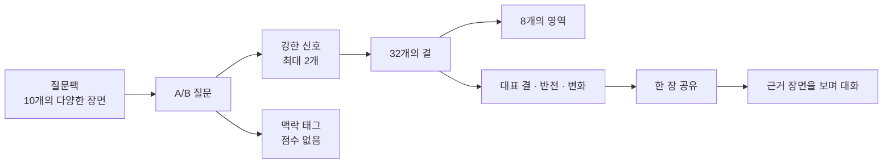

# 겹 상위개념 그래프 설계 v0

상태: **concept v1 활성 설계**

이 문서는 여러 질문팩에서 쌓인 응답을 대화가 확장되는 상위개념으로 연결하는 concept v1 계약이다. catalog·집계·owner-only 표시 경계를 정하며 기존 팩·카드와 공개 범위는 변경하지 않는다.

## 1. 해결하려는 문제

현재 질문 결과는 구체적이고 이해하기 쉽지만, 그대로 공유하면 답변을 줄줄이 보여줘야 한다. 반대로 하나의 질문만 공유하면 대화가 그 상황에 갇힌다.

필요한 것은 고정된 성격 유형이 아니라 다음 구조다.

1. 질문 하나는 일상의 구체적인 장면을 묻는다.
2. 서로 다른 팩의 질문들이 여러 상위개념에 조금씩 근거를 더한다.
3. 팩을 더 열수록 같은 상위개념의 방향과 맥락이 선명해진다.
4. 공유할 때는 전체 답변 대신 지금 가장 이야기할 만한 몇 개의 결만 보여준다.
5. 결과를 본 뒤에는 어떤 장면들이 그 결을 만들었는지 되짚을 수 있다.

## 2. MBTI와 다른 점

| MBTI식 구조 | 겹의 목표 구조 |
|---|---|
| 적은 수의 축으로 하나의 유형을 만든다 | 많은 수의 독립적인 결이 각자 쌓인다 |
| 결과가 하나의 코드로 압축된다 | 대표 결·반전·맥락으로 압축된다 |
| 한 번의 검사로 결과가 완성된다 | 여러 팩을 열며 색이 점점 진해진다 |
| 유형으로 사람 전체를 설명하기 쉽다 | 관찰된 장면만 설명하고 여백을 남긴다 |

겹은 `ENTJ` 같은 고정 코드를 만들지 않는다. 대신 “관계는 먼저 열지만, 결정은 오래 열어두는 편”처럼 서로 다른 결의 조합이 대화를 만든다.

## 3. 전체 모델



- **팩**은 재미와 주제를 만드는 경험 단위다.
- **질문**은 구체적인 관찰 근거다.
- **결**은 여러 질문에서 반복해서 나타나는 상위개념이다.
- **영역**은 32개의 결을 관리하기 위한 분류다. 사용자 유형이 아니다.
- **공유 결과**는 32개 전체가 아니라 대화 가능성이 큰 일부만 고른다.

## 4. 상위개념 사전 v0

32개는 출시 수량이 아니라 검증을 시작할 후보 수량이다. 각 결은 우열이 없는 양방향 스펙트럼이며, 사람을 한쪽으로 고정하지 않는다.

### A. 관계의 흐름

| 코드 | 결 | 방향 A | 방향 B |
|---|---|---|---|
| `rel.entry` | 관계 진입 | 먼저 문을 연다 | 흐름을 보고 합류한다 |
| `rel.range` | 연결 범위 | 여러 사람과 폭넓게 잇는다 | 적은 관계를 깊게 잇는다 |
| `rel.cadence` | 접촉 리듬 | 자주 짧게 이어간다 | 간격을 두고 길게 이어간다 |
| `rel.distance` | 거리 조율 | 빠르게 편안해진다 | 천천히 맥락을 맞춘다 |

### B. 표현과 소통

| 코드 | 결 | 방향 A | 방향 B |
|---|---|---|---|
| `exp.reaction` | 반응 시점 | 바로 반응한다 | 생각을 거쳐 반응한다 |
| `exp.processing` | 생각 정리 | 말하며 정리한다 | 안에서 정리한 뒤 말한다 |
| `exp.intensity` | 표현 강도 | 크게 드러낸다 | 조용히 간직한다 |
| `exp.form` | 전달 형식 | 표정·이미지·상징을 쓴다 | 문장으로 명확히 전한다 |

### C. 계획과 실행

| 코드 | 결 | 방향 A | 방향 B |
|---|---|---|---|
| `act.preparation` | 준비 방식 | 미리 구조를 잡는다 | 움직이며 맞춰간다 |
| `act.start` | 시작 방식 | 작은 조각부터 손댄다 | 전체 그림부터 잡는다 |
| `act.routine` | 일상 운용 | 정해둔 순서를 복원한다 | 그날 흐름에 맞춰 바꾼다 |
| `act.adjustment` | 변경 대응 | 새 정보에 계획을 고친다 | 처음 정한 흐름을 지킨다 |

### D. 선택과 탐색

| 코드 | 결 | 방향 A | 방향 B |
|---|---|---|---|
| `dec.convergence` | 선택 수렴 | 기준을 세워 빨리 좁힌다 | 충분히 비교한 뒤 좁힌다 |
| `dec.openness` | 가능성 유지 | 결정하면 선택지를 닫는다 | 결정 뒤에도 가능성을 남긴다 |
| `dec.experiment` | 시도 방식 | 익숙한 기준에서 고른다 | 새로운 선택을 시험한다 |
| `dec.revision` | 선택 검토 | 일단 정한 선택을 밀고 간다 | 중간에도 다시 검토한다 |

### E. 협업과 돌봄

| 코드 | 결 | 방향 A | 방향 B |
|---|---|---|---|
| `coop.role` | 역할 기여 | 시작과 방향을 연다 | 마무리와 안정을 맡는다 |
| `coop.ambiguity` | 애매함 처리 | 기준부터 확인한다 | 초안을 만들어 확인한다 |
| `coop.support` | 도움 방식 | 해결할 행동을 찾는다 | 감정을 함께 머문다 |
| `coop.sync` | 합 맞추기 | 비슷한 속도를 맞춘다 | 서로 다른 빈틈을 채운다 |

### F. 회복과 조절

| 코드 | 결 | 방향 A | 방향 B |
|---|---|---|---|
| `reg.source` | 회복의 원천 | 사람과 이어지며 충전한다 | 혼자 있는 동안 충전한다 |
| `reg.stimulus` | 자극 조절 | 다른 자극으로 전환한다 | 자극을 낮추며 가라앉힌다 |
| `reg.motion` | 회복 동작 | 움직이며 털어낸다 | 멈추며 회복한다 |
| `reg.transition` | 모드 전환 | 바로 다음 흐름으로 간다 | 여운을 정리하고 넘어간다 |

### G. 주의와 기억

| 코드 | 결 | 방향 A | 방향 B |
|---|---|---|---|
| `att.memory` | 기억 초점 | 구체적인 장면을 기억한다 | 감정과 분위기를 기억한다 |
| `att.reading` | 정보 읽기 | 순서대로 훑는다 | 중요한 부분부터 찾는다 |
| `att.experience` | 경험 포착 | 기록하며 경험한다 | 경험한 뒤 기록한다 |
| `att.story` | 이야기 구성 | 맥락을 자세히 펼친다 | 핵심을 압축해 전한다 |

### H. 취향과 발견

| 코드 | 결 | 방향 A | 방향 B |
|---|---|---|---|
| `pref.stability` | 취향 운용 | 정해둔 최애로 돌아간다 | 그날 기분에 따라 고른다 |
| `pref.discovery` | 발견 방식 | 추천을 따라 더 깊게 간다 | 일부러 다른 길을 찾는다 |
| `pref.focus` | 만족 구성 | 좋은 하나에 집중한다 | 작은 여러 즐거움을 모은다 |
| `pref.familiarity` | 익숙함의 사용 | 익숙한 것을 깊게 누린다 | 낯선 변화를 즐긴다 |

## 5. 질문과 결의 연결 규칙

질문 하나가 여러 의미를 가질 수는 있지만, 모든 의미를 점수로 만들면 결과가 흐려진다. v0에서는 다음만 허용한다.

- 질문당 **강한 신호는 1개, 최대 2개**다.
- 두 번째 신호도 두 선택지가 해당 결의 양쪽 방향을 실제로 구분할 때만 붙인다.
- 그 밖의 연관성은 `맥락 태그`로 남기고 집계하지 않는다.
- 하나의 답만으로 결을 확정하지 않는다.
- 연결 이유를 한 문장으로 설명할 수 없는 신호는 붙이지 않는다.
- 모든 출시 후보 질문은 최소 1개의 강한 신호를 가져야 한다.
- 자연스럽게 연결되는 결이 없으면 신호를 억지로 붙이지 않고, 팩의 장면은 유지한 채 질문과 선택지를 다시 쓴다.

예시:

```json
{
  "cardId": "deadline-signature",
  "signals": [
    {
      "concept": "act.start",
      "optionA": "A",
      "reason": "작은 첫 조각과 전체 구조 중 무엇으로 시작하는지 묻는다."
    }
  ],
  "contexts": ["일", "마감", "시작"]
}
```

이 JSON은 구조 설명용이다. v0 검토가 끝나기 전에는 실제 카드 매니페스트에 필드를 추가하지 않는다.

## 6. 쉽게 유추되지 않게 만드는 방법

목표는 사용자를 속이는 것이 아니라, 질문을 보고 원하는 결과를 고르기 어렵게 하면서 결과의 근거는 나중에 이해할 수 있게 만드는 것이다.

1. **직접 묻지 않는다.** “나는 계획적인 사람이다” 대신 여행 준비, 마감 시작, 약속 변경처럼 실제 장면을 묻는다.
2. **한 결을 여러 맥락에 흩뿌린다.** 같은 `act.preparation`도 여행·업무·모임에서 각각 관찰한다.
3. **한 팩에서 결을 완성하지 않는다.** 다음 팩을 열어야 다른 장면의 근거가 더해진다.
4. **선택지 위치를 섞는다.** 저장되는 의미 식별자와 화면의 좌우 위치를 분리하고, 한 응답 안에서는 위치를 고정한 채 질문마다 좌우를 섞는다.
5. **한 질문이 결과 문구를 그대로 예고하지 않게 한다.** 질문은 장면 언어, 결과는 반복 패턴의 언어를 쓴다.
6. **결과 뒤에는 근거를 연다.** 결과 카드에서 “왜 이렇게 나왔지?”를 누르면 연결된 장면들을 볼 수 있어야 한다.

금지할 것:

- 결과를 숨기기 위한 모호한 선택지
- 정답처럼 보이는 사회적으로 바람직한 선택지
- 같은 내용을 표현만 바꿔 반복하는 질문
- 질문 하나로 상위개념을 단정하는 문구

## 7. 팩 구성 규칙

한 팩은 특정 결을 검사하는 시험지가 아니다. 기존처럼 서로 다른 장면을 즐기는 10장짜리 경험이어야 한다.

- 기존 규칙인 **10개 A/B 카드와 정확히 1개의 Signature**를 유지한다.
- 팩의 주제와 관계 맥락은 일관되게 유지한다.
- 초안 검수 때 한 팩이 최소 4개 영역·6개의 서로 다른 결을 자연스럽게 건드리는지 확인한다.
- 같은 결의 강한 신호는 한 팩에 최대 3개까지만 둔다.
- 같은 결이 한 팩에서 반복되더라도 비슷한 상황·비슷한 문장으로 반복하지 않는다.
- 결별 균형은 한 팩이 아니라 전체 팩 카탈로그에서 맞춘다.
- Signature는 팩을 대표해야 하며, 상위개념 점수를 세게 주는 특별 문항은 아니다.

## 8. 팩을 열수록 진해지는 방식

결마다 다음 두 값을 분리한다.

- **방향**: 현재 근거가 어느 쪽에 더 모였는가
- **선명도**: 서로 다른 팩과 맥락에서 같은 방향이 얼마나 반복됐는가

답변 수만 많다고 선명해지지 않는다. 같은 질문에 방문자 응답이 많이 쌓여도 하나의 장면일 뿐이다. 다른 팩·다른 맥락의 근거가 추가되어야 색이 진해진다.

또한 가운데에 있다는 것이 흐릿하다는 뜻은 아니다. 양쪽 근거가 모두 많이 쌓였다면 “상황에 따라 달라지는 결”이 선명하게 드러난 것이다.

내부 방향 점수는 A 방향 `+1`, B 방향 `-1`을 유지한다. `cardCount >= 3`, `packCount >= 2`, `contextCount >= 2`면 `outline`, 각각 `6`, `3`, `3` 이상이면 `clear`, 나머지는 `trace`다. 응답 수만으로 단계를 올리지 않고 기존 card/pack/context 근거를 함께 사용한다.

### owner-only 표시 계약

- API는 raw `directionScore`를 제거하고 `position = clamp(-directionScore, -1, 1)`만 제공한다. 화면의 왼쪽 `-1`은 catalog `directionA`, 오른쪽 `1`은 `directionB`다. 기존 direction과 kind 판정에는 내부 점수를 그대로 사용한다.
- self, 공개 기준을 통과한 `privateOthers`, 공유 안전 `shareSafeOthers`의 available source만 유한한 `position`을 가진다. locked `privateOthers`는 `{ status, sightCount }`만 제공하고 UI도 `시선을 모으는 중 · n/3` 외 위치·방향·범위를 DOM·접근성 이름에 남기지 않는다.
- `a`/`b`인 self와 others는 marker를 쓴다. others에는 stage에 따른 넓은/중간/좁은 익명 band를 더하지만 이는 확률·신뢰구간이 아니다. `contextual`은 중앙 marker 없이 양쪽 split, `unsettled`은 marker 없이 넓은 neutral 상태로 표현한다. band와 pattern은 UI가 direction/stage/position에서 파생하며 API에 범위 필드를 추가하지 않는다.
- 8개 area summary API는 catalog order를 따르고 self 질문을 같은 `cardKey` 기준으로 영역 안에서 한 번만 세어 `cardCount`, `packCount`, `contextCount`, count-derived `stage`만 제공한다. 전면 rail은 `cardCount`와 `stage`만 표시하고 팩·맥락 수는 대표 카드의 기존 상세에만 둔다. 같은 카드가 같은 영역의 두 결에 연결되면 영역에서는 한 번, 각 결에서는 각각 한 번 세며 네 결의 방향을 합산하지 않는다.
- source pair가 있으면 대표 결은 정확히 3개다. `difference → contextual → repeated → emerging`의 one-per-kind와 kind 내부 rank를 유지하면서 unused area를 우선하고, 부족분도 global rank의 unused area부터 채운 뒤에만 중복 area를 허용한다. 공유 가능한 hook 보장은 달성 가능한 영역 다양성을 줄이지 않는 범위에서 유지한다.
- `/me` 1차 결과는 양쪽 endpoint, 내 위치, 지인 익명 상태, 고유 문항 수와 stage를 먼저 표시하고 `profileLead`, observation, 대화형 question은 제거한다. settled self 근거와 유효한 `profileSourcePlayId`가 있는 결이 3개 이상이면 지인 threshold와 무관하게 `영역 · A—B` picker와 `내 겹 공유하기`를 표시하고, 부족하면 concept 공유 카드 대신 `시선 더 모으기`를 유지한다.
- 누적 전후 시각 기준은 [상위개념 프로필 정밀도 성장 목업](../design/mockups/concept-profile-v2/29-app-style-precision-growth.png)을 따른다.

## 9. 24팩·240문항 전수 매핑 결과

활성 최신본 24팩의 240문항을 모두 검토했다. 목표본에서는 모든 문항이 1~2개의 강한 신호를 가진다.

- 기존 문구로 연결 가능한 문항: 192개
- 질문·선택지를 바꿔야 연결되는 문항: 48개
- 신호가 없는 문항: 0개
- 연결된 후보 결: 32개

전수 자료:

- [240문항 전체 연결표](concept-card-mapping-v0.tsv)
- [48문항 다음 버전 재작성안](concept-card-rewrites-v0.tsv)

연결표의 `concept:A`는 질문의 A 선택지가 해당 결의 A 방향이라는 뜻이고, `concept:B`는 반대 방향이라는 뜻이다. 재작성 대상 48개는 연결표의 신호가 기존 공개 문구가 아니라 재작성안에 적용된다. 공개된 v1·v2 파일은 수정하지 않고, 승인 뒤 새 버전으로만 발행한다.

### Signature 24개

| 팩 | Signature 장면 | 후보 신호 |
|---|---|---|
| 퇴근 후 | 일을 마친 직후 | `reg.transition` |
| 알고리즘 거울 | 피드가 나를 잘 안다고 느낄 때 | `pref.discovery` |
| 카메라롤 | 재밌는 순간의 사진 | `att.experience` |
| 댓글창 | 예상 못 한 말을 봤을 때 | `exp.reaction`, `exp.processing` |
| 칭찬 반응 | 칭찬을 받았을 때 | `exp.intensity`, `exp.reaction` |
| 동료 온도차 | 업무 기준이 애매할 때 | `coop.ambiguity`, `act.preparation` |
| 마감 | 마감을 앞두고 시작할 때 | `act.start` |
| 결정의 늪 | 중요한 선택을 할 때 | `dec.convergence`, `dec.openness` |
| 이모지 | 이모지·밈과 짧은 문장 | `exp.form` |
| 첫인상 | 처음 만난 사람에게 | `rel.entry` |
| 친구 합 | 둘이 한 팀이 됐을 때 | `coop.role` |
| 단톡방 | 메시지가 쌓였을 때 | `exp.reaction`, `att.reading` |
| 솔직한 나 | 복잡한 감정을 풀 때 | `exp.processing`, `reg.source` |
| 웃음 | 웃긴 말을 들었을 때 | `exp.reaction`, `exp.intensity` |
| 오랜 친구 | 오랜만에 다시 만났을 때 | `rel.distance` |
| 답장 온도 | 답장이 늦을 때 | `rel.cadence` |
| 방의 온도 | 집에 돌아와 일상 모드를 바꿀 때 | `reg.transition` · 다음 버전 재작성 |
| 작은 사치 | 나를 위한 작은 소비 | `pref.focus` |
| 간식 | 간식을 고를 때 | `pref.stability` |
| 소셜 배터리 | 사람을 만난 뒤 | `reg.source` |
| 즉흥 | 갑자기 제안이 들어왔을 때 | `act.preparation`, `dec.openness` |
| 사소한 루틴 | 반복되는 일상 순서 | `act.routine` |
| 여행 | 여행 준비를 할 때 | `act.preparation` |
| 주말 | 주말을 시작할 때 | `reg.motion`, `reg.transition` |

### 결별 분포

모든 후보 결이 최소 6문항·3팩·3맥락 기준을 통과했다. 모든 팩도 최소 6개의 서로 다른 결을 포함하고, 같은 결은 팩당 최대 3개다. 질문 수가 많은 결은 결과에서 더 강하게 취급하지 않고, 카드·팩·맥락 단위로 정규화해야 한다.

| 결 | 문항 | 팩 | 맥락 |
|---|---:|---:|---:|
| `act.adjustment` | 10 | 7 | 9 |
| `act.preparation` | 26 | 17 | 25 |
| `act.routine` | 6 | 4 | 6 |
| `act.start` | 6 | 4 | 6 |
| `att.experience` | 6 | 4 | 6 |
| `att.memory` | 6 | 5 | 5 |
| `att.reading` | 10 | 8 | 8 |
| `att.story` | 8 | 8 | 7 |
| `coop.ambiguity` | 7 | 7 | 7 |
| `coop.role` | 6 | 4 | 6 |
| `coop.support` | 6 | 4 | 5 |
| `coop.sync` | 7 | 6 | 7 |
| `dec.convergence` | 8 | 7 | 7 |
| `dec.experiment` | 13 | 9 | 13 |
| `dec.openness` | 6 | 5 | 6 |
| `dec.revision` | 6 | 6 | 6 |
| `exp.form` | 8 | 5 | 6 |
| `exp.intensity` | 10 | 5 | 10 |
| `exp.processing` | 9 | 5 | 9 |
| `exp.reaction` | 28 | 14 | 26 |
| `pref.discovery` | 7 | 4 | 7 |
| `pref.familiarity` | 6 | 4 | 5 |
| `pref.focus` | 7 | 5 | 7 |
| `pref.stability` | 6 | 4 | 6 |
| `reg.motion` | 8 | 5 | 8 |
| `reg.source` | 10 | 8 | 9 |
| `reg.stimulus` | 8 | 7 | 8 |
| `reg.transition` | 15 | 10 | 13 |
| `rel.cadence` | 8 | 5 | 7 |
| `rel.distance` | 6 | 4 | 6 |
| `rel.entry` | 10 | 6 | 10 |
| `rel.range` | 6 | 3 | 5 |

## 10. 공유 결과의 최소 단위

사용자에게 32개의 결이나 모든 답변을 보여주지 않는다. owner가 settled self 근거와 유효한 `profileSourcePlayId`가 있는 결 하나를 고르면 그 결을 첫 축에 고정하고, 같은 조건을 만족한 전체 후보의 기존 stable rank를 따라 가능한 한 다른 영역의 결 2개를 더 고른다. 다른 영역을 선택할 수 없을 때만 영역 중복을 허용한다. 각 evidence snapshot에서 기존 후보 rank·area diversity·source를 다시 계산하며 threshold 전후 동일성을 위한 별도 self-only 알고리즘이나 저장값을 만들지 않는다. 후보가 3개보다 적으면 3축을 축소하거나 채우지 않고 concept 공유 카드를 만들지 않는다.

한 장의 public 모델은 owner가 공개하기로 정한 닉네임과 정확히 3개의 축만 가진다. 각 축은 catalog에서 검증한 영역·결·A/B endpoint, settled인 내 위치, self 고유 문항 수와 `shareSafeOthers`의 locked/available 상태로 제한한다. locked exact variant는 `sightCount` 0/1/2만 가지며 `시선을 모으는 중 · n/3` 외 지인 위치·방향·범위를 API·DOM·접근성 이름·Canvas에 남기지 않는다. available `a`/`b`는 `trace=wide`, `outline=medium`, `clear=narrow` 비통계적 범위와 익명 marker를 표시하고, contextual은 위치 없는 양쪽 split, unsettled은 marker 없는 neutral로 표시한다. 내 방향이 contextual·unsettled인 결만 공유 후보가 아니다.

1080×1920 PNG에는 `● 나 · ○ 지인` 범례와 이 3축만 그린다. 첫 축의 기존 `profileSourcePlayId`가 초대 source이며 server는 현재 owner profile rebuild 결과와 맞지 않는 이전·위조 selection을 404로 닫는다. 관찰문·질문·자연어 성격 해석·유형·점수·퍼센트·응답자 수·개별 답변·관계별 원자료·내부 ID·관리 URL·secret은 모델·DOM·PNG에 포함하지 않는다. 첫 축의 source pack 공개 초대를 카드와 함께 공유하고 수신자의 같은 팩 CTA는 기존 `same_pack_cta`를 유지한다. Web Share가 파일을 지원하지 않거나 취소·`NotAllowedError`·실패하면 생성된 링크를 보존한 채 이미지 저장과 링크 복사를 제공한다.

## 11. 후보 결의 생존 기준

32개를 처음부터 전부 제품에 넣지 않는다. 전체 240개 질문을 연결해본 뒤 아래를 만족한 결만 남긴다.

- 강한 신호가 되는 질문이 최소 6개 있다.
- 최소 3개의 서로 다른 팩에 흩어져 있다.
- 최소 3개의 서로 다른 생활 맥락에서 관찰된다.
- 양쪽 선택지가 가치 판단 없이 균형을 이룬다.
- 다른 상위개념과 실제로 구분되는 질문 묶음을 가진다.
- 결과 문구가 구체적인 대화 질문으로 이어진다.

겹치는 두 결은 합치고, 근거가 부족한 결은 보류한다. 반대로 240개 질문을 연결하다 반복되는 패턴이 새로 발견되면 후보를 추가한다.

## 12. 개인정보와 공개 경계

상위개념 집계는 여러 카드의 정보를 합치므로 현재 카드별 결과보다 더 강한 추론이 될 수 있다. 따라서 별도 제품 결정 전에는 다음을 지킨다.

- 현재 프로필의 소유자 전용 공개 범위와 최소 응답 기준을 그대로 유지한다.
- 방문자 개인의 답변이나 개인별 상위개념을 노출하지 않는다.
- 최소 표본 미만인 카드들을 합쳐 새로운 상위개념 결과를 우회 공개하지 않는다.
- 공유는 소유자가 직접 고른 요약만 허용한다.
- 진단·평가·채용·적합도 같은 용도로 해석하지 않는다.

## 13. 다음 설계 단계

1. 48개 재작성안이 기존 팩의 재미와 문체를 유지하는지 카드 단위로 검수한다.
2. 질문별 의미 식별자와 화면 좌우 위치를 분리하는 규칙을 정한다.
3. 실제 사용자 3~5명의 가상 결과를 만들어 공유 문구가 대화로 이어지는지 본다.
4. 겹치거나 결과 문구가 비슷한 결이 발견되면 32개 사전을 다시 합친다.
5. 검증 뒤에만 활성 SSOT, 집계 방식, 화면, 새 팩 버전을 별도 결정한다.
