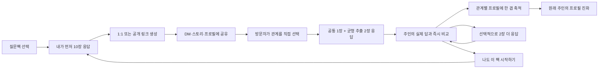

# 겹(GYEOP) 핵심 기능 우선순위 v0.4

> 작성일: 2026-07-15  
> 목적: 지금까지 논의한 제품을 개발 가능한 기능 단위로 정렬하고, 첫 프로토타입·공개 MVP·성장 단계의 경계를 고정한다.

## 1. 제품을 한 문장으로

사용자가 질문팩 10장에 먼저 답하고 링크를 공개하면, 친구부터 온라인 팔로워까지 방문자가 3장에 답해 주인의 실제 답과 비교하고 `나도 이 팩 시작하기`로 새로운 프로필 주인이 되는 모바일 웹서비스.

## 2. 반드시 지켜야 할 핵심 루프



이 루프에 직접 기여하지 않는 기능은 첫 버전의 핵심 기능이 아니다.

## 3. 제품 용어

| 용어 | 의미 |
|---|---|
| 팩 템플릿 | 질문 10장과 좌우 선택지로 구성된 재사용 가능한 질문 묶음 |
| 팩 시작 | 사용자가 템플릿을 골라 자신의 답변 세션을 만드는 행위 |
| 셀프 응답 | 팩 주인이 먼저 자신에 대해 답한 10개 선택 |
| 팩 플레이 | 특정 사용자가 답을 완료한 뒤 친구 응답을 기다리는 살아 있는 팩 인스턴스 |
| 초대 | 팩 플레이에 방문자가 참여하도록 만든 1:1 또는 공개 공유 링크 |
| 방문자 관계 | 응답자가 팩 주인과의 관계 및 알게 된 시점을 직접 선택한 정보 |
| 친구 응답 | 방문자가 팩 주인을 떠올리며 공통 핵심 1장과 균형 추출 2장에 답한 선택 |
| 시선 | 셀프 응답과 친구 응답을 비교해서 얻은 한 사람의 관점 |
| 겹 프로필 | 여러 관계와 여러 팩에서 받은 시선이 누적된 프로필 |

팩 템플릿 제작자와 팩 플레이 주인은 다른 사람일 수 있다. 템플릿 제작자는 다른 사용자의 개별 답변을 볼 수 없다.

## 4. 기능 우선순위 한눈에 보기

| 단계 | 목표 | 반드시 포함 | 의도적으로 제외 |
|---|---|---|---|
| P0 루프 프로토타입 | 사람들이 실제로 답하고 링크를 다시 퍼뜨리는지 검증 | 공식 팩, 셀프 응답, 1:1·공개 링크, 3장 방문자 응답, 즉시 비교, 최소 프로필 | 사용자 팩 제작, 공개 팩 탐색, 결제, 광고 |
| P1 공개 MVP | 반복 사용과 질문 공급 구조 검증 | 선택·조합형 팩 메이커, 링크 공개 팩, 관계별 프로필, 알림, SNS 카드 | 유료 마켓, 팔로우, 댓글, DM |
| P2 성장 | 좋은 팩이 스스로 퍼지는지 검증 | 공개 팩 탐색, 리믹스, 제작자 프로필, 랭킹, 신고·검수 | 브랜드 팩과 수익 배분의 복잡한 정산 |
| P3 수익화 | 지불 의사 검증 | 프리미엄 팩, 깊은 인사이트, 브랜드·크리에이터 팩 | 친구의 신원이나 개별 답변을 돈으로 해금 |

## 5. P0 — 루프 프로토타입

### 5.1 시작과 로그인

- 모바일 웹으로 바로 진입한다.
- 친구 응답자는 회원가입 없이 답변할 수 있다.
- 팩 주인은 결과를 저장할 때 소셜 로그인 또는 이메일 매직 링크로 계정을 만든다.
- 첫 화면의 주 CTA는 `팩 열어보기`다.

### 5.2 공식 질문팩 선택

첫 테스트에서는 운영자가 만든 4~6개 팩만 제공한다.

- 스타터팩
- 첫인상팩
- 오래된 친구팩
- 직장동료팩
- 썸·연애팩
- 솔직한 나팩

팩 카드에는 제목보다 다음 정보가 빠르게 읽혀야 한다.

- 추천 관계
- 질문 10장
- 예상 시간
- 분위기와 민감도
- 1:1 추천 여부

### 5.3 팩 개봉과 셀프 응답

- 시작 시 1~2초 이내의 팩 개봉 연출을 제공한다.
- 한 화면에는 카드 한 장만 보여준다.
- 모든 질문은 MVP에서 A/B 좌우 선택만 사용한다.
- 좌우 스와이프와 버튼 탭을 모두 지원한다.
- 현재 진행도를 `3/10`처럼 표시한다.
- 뒤로 가기와 답변 수정이 가능하다.
- 중간 이탈 시 현재 카드까지 자동 저장한다.

예시:

```text
서운한 일이 생기면 나는?

← 바로 말한다              혼자 삭인다 →
```

### 5.4 링크 공개 방식 설정

셀프 응답 완료 후에만 공유 설정을 보여준다.

- 팩 주인은 공유 전에 응답자의 관계를 지정하지 않는다.
- 공개 링크: 인스타그램 스토리·프로필·단체방 등에 올리고 여러 사람이 참여
- 1:1 링크: 특정 상대에게 DM으로 보내며 한 명이 완료하면 닫히는 링크
- 링크 활성·비활성 전환과 새 링크 발급을 지원한다.
- 민감한 팩은 1:1 링크를 기본값으로 추천한다.
- 카카오톡, 인스타그램 DM·Story, 문자, 링크 복사를 지원한다.
- 주소록 접근이나 서비스 내 친구 추가는 첫 버전에서 하지 않는다.

공개 링크는 인스타그램 팔로워처럼 팩 주인을 온라인에서만 아는 사람도 참여할 수 있어야 한다. 링크 자체가 `누구에게 보냈는지`를 결정하지 않고, 방문자가 자신의 관계를 직접 분류한다.

### 5.5 친구의 응답

- 링크를 열면 `희섭이 먼저 답한 질문팩이에요`처럼 맥락을 보여준다.
- 먼저 방문자가 팩 주인과의 관계를 직접 선택한다.
  - 오래된 친구
  - 학교 친구
  - 직장 동료
  - 썸·연인
  - 가족
  - 온라인 친구
  - SNS 팔로워·온라인에서만 봄
  - 기타
- 알게 된 시점 또는 팔로우하기 시작한 시점을 선택한다.
- 시스템이 1인칭 질문을 친구 관점으로 자동 변환한다.
  - 주인 화면: `서운한 일이 생기면 나는?`
  - 친구 화면: `서운한 일이 생기면 희섭은?`
- 방문자는 팩 10장 중 모든 방문자에게 공통인 핵심 1장과 시스템이 균형 추출한 2장에 답한다.
- 공통 핵심 카드는 팩의 대표 질문으로 지정해 적은 방문자만으로도 첫 집단 인사이트가 생기게 한다.
- 나머지 2장은 완전 무작위가 아니라 응답 수가 적은 질문을 먼저 배정해 10장 전체의 표본이 고르게 쌓이게 한다.
- 로그인 없이 완료할 수 있다.
- 필수 3장 제출 전에는 팩 주인의 답을 보여주지 않아 응답이 영향을 받지 않게 한다.
- 3장 완료 직후 자신이 답한 3장에 한해 팩 주인의 셀프 응답을 공개하고 즉시 비교한다.

### 5.6 비교 결과

점수와 순위보다 시선의 차이와 다음 사용자 전환을 중심에 둔다.

- 카드마다 `희섭의 실제 답`과 `내가 본 희섭`을 나란히 표시
- 자신이 답한 3장 중 서로 같게 본 항목
- 자신이 답한 3장 중 서로 다르게 본 항목
- 가장 흥미로운 차이 1개
- 관계와 알게 된 시점
- Primary CTA: `나도 이 팩으로 시작하기`
- Secondary CTA: `2장 더 답해서 희섭을 더 선명하게 만들기`

Primary CTA를 누르면 팩 탐색으로 보내지 않고 방금 참여한 동일한 팩 템플릿의 셀프 10장 응답을 바로 시작한다. 방문자는 이 순간 새로운 팩 주인으로 전환되며, 자신의 10장을 완료한 뒤 새로운 링크를 공유한다.

Secondary CTA로 2장을 더 답하면 추가한 두 카드의 비교 결과를 보여준 뒤 동일한 Primary CTA로 돌아온다. 추가 응답은 바이럴 전환을 막는 선행 조건이 아니다.

`친밀도 82점` 같은 단일 점수는 보조 정보로도 초기에는 사용하지 않는다.

### 5.7 최소 겹 프로필

- 내가 보는 나
- 도착한 전체 시선 수
- 관계별 시선 수
- 질문별 응답 표본 수와 아직 표본이 부족한 질문
- 최근 도착한 시선
- 팩별 응답 현황
- 새로운 시선이 추가될 때 프로필이 변화했다는 피드백

첫 프로토타입의 프로필은 완성형 SNS 프로필이 아니라 응답이 사라지지 않고 쌓인다는 사실을 증명하는 저장소다.

### 5.8 알림

- 첫 번째 친구 응답 도착
- 새로운 관계의 시선 도착
- 한 팩에 응답 3개 도착

P0에서는 이메일이나 웹 푸시 중 하나만 선택한다. 친구에게 재촉하는 자동 알림은 제외한다.

## 6. P1 — 공개 MVP

### 6.1 선택·조합형 팩 메이커

사용자에게 질문 10개와 선택지 20개를 빈 화면에서 모두 입력하게 하지 않는다.

기본 제작 흐름:

1. 관계 선택
2. 주제 선택
3. 분위기와 민감도 선택
4. 시스템이 질문 후보 15장을 추천
5. 사용자가 마음에 드는 10장을 스와이프로 선택
6. 순서 조정
7. 제목과 커버 자동 제안
8. 미리보기 후 발행

기본적으로 검증된 질문 은행을 조합하고, 직접 수정은 카드별 고급 기능으로 둔다.

필수 제작 기능:

- 추천 카드 교체
- 질문 순서 드래그 정렬
- 질문 또는 좌우 선택지 직접 수정
- 카드 한 장 직접 추가
- 팩 제목·커버 자동 생성
- 관계·분위기·민감도 태그
- 내 팩으로 저장

### 6.2 팩 공개 범위

- 비공개: 제작자만 사용
- 링크 공개: 링크를 받은 사람만 팩을 시작할 수 있음
- 전체 공개: P2에서 제공

P1에서는 링크 공개까지만 제공해 검수 부담과 저품질 공개 팩 범람을 막는다.

### 6.3 관계별 프로필

프로필 첫 화면은 타임라인이 아니라 관계별 시선의 겹이다.

- 전체 시선 요약
- 오래된 친구가 보는 나
- 학교 친구가 보는 나
- 직장 동료가 보는 나
- 연인·특별한 관계가 보는 나
- 온라인 친구가 보는 나
- SNS 팔로워가 보는 나
- 셀프 인식과 타인 인식의 차이

시간 변화는 각 관계 레이어 안의 보조 탐색으로 제공한다.

관계별 공개 집계는 같은 관계에서 응답자 3명 이상이 모인 경우에만 생성한다. 3명 미만이면 주인에게 `아직 시선을 모으는 중`으로 표시해 특정 응답자를 역추론하기 어렵게 한다.

### 6.4 공개 범위와 민감한 관계

- 일반 관계팩: 집계된 결과를 프로필에 공개할 수 있음
- 공개 링크 응답: 이름 입력을 요구하지 않고 관계별 집계에만 사용
- 1:1 팩: 두 참여자의 개별 비교를 기본 비공개로 저장
- 썸·연애팩: 결과 공유를 명시적으로 선택해야만 외부 공개
- 팩 템플릿 제작자: 사용 수와 완료율만 확인 가능
- 템플릿 제작자는 다른 사람의 셀프·친구 답변에 접근 불가

### 6.5 SNS 공유 카드

공유 카드는 서비스 소개보다 사용자에 대한 발견을 주어로 한다.

- `나는 바로 말한다고 생각했는데, 오래된 친구들은 참는 사람으로 봤다.`
- 관계 이름과 팩 이름
- 응답자 개인 신원은 기본적으로 숨김
- `이 팩으로 나를 알아보기` 딥링크
- Instagram Story 9:16 우선

## 7. P2 — 성장 기능

### 7.1 공개 팩 탐색

- 지금 인기 있는 팩
- 관계별 팩
- 분위기별 팩
- 새로 나온 팩
- 친구들이 사용한 팩
- 저장한 팩

랭킹은 단순 클릭 수가 아니라 시작 대비 완료율, 공유 전환율, 신고율을 함께 사용한다.

### 7.2 리믹스

- 공개 팩을 복제해 질문 일부 교체
- 원작자와 원본 팩 표시
- 리믹스 계보 확인
- 원작자가 리믹스 허용 여부 선택

### 7.3 제작자 시스템

- 제작자 프로필
- 만든 팩과 사용 횟수
- 저장·리믹스 수
- 인기 제작자 배지
- 팔로우는 데이터가 충분히 쌓인 뒤 도입

### 7.4 안전과 품질 관리

- 공개 전 자동 민감도 분류
- 욕설·혐오·성적·개인정보 유도 질문 차단
- 신고와 숨김
- 중복 팩 탐지
- 신규 제작자의 공개 발행 횟수 제한
- 청소년에게 부적절한 팩 노출 제한

## 8. P3 — 수익화

제품 루프와 프로필 재방문이 확인된 이후에만 실험한다.

- 프리미엄 테마와 커버
- 깊은 관계 인사이트
- 기간별 프로필 변화 리포트
- 크리에이터 유료 팩
- 브랜드 공식 팩
- 모임·학교·기업용 이벤트 팩

금지하는 수익화:

- 친구의 이름이나 신원 해금
- 개별 답변을 결제로 공개
- 답변 도중 전면 광고
- 친구 결과를 보기 위해 강제 결제

## 9. 이번 범위에서 제외할 기능

- 서비스 내 DM과 채팅
- 공개 사용자 검색
- 댓글과 커뮤니티 피드
- 친구 순위와 인기 점수
- MBTI식 고정 유형명
- 모든 답변 형식을 지원하는 범용 설문 빌더
- 음성·영상 질문
- 실시간 공동 응답
- 연락처 자동 초대
- 광고와 결제
- 크리에이터 정산

## 10. 개발 순서

### Sprint 1 — 혼자서 팩 완료

- 공식 팩 목록
- 카드 10장 응답 UI
- 셀프 응답 저장
- 모바일 성능과 이탈 복구

### Sprint 2 — 친구에게 보내고 답받기

- 팩 플레이 생성
- 공개·1:1 링크와 링크 상태 관리
- 방문자 관계·알게 된 시점 직접 선택
- 공통 핵심 1장 + 질문별 표본 수를 고려한 2장 균형 추출
- 게스트 3장 응답과 선택적 2장 추가 응답
- 완료 결과 비교

### Sprint 3 — 답변을 프로필에 쌓기

- 응답 도착 알림
- 최소 겹 프로필
- 관계별 집계
- 기본 공개 범위

### Sprint 4 — 공유 루프 검증

- Instagram Story 결과 카드
- `나도 이 팩 시작하기` 딥링크
- 퍼널 이벤트와 바이럴 계수 측정

### Sprint 5 — 사용자 팩 메이커

- 관계·주제·분위기 선택
- 질문 후보 15장 추천
- 10장 선택과 순서 조정
- 카드 직접 수정
- 자동 제목·커버
- 비공개·링크 공개 발행

## 11. 성공 지표

### 핵심 퍼널

| 단계 | 1차 목표 |
|---|---:|
| 팩 상세 → 셀프 응답 시작 | 60% 이상 |
| 셀프 응답 시작 → 10장 완료 | 75% 이상 |
| 셀프 응답 완료 → 링크 생성 | 55% 이상 |
| 링크 생성 → 실제 외부 공유 | 70% 이상 |
| 공개·1:1 링크 방문 → 방문자 3장 응답 시작 | 60% 이상 |
| 방문자 응답 시작 → 필수 3장 완료 | 90% 이상 |
| 필수 3장 완료 → 비교 결과 확인 | 95% 이상 |
| 비교 결과 → `나도 이 팩으로 시작하기` | 20% 이상 |
| `나도 시작하기` → 셀프 10장 응답 시작 | 80% 이상 |
| 비교 결과 → 선택 2장 추가 응답 | 25% 이상 |
| 팩 주인 1명당 완료 방문자 응답 | 평균 3개 이상 |

### 재방문 지표

- 첫 응답 도착 후 24시간 내 주인 재방문율 60% 이상
- 첫 팩 완료자의 14일 내 두 번째 팩 시작률 25% 이상
- 방문자 응답 3개 이상 받은 사용자의 14일 내 프로필 재방문율 40% 이상

### 팩 메이커 지표

- 제작 시작 → 팩 발행 완료율 50% 이상
- 발행까지 중앙값 3분 이하
- 한 팩 제작 시 직접 키보드 입력이 필요한 단계 2회 이하
- 링크 공개 팩의 첫 7일 내 실제 사용 1회 이상 비율 30% 이상

## 12. P0 승인 기준

- 사용자는 공식 팩 하나를 선택해 모바일에서 10장을 완료할 수 있다.
- 셀프 응답 완료 전에는 친구 초대 링크가 만들어지지 않는다.
- 팩 주인은 관계를 미리 지정하지 않고 공개 링크 또는 1:1 링크를 생성할 수 있다.
- 공개 링크는 Instagram Story·프로필·단체방에서 여러 방문자가 반복 사용할 수 있다.
- 1:1 링크는 한 명이 완료하면 자동으로 닫힌다.
- 방문자는 로그인 없이 관계와 알게 된 시점을 직접 선택할 수 있다.
- 방문자는 공통 핵심 1장과 표본이 부족한 질문을 우선한 2장에 답할 수 있다.
- 팩 주인의 답은 방문자가 필수 3장을 제출하기 전에는 노출되지 않는다.
- 방문자는 필수 3장 완료 직후 자신이 답한 항목에서 팩 주인의 실제 답과 자신의 선택을 비교할 수 있다.
- 비교 화면의 가장 강한 CTA는 `나도 이 팩으로 시작하기`이며 동일한 팩의 셀프 10장 응답으로 한 번에 이동한다.
- 2장 추가 응답은 비교 화면의 보조 CTA이며 신규 팩 시작의 선행 조건이 아니다.
- 팩 주인은 새 응답이 도착했다는 알림을 받고 프로필에서 확인할 수 있다.
- 공개 링크를 여러 명이 사용해도 각 응답과 응답자가 선택한 관계는 독립적으로 저장된다.
- 모든 방문자에게 공통 핵심 카드가 배정되고, 나머지 질문은 표본 수가 가능한 한 고르게 쌓이도록 동작한다.
- 썸·연애팩의 결과는 사용자의 명시적 선택 없이는 공개되지 않는다.
- 템플릿 제작자는 다른 사용자의 응답 내용에 접근할 수 없다.
- 주요 퍼널 이벤트가 누락 없이 기록된다.

## 13. 가장 중요한 제품 결정

첫 프로토타입에서 사용자 팩 제작까지 동시에 만들지 않는다. 먼저 공식 팩으로 `셀프 완료 → 외부 공유 → 친구 완료 → 프로필 재방문`이 발생하는지 증명한다.

다만 공개 MVP에는 선택·조합형 팩 메이커를 포함한다. 질문을 무한히 직접 공급하는 운영 모델이 아니라, 사용자가 검증된 질문 카드를 골라 자기 팩으로 구성하고 퍼뜨리는 공급 구조를 제품의 두 번째 핵심 루프로 삼는다.

## 14. 다음으로 결정할 한 가지

P0 공식 팩의 첫 타깃 관계를 하나만 고른다.

현재 추천은 **오래된 친구**다. 관계 맥락이 명확하고, 썸·연애보다 공유 장벽이 낮으며, 직장동료보다 감정적인 결과가 잘 나오기 때문이다. 첫 팩을 오래된 친구용으로 좁히면 질문 품질과 공유 문구를 빠르게 검증할 수 있다.
