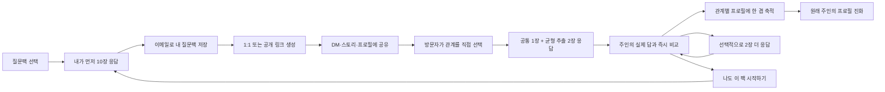

# 겹(GYEOP) 핵심 기능 우선순위 v0.8

> 작성일: 2026-07-15  
> 목적: 지금까지 논의한 제품을 개발 가능한 기능 단위로 정렬하고, 첫 프로토타입·공개 MVP·성장 단계의 경계를 고정한다.

## 1. 제품을 한 문장으로

사용자가 질문팩 10장에 먼저 답하고 링크를 공개하면, 친구부터 온라인 팔로워까지 방문자가 3장에 답해 주인의 실제 답과 비교하고 `나도 이 팩 시작하기`로 새로운 프로필 주인이 되는 모바일 웹서비스.

## 2. 반드시 지켜야 할 핵심 루프



이 루프에 직접 기여하지 않는 기능은 첫 버전의 핵심 기능이 아니다.

## 3. 제품 용어

| 용어           | 의미                                                                           |
| -------------- | ------------------------------------------------------------------------------ |
| 팩 템플릿      | 질문 10장과 좌우 선택지로 구성된 재사용 가능한 질문 묶음                       |
| 팩 시작        | 사용자가 템플릿을 골라 자신의 답변 세션을 만드는 행위                          |
| 셀프 응답      | 팩 주인이 먼저 자신에 대해 답한 10개 선택                                      |
| 팩 플레이      | 특정 사용자가 답을 완료한 뒤 친구 응답을 기다리는 살아 있는 팩 인스턴스        |
| 초대           | 팩 플레이에 방문자가 참여하도록 만든 1:1 또는 공개 공유 링크                   |
| 방문자 관계    | 응답자가 팩 주인과의 관계 및 알게 된 시점을 직접 선택한 정보                   |
| 카드 응답      | 셀프 응답이나 친구 응답에 포함된 질문 한 장의 A/B 선택                         |
| 친구 응답      | 방문자가 관계·시점과 함께 필수 3장 및 선택 추가 카드에 제출한 하나의 완료 기록 |
| 시선           | 유효하게 완료된 친구 응답 한 건. 프로필의 사람 수와 관계별 시선 수를 세는 단위 |
| 관계·질문 집계 | 같은 팩 플레이·카드 버전·관계에 속한 카드 응답의 좌우 선택 수                  |
| 겹 프로필      | 셀프 응답과 공개 가능한 관계·질문 집계가 원본 질문 카드 위에 누적된 프로필     |

팩 템플릿 제작자와 팩 플레이 주인은 다른 사람일 수 있다. 템플릿 제작자는 다른 사용자의 개별 답변을 볼 수 없다.

## 4. 기능 우선순위 한눈에 보기

| 단계               | 목표                                               | 반드시 포함                                                                | 의도적으로 제외                          |
| ------------------ | -------------------------------------------------- | -------------------------------------------------------------------------- | ---------------------------------------- |
| P0 루프 프로토타입 | 사람들이 실제로 답하고 링크를 다시 퍼뜨리는지 검증 | 공식 팩, 셀프 응답, 1:1·공개 링크, 3장 방문자 응답, 즉시 비교, 최소 프로필 | 사용자 팩 제작, 공개 팩 탐색, 결제, 광고 |
| P1 공개 MVP        | 반복 사용과 질문 공급 구조 검증                    | 선택·조합형 팩 메이커, 링크 공개 팩, 관계별 프로필, 알림, SNS 카드         | 유료 마켓, 팔로우, 댓글, DM              |
| P2 성장            | 좋은 팩이 스스로 퍼지는지 검증                     | 공개 팩 탐색, 리믹스, 제작자 프로필, 랭킹, 신고·검수                       | 브랜드 팩과 수익 배분의 복잡한 정산      |
| P3 수익화          | 지불 의사 검증                                     | 프리미엄 팩, 깊은 인사이트, 브랜드·크리에이터 팩                           | 친구의 신원이나 개별 답변을 돈으로 해금  |

## 5. P0 — 루프 프로토타입

### 5.1 시작과 로그인

- 모바일 웹으로 바로 진입한다.
- 친구 응답자는 회원가입 없이 답변할 수 있다.
- 연령·국가 확인 없이 주인과 방문자가 참여할 수 있다. 생년월일·신분증·보호자 정보·IP geolocation은 수집하지 않는다.
- 모든 공식 질문팩은 전체 연령이 답할 수 있는 내용만 제공한다. 성적·성인 전용 질문, 제3자의 민감한 개인정보를 요구하는 질문, 위험 행동을 부추기는 질문은 발행하지 않는다.
- 팩 주인은 이메일·전화번호·표시 이름 없이 익명으로 시작한다. 서버가 발급한 256-bit owner 관리 secret은 `Secure`·`HttpOnly`·`SameSite=Lax` same-browser cookie에만 두고 DB에는 domain-separated hash만 저장한다.
- 같은 브라우저에서 공식 팩을 바꾸면 기존 진행을 버리지 않고, 하나의 익명 owner 아래 팩별 play를 하나씩 만들거나 재개한다. 성공한 owner 접근부터 7일 inactivity 동안 draft·완료 상태를 복구한다.
- 셀프 10장을 완료하고 공유하려는 시점에만 Supabase Auth 이메일 매직 링크를 요청한다. 같은 브라우저에서 링크를 열면 익명 owner의 모든 play를 Auth 계정에 원자적으로 연결한 뒤 공유 화면을 연다.
- 계정에 연결된 완료 play 목록·답변·공유 관리·누적 프로필은 같은 이메일로 다른 브라우저에서도 다시 열 수 있다. 서버는 fresh Auth UID와 play 소유권을 매 요청에서 함께 검증하며 anonymous capability secret을 브라우저에 재발급하지 않는다.
- cookie를 잃거나 만료·로그아웃한 미귀속 draft는 이메일·운영자 경로로 복구하거나 재발급하지 않는다. 이메일 알림과 owner 계정 삭제 worker는 `production beta 재승인` 후보로 남긴다.
- 첫 화면의 주 CTA는 `질문 시작하기`다.

### 5.2 공식 질문팩 선택

단일 팩으로 서버 저장·공유·비교·프로필 루프를 완성한 뒤, 현재 비공개 재미 검증에서는 사람이 검수한 공식 팩 4개를 제공한다.

- `오래 본 너의 시선` (`old-friend-v1`)
- `처음 만난 너의 시선` (`first-impression-v1`)
- `같이 일한 너의 시선` (`coworker-v1`)
- `가까운 너의 시선` (`honest-self-v1`, 1:1 공유 추천)

이 활성화는 팩별 재미와 공유 전환을 비교하기 위한 private MVP 범위다. 스타터, 썸·연애, 새 공식 팩과 public beta 노출은 현재 네 팩의 핵심 지표를 확인한 뒤 별도 검토한다.

팩 카드에는 제목보다 다음 정보가 빠르게 읽혀야 한다.

- 추천 관계
- 질문 10장
- 예상 시간
- 분위기와 민감도
- 1:1 추천 여부

### 5.3 팩 개봉과 셀프 응답

- 팩을 선택하면 중간 대기 화면 없이 첫 질문과 선택지를 즉시 표시한다.
- 한 화면에는 카드 한 장만 보여준다.
- 모든 질문은 MVP에서 A/B 좌우 선택만 사용한다.
- 비공개 재미 검증은 44px 이상의 A/B 버튼 탭과 키보드 조작을 지원한다. 좌우 스와이프는 핵심 재미를 확인한 뒤 별도 검토한다.
- 현재 진행도를 `3/10`처럼 표시한다.
- 뒤로 가기와 답변 수정이 가능하다.
- 중간 이탈 시 현재 카드까지 자동 저장한다.

예시:

```text
서운한 일이 생기면 나는?

← 바로 말한다              혼자 삭인다 →
```

### 5.4 링크 공개 방식 설정

셀프 응답 완료 후에만 공유 설정을 보여준다.

- 완료 화면의 `내 질문팩 저장하고 공유하기`에서 이메일 매직 링크로 owner를 계정에 먼저 연결한다.
- 로그인·claim이 끝나지 않은 owner는 링크를 생성·조회·회전·비활성화할 수 없다.

- 팩 주인은 공유 전에 응답자의 관계를 지정하지 않는다.
- 공개 링크: 인스타그램 스토리·프로필·단체방 등에 올리고 여러 사람이 참여
- 1:1 링크: 특정 상대에게 DM으로 보내며 한 명이 완료하면 닫히는 링크
- 링크 활성·비활성 전환과 새 링크 발급을 지원한다.
- 민감한 팩은 1:1 링크를 기본값으로 추천한다.
- 카카오톡, 인스타그램 DM·Story, 문자, 링크 복사를 지원한다.
- 주소록 접근이나 서비스 내 친구 추가는 첫 버전에서 하지 않는다.

공개 링크는 인스타그램 팔로워처럼 팩 주인을 온라인에서만 아는 사람도 참여할 수 있어야 한다. 링크 자체가 `누구에게 보냈는지`를 결정하지 않고, 방문자가 자신의 관계를 직접 분류한다.

P0에서 외부에 공유하는 기본 대상은 공개 프로필이 아니라 특정 팩 플레이 링크다. 공개 프로필 링크와 프로필에서 참여할 대표 팩을 고르는 기능은 P1에서 제공한다.

### 5.5 친구의 응답

- 링크를 열면 `친구가 먼저 답한 질문팩이에요`처럼 표시 이름 없는 맥락을 보여준다.
- 먼저 방문자가 팩 주인과의 관계를 직접 선택한다.
  - 오래된 친구
  - 학교 친구
  - 직장 동료
  - 썸·연인
  - 가족
  - 온라인 친구
  - SNS 팔로워·온라인에서만 봄
  - 기타
- 알게 된 시점 또는 팔로우하기 시작한 시점을 선택한다.
- 각 카드는 검수된 주인용 질문과 방문자용 질문을 함께 저장한다.
  - 주인 화면: `서운한 일이 생기면 나는?`
  - 친구 화면: `서운한 일이 생기면 이 사람은?`
- P0 공식 팩은 두 문구를 운영자가 직접 작성·검수하며 AI로 질문이나 결과 문장을 생성하지 않는다.
- 방문자는 팩 10장 중 모든 방문자에게 공통인 핵심 1장과 시스템이 균형 추출한 2장에 답한다.
- 공통 핵심 카드는 팩의 대표 질문으로 지정해 적은 방문자만으로도 첫 집단 인사이트가 생기게 한다.
- 나머지 2장은 완전 무작위가 아니라 응답 수가 적은 질문을 먼저 배정해 10장 전체의 표본이 고르게 쌓이게 한다.
- 로그인 없이 완료할 수 있다.
- 필수 3장 제출 전에는 팩 주인의 답을 보여주지 않아 응답이 영향을 받지 않게 한다.
- 3장 완료 직후 자신이 답한 3장에 한해 팩 주인의 셀프 응답을 공개하고 즉시 비교한다.
- 제출 직후 추측하기 어려운 비밀 응답 관리 링크를 발급해 현재 브라우저에 저장하고 방문자가 복사할 수 있게 한다.
- 방문자는 계정이나 이름 없이 관리 링크로 자신의 응답을 철회할 수 있다. 링크를 잃으면 신원 확인이나 재발급을 제공하지 않는다.
- 철회하면 해당 응답과 집계를 제거하고 관리 링크를 폐기한다. 완료된 1:1 링크는 다시 열지 않으며 주인이 새 링크를 발급한다.

### 5.6 비교 결과

점수와 순위보다 시선의 차이와 다음 사용자 전환을 중심에 둔다.

- 카드마다 `이 사람의 실제 답`과 `내가 본 이 사람`을 나란히 표시
- 자신이 답한 3장 중 서로 같게 본 항목
- 자신이 답한 3장 중 서로 다르게 본 항목
- 가장 흥미로운 차이 1개
- 관계와 알게 된 시점
- Primary CTA: `나도 이 팩으로 시작하기`
- Secondary CTA: `2장 더 답해서 이 사람을 더 선명하게 만들기`

Primary CTA를 누르면 팩 탐색으로 보내지 않고 방금 참여한 동일한 팩 템플릿의 셀프 10장 응답을 바로 시작한다. 방문자는 이 순간 새로운 팩 주인으로 전환되며, 자신의 10장을 완료한 뒤 새로운 링크를 공유한다.

Secondary CTA로 2장을 더 답하면 추가한 두 카드의 비교 결과를 보여준 뒤 동일한 Primary CTA로 돌아온다. 추가 응답은 바이럴 전환을 막는 선행 조건이 아니다.

`가장 흥미로운 차이`는 AI 문장이나 점수로 만들지 않는다. 서로 다른 선택이 있으면 Signature 카드의 차이를 먼저 고르고, Signature가 같으면 팩 순서상 첫 차이를 고른다. 세 카드가 모두 같으면 차이를 꾸며내지 않고 `세 항목을 모두 같게 봤어요`로 표시한다.

`친밀도 82점` 같은 단일 점수는 보조 정보로도 초기에는 사용하지 않는다.

### 5.7 최소 겹 프로필

P0 프로필은 주인이 자신의 응답과 누적 상태를 확인하는 비공개 저장소다. 외부 방문자에게 공개되는 완성형 SNS 프로필이 아니다.

비공개 재미 검증의 `/me`는 submitted 공개 링크 응답만 전체 시선과 카드 표본에 포함한다. 1:1 응답은 `/me` 누적·관계 레이어·질문 표본에서 제외하되, 해당 링크를 만든 주인과 답한 방문자에게 그 한 건의 비공개 카드 비교를 제공한다. private 전체 시선의 1:1 포함 여부는 production beta 재승인 전에는 구현하지 않는다.

- 내가 보는 나: 팩별 셀프 10장
- 도착한 전체 시선 수: 유효하게 완료된 친구 응답 수
- 관계별 시선 수
- 질문별 응답 표본 수와 아직 표본이 부족한 질문
- 최근 변화: 개인 답변이 아닌 `새 시선 도착`, `새 관계 도착`, `집계 공개 가능` 같은 익명 이벤트
- 팩별 응답 현황

집계와 노출은 다음 규칙을 따른다.

1. 카드 응답은 팩 플레이·카드 버전·방문자 관계별로 좌우 선택 수를 집계한다.
2. 같은 관계의 유효한 완료 방문자가 3명 이상일 때만 관계 레이어를 공개 가능 상태로 만든다.
3. 공개 가능한 관계에서도 해당 질문의 카드 응답이 3개 이상일 때만 좌우 선택 수를 보여준다.
4. 두 기준 중 하나라도 부족하면 값 대신 `시선을 모으는 중 · n/3`을 표시한다.
5. 삭제·철회·무효 처리된 응답은 전체 시선 수와 모든 관계·질문 집계에서 제거한다.
6. AI 요약이나 성격 문장을 만들지 않고 원본 질문, 좌우 선택지, 셀프 선택, 관계별 선택 수만 사용한다.

노출 주체별 경계도 고정한다.

- 주인: 자신의 셀프 응답과 공개 기준을 충족한 집계, 표본 부족 상태를 확인한다.
- 필수 3장 미제출 방문자: 셀프 선택과 관계별 선택 수를 볼 수 없다.
- 필수 3장 제출 방문자: 자신이 답한 카드에 한해 즉시 비교를 본다.
- 1:1 응답: 공개 프로필 집계에 자동 포함하지 않고, 링크를 만든 주인과 답한 방문자만 개별 비교를 본다.

새로운 시선이 도착하면 프로필의 수치와 레이어 상태가 실제로 변했다는 피드백을 제공한다.

submitted 공개 링크 시선이 한 건 이상이면 해당 팩 상태 가까이에 `시선 더 모으기`를 한 번만 표시한다. CTA는 새 play나 공개 프로필을 만들지 않고 같은 owner play의 공유 관리 화면으로 돌아간다. 브라우저가 전체 링크를 더는 가지고 있지 않으면 secret을 복원하지 않고 기존 active 링크의 안전한 재발급 뒤에만 다시 공유한다.

### 5.8 알림

- 첫 번째 친구 응답 도착
- 새로운 관계의 시선 도착
- 한 팩에 응답 3개 도착

비공개 재미 검증에는 알림을 넣지 않는다. 위 알림과 계정 이메일 발송은 `production beta 재승인` 후보이며, 웹 푸시와 친구에게 재촉하는 자동 알림은 계속 제외한다.

### 5.9 계정 삭제와 보관

- 공유 링크·owner·visitor·Auth·notification·analytics·backup의 canonical SSOT는 `docs/product/data-retention-and-deletion-policy.md`다.
- 비공개 재미 검증은 공유 직전 Auth owner 계정을 만들지만 owner 계정 삭제 UI·worker와 미귀속 Auth cleanup은 production beta 완료 조건으로 남긴다.
- 미귀속 same-browser owner는 로그아웃으로 owner 관리 hash와 cookie를 즉시 폐기한다. 마지막 owner 활동+7일에 연결 데이터를 만료시키고 24시간 안에 운영 DB에서 삭제한다.
- public link는 발급 후 30일, 1:1 link는 발급 후 7일 또는 첫 제출에 닫힌다. disable·rotate는 기존 링크를 되살리지 않고 새 link를 발급한다.
- Auth 계정 삭제가 필요한 production beta는 재인증, 해당 주인의 팩 플레이·셀프 응답·공유 링크·연결 방문자 응답과 application 식별자를 요청 후 24시간 안에 제거하는 계약을 별도 재승인한 뒤에만 연다.
- 방문자의 비밀 관리 링크 철회는 owner 계정 삭제와 독립적으로 계속 제공한다.
- 기간은 확정했지만 현행 한국 개인정보 법률 서면 검토, provider backup 30일 이내 파기 증빙, 2배 peak cleanup·restore drill과 공개 privacy 연락 채널이 없으면 production beta를 열지 않는다.

## 6. P1 — 공개 MVP

### 6.1 선택·조합형 팩 메이커

사용자에게 질문 10개와 선택지 20개를 빈 화면에서 모두 입력하게 하지 않는다.

기본 제작 흐름:

1. 관계 선택
2. 주제 선택
3. 분위기와 민감도 선택
4. 시스템이 질문 후보 15장을 추천
5. 사용자가 마음에 드는 10장을 스와이프로 선택
6. 순서 조정
7. 기본 제목 확인과 커버 템플릿 선택
8. 미리보기 후 발행

기본적으로 검증된 질문 은행을 조합하고, 직접 수정은 카드별 고급 기능으로 둔다.

필수 제작 기능:

- 추천 카드 교체
- 질문 순서 드래그 정렬
- 질문 또는 좌우 선택지 직접 수정
- 카드 한 장 직접 추가
- 기본 팩 제목 수정과 커버 템플릿 선택
- 관계·분위기·민감도 태그
- 내 팩으로 저장

### 6.2 팩 공개 범위

- 비공개: 제작자만 사용
- 링크 공개: 링크를 받은 사람만 팩을 시작할 수 있음
- 전체 공개: P2에서 제공

P1에서는 링크 공개까지만 제공해 검수 부담과 저품질 공개 팩 범람을 막는다.

### 6.3 관계별 프로필

P1에서 공개 가능한 프로필을 추가한다. 프로필 첫 화면은 타임라인이나 AI 소개문이 아니라 원본 답변 카드에 관계별 집계가 겹쳐진 구조다.

- 표시 이름과 선택적 프로필 이미지. 공개 사용자 검색과 팔로우는 포함하지 않는다.
- 전체 시선 요약
- 주인이 셀프 응답에서 고른 대표 질문 카드 최대 3장
- 대표 질문마다 `내가 보는 나`와 공개 가능한 관계별 좌우 선택 수
- 오래된 친구, 학교 친구, 직장 동료, 연인·특별한 관계, 온라인 친구, SNS 팔로워 관계 레이어
- 같은 질문에서 셀프 선택과 관계별 선택을 직접 비교하는 상세 화면
- 프로필 참여 CTA와 연결할 대표 팩 1개

시간 변화는 각 관계 레이어 안의 보조 탐색으로 제공한다.

미참여 방문자에게는 참여할 대표 팩의 셀프 선택과 관계별 선택 수를 노출하지 않는다. 질문 제목과 잠긴 레이어만 보여주고, 필수 3장 제출 후 자신이 답한 카드 범위에서 비교를 연다.

관계 레이어는 같은 관계의 유효한 완료 방문자 3명 이상, 질문별 선택 수는 같은 관계·질문 카드 응답 3개 이상에서만 공개한다. 3명 미만이면 `아직 시선을 모으는 중`으로 표시한다. 주인이 명시적으로 공개한 일반 관계 집계만 공개 프로필에 포함하고 1:1·민감 관계 결과는 기본 비공개로 유지한다.

### 6.4 공개 범위와 민감한 관계

- 일반 관계팩: 집계된 결과를 프로필에 공개할 수 있음
- 공개 링크 응답: 이름 입력을 요구하지 않고 관계별 집계에만 사용
- 1:1 팩: 두 참여자의 개별 비교를 기본 비공개로 저장
- 썸·연애팩: 결과 공유를 명시적으로 선택해야만 외부 공개
- 팩 템플릿 제작자: 사용 수와 완료율만 확인 가능
- 템플릿 제작자는 다른 사람의 셀프·친구 답변에 접근 불가

### 6.5 SNS 공유 카드

공유 카드는 서비스 소개보다 사용자의 원본 답변과 공개 가능한 관계별 집계를 주어로 한다. AI가 새로운 성격 문장이나 요약을 만들지 않는다.

- 원본 질문, 좌우 선택지, 셀프 선택, 공개 가능한 관계별 선택 수
- 관계 이름과 팩 이름
- 응답자 개인 신원은 기본적으로 숨김
- 주인이 명시적으로 선택한 카드만 외부 공유
- `이 팩으로 나를 알아보기` 딥링크
- Instagram Story 9:16 우선

## 7. P2 — 성장 기능

### 7.1 공개 팩 탐색

- 지금 인기 있는 팩
- 관계별 팩
- 분위기별 팩
- 새로 나온 팩
- 친구들이 사용한 팩
- 저장한 팩

랭킹은 단순 클릭 수가 아니라 시작 대비 완료율, 공유 전환율, 신고율을 함께 사용한다.

### 7.2 리믹스

- 공개 팩을 복제해 질문 일부 교체
- 원작자와 원본 팩 표시
- 리믹스 계보 확인
- 원작자가 리믹스 허용 여부 선택

### 7.3 제작자 시스템

- 제작자 프로필
- 만든 팩과 사용 횟수
- 저장·리믹스 수
- 인기 제작자 배지
- 팔로우는 데이터가 충분히 쌓인 뒤 도입

### 7.4 안전과 품질 관리

- 공개 전 자동 민감도 분류
- 욕설·혐오·성적·개인정보 유도 질문 차단
- 신고와 숨김
- 중복 팩 탐지
- 신규 제작자의 공개 발행 횟수 제한
- 청소년에게 부적절한 팩 노출 제한

## 8. P3 — 수익화

제품 루프와 프로필 재방문이 확인된 이후에만 실험한다.

- 프리미엄 테마와 커버
- 깊은 관계 인사이트
- 기간별 프로필 변화 리포트
- 크리에이터 유료 팩
- 브랜드 공식 팩
- 모임·학교·기업용 이벤트 팩

금지하는 수익화:

- 친구의 이름이나 신원 해금
- 개별 답변을 결제로 공개
- 답변 도중 전면 광고
- 친구 결과를 보기 위해 강제 결제

## 9. 이번 범위에서 제외할 기능

- 서비스 내 DM과 채팅
- 공개 사용자 검색
- 댓글과 커뮤니티 피드
- 친구 순위와 인기 점수
- MBTI식 고정 유형명
- 모든 답변 형식을 지원하는 범용 설문 빌더
- 음성·영상 질문
- 실시간 공동 응답
- 연락처 자동 초대
- 광고와 결제
- 크리에이터 정산

## 10. 개발 순서

### Sprint 1 — 혼자서 팩 완료

- 공식 팩 목록
- 카드 10장 응답 UI
- 셀프 응답 저장
- 모바일 성능과 이탈 복구

### Sprint 2 — 친구에게 보내고 답받기

- 팩 플레이 생성
- 공개·1:1 링크와 링크 상태 관리
- 방문자 관계·알게 된 시점 직접 선택
- 공통 핵심 1장 + 질문별 표본 수를 고려한 2장 균형 추출
- 게스트 3장 응답과 선택적 2장 추가 응답
- 완료 결과 비교

### Sprint 3 — 답변을 프로필에 쌓기

- 응답 도착 알림
- 최소 겹 프로필
- 팩 플레이·카드 버전·관계별 집계
- 관계 및 관계·질문 이중 최소 표본 기준
- 주인·미참여 방문자·제출 방문자별 노출 상태
- 삭제·철회 후 재집계

### Sprint 4 — 공유 루프 검증

- Instagram Story 결과 카드
- `나도 이 팩 시작하기` 딥링크
- 퍼널 이벤트와 바이럴 계수 측정

### Sprint 5 — 사용자 팩 메이커

- 관계·주제·분위기 선택
- 질문 후보 15장 추천
- 10장 선택과 순서 조정
- 카드 직접 수정
- 자동 제목·커버
- 비공개·링크 공개 발행

## 11. 성공 지표

### 핵심 퍼널

| 단계                                      |      1차 목표 |
| ----------------------------------------- | ------------: |
| 팩 상세 → 셀프 응답 시작                  |      60% 이상 |
| 셀프 응답 시작 → 10장 완료                |      75% 이상 |
| 셀프 응답 완료 → 링크 생성                |      55% 이상 |
| 링크 생성 → 실제 외부 공유                |      70% 이상 |
| 공개·1:1 링크 방문 → 방문자 3장 응답 시작 |      60% 이상 |
| 방문자 응답 시작 → 필수 3장 완료          |      90% 이상 |
| 필수 3장 완료 → 비교 결과 확인            |      95% 이상 |
| 비교 결과 → `나도 이 팩으로 시작하기`     |      20% 이상 |
| `나도 시작하기` → 셀프 10장 응답 시작     |      80% 이상 |
| 비교 결과 → 선택 2장 추가 응답            |      25% 이상 |
| 팩 주인 1명당 완료 방문자 응답            | 평균 3개 이상 |

MVP 판단은 `owner_share`, `visitor_same_pack`, `profile_reshare` 세 ordered funnel을 기준으로 한다. 후행 event 총량이 아니라 같은 owner/response/link subject가 앞 단계를 먼저 통과한 전환만 센다. 관계·알게 된 시점·A/B 선택은 분석 properties에 저장하지 않으며 상세 계약은 `docs/engineering/core-funnel-events.md`가 소유한다.

### 재방문 지표

- 첫 응답 도착 후 24시간 내 주인 재방문율 60% 이상
- 첫 팩 완료자의 14일 내 두 번째 팩 시작률 25% 이상
- 방문자 응답 3개 이상 받은 사용자의 14일 내 프로필 재방문율 40% 이상

### 팩 메이커 지표

- 제작 시작 → 팩 발행 완료율 50% 이상
- 발행까지 중앙값 3분 이하
- 한 팩 제작 시 직접 키보드 입력이 필요한 단계 2회 이하
- 링크 공개 팩의 첫 7일 내 실제 사용 1회 이상 비율 30% 이상

## 12. P0 승인 기준

- 주인과 방문자는 연령·국가 확인 없이 같은 질문팩 흐름을 시작할 수 있고, 공식 질문팩은 전체 연령용 콘텐츠 기준을 지킨다.
- 사용자는 공식 팩 하나를 선택해 모바일에서 10장을 완료할 수 있다.
- 셀프 응답 완료 전에는 친구 초대 링크가 만들어지지 않는다.
- 팩 주인은 관계를 미리 지정하지 않고 공개 링크 또는 1:1 링크를 생성할 수 있다.
- 공개 링크는 Instagram Story·프로필·단체방에서 여러 방문자가 반복 사용할 수 있다.
- 1:1 링크는 한 명이 완료하면 자동으로 닫힌다.
- 방문자는 로그인 없이 관계와 알게 된 시점을 직접 선택할 수 있다.
- 방문자는 제출 직후 발급된 비밀 관리 링크로 계정이나 이름 없이 자신의 응답을 철회할 수 있다.
- 철회된 응답은 전체 시선 수와 관계·질문 집계에서 제거되고, 완료된 1:1 링크는 다시 열리지 않는다.
- 방문자는 공통 핵심 1장과 표본이 부족한 질문을 우선한 2장에 답할 수 있다.
- 팩 주인의 답은 방문자가 필수 3장을 제출하기 전에는 노출되지 않는다.
- 방문자는 필수 3장 완료 직후 자신이 답한 항목에서 팩 주인의 실제 답과 자신의 선택을 비교할 수 있다.
- 비교 결과는 같은 항목·다른 항목·관계·알게 된 시점을 보여주고, 차이가 있으면 Signature 우선·팩 순서의 결정적 규칙으로 가장 흥미로운 차이 1개를 고른다.
- 비교 화면의 가장 강한 CTA는 `나도 이 팩으로 시작하기`이며 동일한 팩의 셀프 10장 응답으로 한 번에 이동한다.
- 2장 추가 응답은 비교 화면의 보조 CTA이며 신규 팩 시작의 선행 조건이 아니다.
- 팩 주인은 새 응답이 도착했다는 알림을 받고 프로필에서 확인할 수 있다.
- 공개 링크를 여러 명이 사용해도 각 응답과 응답자가 선택한 관계는 독립적으로 저장된다.
- P0는 주인의 표시 이름을 입력받거나 링크에 노출하지 않고 검수된 일반 문구를 사용한다.
- 모든 방문자에게 공통 핵심 카드가 배정되고, 나머지 질문은 표본 수가 가능한 한 고르게 쌓이도록 동작한다.
- 유효하게 완료된 친구 응답 한 건이 전체 및 관계별 `시선` 한 건으로 계산된다.
- 관계 레이어는 같은 관계 완료 방문자 3명 이상, 질문별 선택 수는 같은 관계·질문 카드 응답 3개 이상에서만 공개된다.
- 필수 3장 미제출 방문자는 프로필·공유 미리보기·API 어디에서도 셀프 선택과 관계별 선택 수를 볼 수 없다.
- P0 프로필의 최근 변화에는 개별 방문자 답변이나 신원이 노출되지 않는다.
- 프로필에는 AI가 생성한 요약, 성격 문장, 고정 유형을 표시하지 않는다.
- 썸·연애팩의 결과는 사용자의 명시적 선택 없이는 공개되지 않는다.
- 템플릿 제작자는 다른 사용자의 응답 내용에 접근할 수 없다.
- 비공개 재미 검증의 주인은 same-browser 로그아웃으로 capability를 폐기할 수 있다. 보관·삭제는 `docs/product/data-retention-and-deletion-policy.md`를 따른다.
- production beta는 현행 개인정보 법률 검토, provider backup 삭제 증빙, 2배 peak cleanup·restore drill, 공개 privacy 문의 채널 없이는 열지 않는다.
- 완료→공개 공유, 제출→비교→same-pack 새 owner, 프로필→재공유→후속 제출의 세 퍼널이 subject와 발생 순서로 계산된다.

## 13. 가장 중요한 제품 결정

첫 프로토타입에서 사용자 팩 제작까지 동시에 만들지 않는다. 먼저 공식 팩으로 `셀프 완료 → 외부 공유 → 친구 완료 → 프로필 재방문`이 발생하는지 증명한다.

다만 공개 MVP에는 선택·조합형 팩 메이커를 포함한다. 질문을 무한히 직접 공급하는 운영 모델이 아니라, 사용자가 검증된 질문 카드를 골라 자기 팩으로 구성하고 퍼뜨리는 공급 구조를 제품의 두 번째 핵심 루프로 삼는다.

## 14. 확정된 P0 시작 범위

P0 최초 공식 팩과 타깃 관계는 **오래된 친구**로 시작했다. 단일 팩으로 서버 저장·공유·비교·프로필 루프를 완성했으므로, 현재 비공개 재미 검증에서는 5.2의 검수된 공식 팩 4개를 함께 활성화한다. public beta와 새 공식 팩 추가는 네 팩의 핵심 루프 지표를 확인한 뒤 별도로 결정한다.
