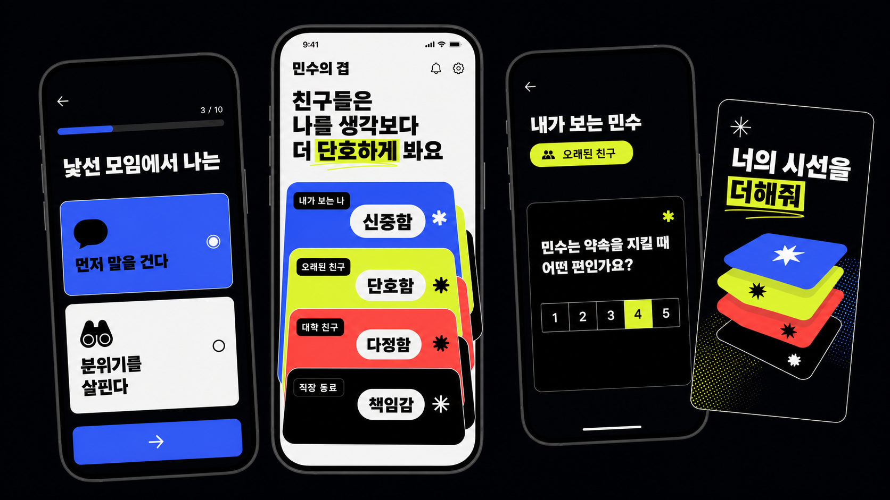
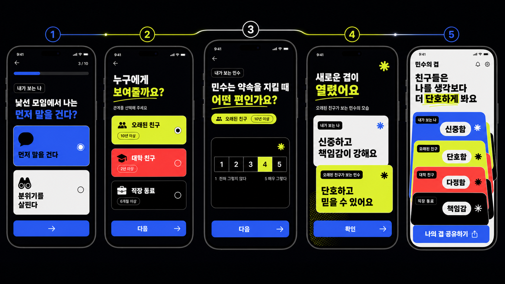
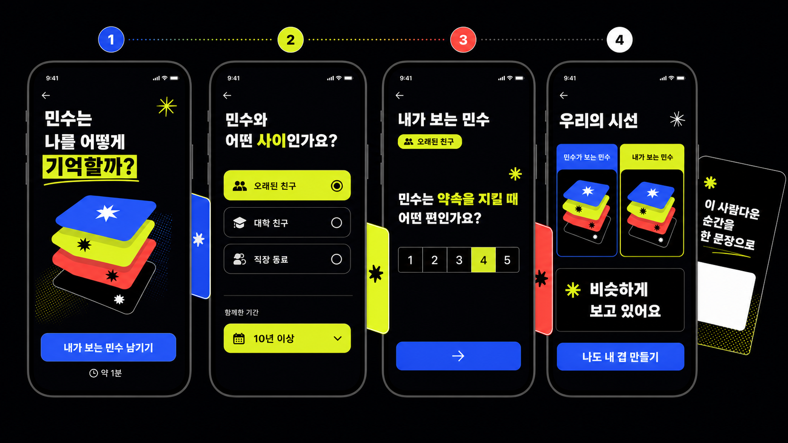
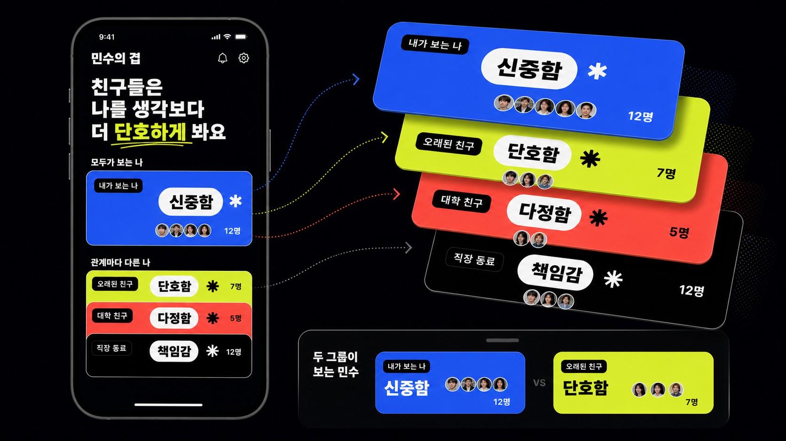
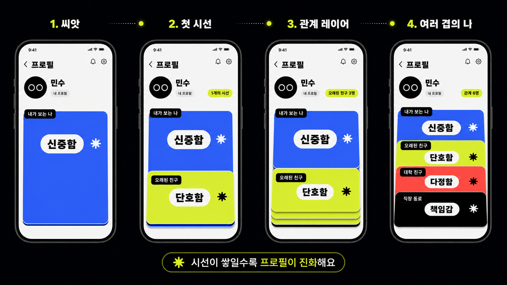
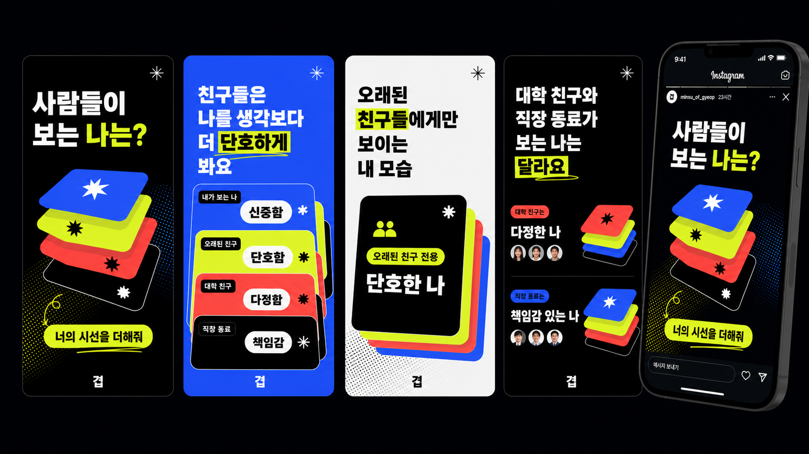

# 겹(GYEOP) — 살아 있는 소셜 프로필 풀 기획서

> **문서 상태:** Product Definition v1.0  
> **작성일:** 2026-07-15  
> **목적:** 제품·디자인·개발·베타 운영의 단일 기준 문서(SSOT)  
> **핵심 검증 단계:** 모바일 웹 MVP → 비공개 베타 → 공개 바이럴 테스트

---

## 0. Executive Summary

### 한 줄 정의

**겹은 내가 보는 나와, 나를 만난 사람들이 보는 나를 관계별로 쌓아 만드는 살아 있는 소셜 프로필이다.**

### 사용자에게 보여줄 문장

> 친구들은 나를 어떻게 보고 있을까?  
> 너의 시선이 쌓일수록, 내가 더 입체적으로 보여요.

### 핵심 경험

1. 사용자는 관찰 가능한 행동 질문 10개로 `내가 보는 나`를 만든다.
2. 오래된 친구·대학 친구·직장동료 등 관계별 링크를 공유한다.
3. 친구는 관계 맥락을 선택하고 같은 행동 질문에 `내가 보는 이 사람`으로 답한다.
4. 친구에게는 자기 시선과 주인의 자기인식이 어떻게 겹치고 다른지 즉시 보여준다.
5. 같은 관계의 시선이 3개 이상 쌓이면 관계 레이어가 열린다.
6. 주인의 프로필은 관계별 시선과 새로운 자기평가가 추가될수록 계속 진화한다.

### 가장 중요한 제품 결정

- `누가 나를 가장 잘 아는가`를 겨루는 정답 퀴즈가 아니다.
- 사람을 MBTI 같은 하나의 유형이나 평균 점수로 환원하지 않는다.
- 프로필 첫 화면의 중심은 타임라인이 아니라 **관계별 시선의 겹**이다.
- 시간은 `변화`를 탐색하는 보조 축으로 사용한다.
- 공유되는 것은 서비스 설명이 아니라 **사용자에 대한 흥미로운 한 문장**이다.
- 친구의 신원이나 개별 답변을 유료로 공개하지 않는다.



---

## 1. 문제와 기회

### 사용자가 가진 욕망

- 나는 다른 사람에게 어떤 사람으로 보이는지 알고 싶다.
- 내가 나를 이해하는 방식과 타인이 보는 방식의 차이가 궁금하다.
- 나를 설명할 수 있는 결과를 SNS에 공유하고 싶다.
- 친구에 대해 알고 있는 것을 표현하고 관계를 확인하고 싶다.
- 시간이 지나며 달라지는 나를 기록하고 싶다.

### 기존 서비스의 한계

`Who knows me best?` 계열 서비스는 보통 다음 흐름에 머문다.

`내 정답 입력 → 친구가 맞히기 → 점수/순위 → 종료`

BuddyMeter, BestieQuiz 같은 서비스가 이 구조를 이미 선점했다. 동일한 흐름으로는 복제 서비스로 보이기 쉽고, 친구의 참여 결과도 일회성 점수로 소진된다.

겹은 질문의 목적을 `정답 맞히기`에서 `관점 남기기`로 바꾼다. 참여할 때마다 사람에 대한 데이터가 관계 맥락과 함께 쌓이고, 프로필 자체가 더 풍부해진다는 점이 핵심 차별점이다.

### 제품 기회

- MBTI처럼 대화의 시작점이 되지만 고정 유형을 부여하지 않는다.
- SNS 프로필처럼 지속되지만 본인이 혼자 만드는 프로필이 아니다.
- 익명 질문처럼 호기심을 만들지만 공격적 메시지와 신원 추적을 핵심으로 삼지 않는다.
- 친구 퀴즈처럼 참여가 쉽지만 참여 후 데이터가 장기 자산으로 남는다.

---

## 2. 목표 사용자와 JTBD

### Primary Persona — 자기표현형 사용자

- 16–29세 중심, Instagram·TikTok·KakaoTalk 공유에 익숙함
- 성격 테스트, 밸런스 게임, 스토리 템플릿을 즐김
- 자신의 결과를 꾸미고 공유하는 행위 자체에서 만족을 얻음

**JTBD:** “친구들이 보는 나를 재미있고 예쁘게 확인하고, 내 SNS에서 나를 표현할 소재를 만들고 싶다.”

### Secondary Persona — 관계 확인형 친구

- 공유 링크를 통해 들어옴
- 가입 의도는 없지만 친구를 얼마나 알고 있는지 표현하고 싶음
- 1–2분 안에 재미있는 결과를 기대함

**JTBD:** “친구에게 내가 보는 너를 부담 없이 알려주고, 우리 관계에서만 보이는 모습을 확인하고 싶다.”

### Tertiary Persona — 기록형 사용자

- 시간이 지나며 프로필을 다시 채움
- 과거 친구와 현재 관계가 보는 자신의 차이에 관심이 있음

**JTBD:** “내가 어떻게 변했는지, 관계마다 어떤 모습으로 살아왔는지 기록하고 싶다.”

---

## 3. 제품 원칙

1. **체험이 가입보다 먼저다.** 첫 문항 전에 로그인하지 않는다.
2. **친구의 참여는 2분 안에 끝난다.** 관계 맥락 3–4탭 + 관찰 7문항이 기본이다.
3. **관점은 맞고 틀리지 않는다.** 결과 언어는 정답·오답 대신 겹침·차이를 사용한다.
4. **관계 맥락을 보존한다.** 오래된 친구와 직장동료의 답을 평균 하나로 합치지 않는다.
5. **공유 결과가 제품의 얼굴이다.** 내부 대시보드보다 공유 카드 완성도를 먼저 높인다.
6. **첫 가치 경험은 무료다.** 친구 결과를 보기 전 광고·결제 장벽을 두지 않는다.
7. **개별 시선은 기본 비공개다.** 3명 이상 집계와 명시적 동의가 있어야 공개한다.
8. **100문항은 시작점이 아니라 누적 결과다.** 첫 방문에는 10문항만 제공한다.
9. **재현 가능한 규칙을 우선한다.** MVP 결과는 AI 심리분석이 아니라 결정론적 계산으로 만든다.
10. **재미보다 안전을 희생하지 않는다.** 신원 공개 판매, 비교 순위, 공격적 익명 메시지를 배제한다.

---

## 4. 제품 언어와 핵심 개념

| 개념 | 정의 | 사용자 표현 |
|---|---|---|
| Self View | 사용자의 자기평가 스냅샷 | 내가 보는 나 |
| Observation | 친구 한 명이 남긴 맥락 있는 관찰 | 하나의 시선 |
| Relation Layer | 같은 관계군 3명 이상의 집계 | 오래된 친구가 보는 나 |
| Perspective Stack | 자기인식과 관계별 레이어가 겹친 프로필 핵심 시각화 | 나의 겹 |
| Memory Fragment | 친구가 선택적으로 남긴 한 줄 기억 | 기억 조각 |
| Snapshot | 특정 시점의 프로필 상태 | 2026년 여름의 나 |
| Evolution | 새 시선·새 자기평가로 프로필이 달라지는 과정 | 겹이 쌓였어요 |

### 금지하거나 피할 표현

- `진짜 성격`, `정확한 분석`, `심리 진단`
- `친구가 틀렸어요`, `나를 잘 모름`
- `누가 썼는지 결제하고 확인`
- `최고의 친구 순위`, `친밀도 점수`
- MBTI 문자 조합과 유사한 고정 유형명

### 권장 결과 표현

- “서로 비슷하게 보고 있어요.”
- “친구들은 이 모습을 조금 더 강하게 보고 있어요.”
- “관계에 따라 다른 모습이 보여요.”
- “오래된 친구들에게만 보이는 모습이에요.”
- “아직 시선이 더 필요해요.”

---

## 5. 전체 사용자 흐름

```text
랜딩
  ↓
셀프 평가 10문항
  ↓
씨앗 프로필 생성
  ↓
관계 그룹 선택 + 전용 링크 공유
  ↓
친구 링크 진입
  ↓
관계 맥락 입력
  ↓
내가 보는 이 사람 7문항
  ↓
선택적 기억 한 문장
  ↓
친구 즉시 비교 결과
  ├─ 친구도 자기 겹 만들기
  └─ 링크 추가 공유
  ↓
주인에게 새 시선 알림
  ↓
동일 관계 3명 이상 시 레이어 해금
  ↓
공개 범위 선택
  ↓
새 인사이트 카드 공유
  ↓
새로운 친구 유입 → 프로필 지속 진화
```



---

## 6. 화면별 상세 요구사항

### 6.1 랜딩

**목표:** 설명보다 결과에 대한 호기심을 만든다.

- Hero: 실제 공유 카드 예시
- 카피: `사람들이 보는 나는?`
- 보조 문구: `10개의 질문으로 내가 보는 나를 만들고, 친구들의 시선을 더해보세요.`
- CTA: `내가 보는 나 만들기`
- 메타: `약 2분 · 가입 없이 시작`
- 금지: 첫 화면에서 100문항, 결제, 광고, 심리 정확도 언급

### 6.2 시작 정보

- 닉네임
- 프로필 이미지 선택 사항
- 연령 확인 또는 최소 연령 정책 동의
- 서비스 공개 방식과 삭제 가능성에 대한 한 문장 안내
- 계정 생성 없이 익명 세션으로 시작

### 6.3 셀프 평가 10문항

**UX 원칙:** 한 화면 한 문항, 큰 터치 영역, 진행률 상시 표시, 자동 저장.

- 진행률 `3 / 10`
- 5단계 양극 척도 또는 두 행동 카드 사이 연속 선택
- 뒤로 가기 시 이전 선택 유지
- 중단 후 동일 기기에서 이어쓰기
- 10문항 완료 후 1초 이내 결과 화면 전환

### 6.4 씨앗 프로필

친구 시선이 아직 없는 상태다.

- Hero: `내가 보는 나`
- 대표 인사이트 1문장
- 자기평가 핵심 특성 3개
- 비어 있는 관계 레이어 슬롯 3개
- CTA: `친구의 시선 더하기`
- 빈 상태 문구: `시선이 쌓이면 관계마다 다른 내가 보여요.`

### 6.5 관계 그룹 선택과 공유

기본 그룹:

- 오래된 친구
- 학교·대학 친구
- 직장동료
- 온라인 친구
- 가족
- 연인·파트너
- 직접 만들기(공개 라벨 검토 필요)

각 그룹은 별도 초대 토큰을 만든다. 링크 미리보기와 공유 카드의 문구도 관계에 맞춰 달라진다.

공유 방식 우선순위:

1. OS 공유 시트
2. KakaoTalk 공유
3. Instagram Story용 이미지 저장
4. 링크 복사

### 6.6 친구 진입

- 주인의 공개 프로필 일부와 공유 카드 노출
- 예상 소요 시간 `약 1분`
- 익명 또는 이름 공개 선택은 답변 완료 시점에 받음
- CTA: `내가 보는 민수 남기기`
- 로그인 요구 없음

### 6.7 관계 맥락 입력

정확한 학교명·회사명·날짜는 수집하지 않는다.

**처음 알게 된 시기**

- 초등학교 이전
- 중·고등학교
- 대학·학교 이후
- 첫 직장 전후
- 최근 3년
- 온라인에서
- 기억나지 않음

**관계 유형**

- 친구 / 학교 / 직장 / 가족 / 연인·파트너 / 온라인 / 기타

**알고 지낸 기간**

- 1년 미만 / 1–3년 / 4–9년 / 10년 이상

**현재 친밀도**

- 가끔 소식만 아는 사이
- 가끔 연락하는 사이
- 자주 연락하거나 만나는 사이
- 무엇이든 말할 수 있는 사이

### 6.8 친구 관찰 7문항

- 셀프 평가와 동일한 행동 차원 사용
- 질문은 3인칭이 아니라 친구 관점의 자연스러운 2인칭·이름형 문장
- 주인의 셀프 답변은 제출 전 공개하지 않음
- 정답을 맞히는 느낌이 아니라 관찰을 남기는 느낌의 카피 사용

### 6.9 선택적 기억 한 문장

- 프롬프트: `이 사람다운 순간이 있다면 한 문장으로 남겨주세요.`
- 건너뛰기 가능
- 작성자는 공개 동의 여부 선택
- 프로필 주인은 공개 전 승인
- 신고 및 자동 금칙어 검사
- MVP에서는 최대 120자

### 6.10 친구 즉시 결과

- `내가 보는 민수` vs `민수가 보는 민수`
- 가장 비슷한 차원 1개
- 가장 다른 차원 1개
- 언어: `비슷하게 봤어요`, `조금 다르게 보고 있어요`
- 개인 응답은 주인 공개 프로필에 자동 노출하지 않음
- CTA 1: `나도 내 겹 만들기`
- CTA 2: `다른 친구에게 보내기`



### 6.11 프로필 메인 — 나의 겹

타임라인을 기본 화면으로 사용하지 않는다.

1. **Hero Insight**  
   예: `친구들은 나를 생각보다 더 단호하게 봐요.`
2. **Perspective Stack**  
   가운데 `내가 보는 나`, 주변에 `오래된 친구`, `대학 친구`, `직장동료` 레이어가 겹쳐진다.
3. **모두가 보는 나**  
   관계군 전체에서 일관된 특성 2–3개.
4. **관계마다 다른 나**  
   분산이 큰 특성 1–2개와 관계 비교 진입점.
5. **새로 쌓인 시선**  
   개별 내용이 아닌 새 레이어·새 인사이트 중심 알림.
6. **다음 진화 CTA**  
   `직장동료 시선 1개만 더 받으면 새 겹이 열려요.`

하위 탐색 탭:

- `나의 겹` — 기본, 전체상
- `관계별` — 관계군 상세 비교
- `변화` — 자기평가와 관계 관점의 시간 변화
- `기억` — 승인된 기억 조각



### 6.12 변화 탭

시간은 전체 프로필을 대신하지 않고 변화 탐색에 사용한다.

- 셀프 평가 스냅샷 변화
- 새 관계 레이어가 열린 시점
- 과거 친구와 최근 친구의 관점 차이
- 사용자가 공개를 승인한 주요 인사이트 기록
- 최소 데이터가 없을 때는 타임라인을 억지로 만들지 않음

---

## 7. 질문 시스템

### 질문 설계 원칙

- 가치 판단보다 관찰 가능한 행동을 묻는다.
- 어느 쪽을 선택해도 부정적으로 느껴지지 않게 양극을 구성한다.
- 의료·정신건강·정치·종교·성생활·재산 등 민감정보는 기본팩에서 제외한다.
- 계정 복구 질문에 쓰일 법한 이름·학교·반려동물·가족정보를 묻지 않는다.
- 질문은 문화권에 따라 해석이 크게 달라지지 않도록 구체적 상황을 제시한다.

### 셀프 평가 10개 차원

| 차원 | 왼쪽 행동 | 오른쪽 행동 |
|---|---|---|
| 낯선 관계 | 먼저 말을 건다 | 분위기를 먼저 살핀다 |
| 감정 표현 | 표정과 말로 드러낸다 | 혼자 정리한 뒤 말한다 |
| 계획 | 즉흥적으로 움직인다 | 미리 계획한다 |
| 갈등 | 바로 이야기한다 | 시간을 두고 이야기한다 |
| 위로 | 해결책을 함께 찾는다 | 먼저 감정을 들어준다 |
| 책임 | 유연하게 조정한다 | 끝까지 지키려 한다 |
| 자기개방 | 금방 나를 보여준다 | 천천히 마음을 연다 |
| 변화 | 익숙함을 선호한다 | 새로운 시도를 즐긴다 |
| 연락 | 생각날 때 몰아서 한다 | 꾸준히 먼저 연락한다 |
| 관계 폭 | 넓게 여러 사람과 지낸다 | 적은 사람과 깊게 지낸다 |

### 친구용 7개 차원

첫 MVP에서는 셀프 10개 중 다음 7개를 사용한다.

- 낯선 관계
- 감정 표현
- 계획
- 갈등
- 위로
- 책임
- 자기개방

선정 기준은 친구가 외부에서 관찰하기 쉽고 관계별 차이가 나타날 가능성이 높은가이다.

### 결과 계산

- 각 문항은 1–5 값으로 정규화한다.
- 셀프 값과 관찰 값의 차이를 차원별로 계산한다.
- 관계 레이어는 최소 3명의 중앙값을 기본값으로 사용한다.
- 극단값의 영향을 줄이기 위해 평균보다 중앙값을 우선한다.
- `공통으로 보는 나`는 관계군 간 편차가 낮고 응답 신뢰 기준을 통과한 차원이다.
- `관계마다 다른 나`는 관계군 간 차이가 충분하고 각 그룹이 3명 이상인 차원이다.
- 결과 문구는 사전에 검수된 템플릿으로 생성한다.

MVP에서는 AI로 성격을 추론하지 않는다. 이후 AI를 사용하더라도 원문 자유응답을 무단 학습하거나 심리 진단처럼 표현하지 않는다.

---

## 8. 프로필 진화 규칙

### Stage 0 — 씨앗

- 조건: 셀프 평가 10개 완료
- 공개: 내가 보는 나
- CTA: 첫 관계 링크 공유

### Stage 1 — 첫 시선

- 조건: 첫 친구 관찰 완료
- 공개: 주인에게만 1:1 비교
- 외부 프로필에는 개인 답변 비공개

### Stage 2 — 관계 레이어

- 조건: 동일 관계 그룹 3명 이상
- 공개: 그룹 집계 결과, 주인 승인 필요
- 예: `오래된 친구들이 보는 나`

### Stage 3 — 여러 겹의 나

- 조건: 3명 이상인 관계 그룹 2개 이상
- 공개: 관계 비교와 `관계마다 다른 나`

### Stage 4 — 변화하는 나

- 조건: 일정 기간 후 셀프 평가 재실행 또는 새로운 시기 데이터 축적
- 공개: 스냅샷 비교, 변화 인사이트

### 신선도 정책

- 셀프 평가는 90일 이후 재평가를 제안하되 강제하지 않는다.
- 오래된 관찰을 삭제하지 않고 작성 시점과 맥락을 보존한다.
- 기본 프로필 인사이트는 최근 자기평가와 유효 관찰을 함께 사용한다.
- 사용자가 특정 시점 스냅샷을 저장하고 공유할 수 있다.



---

## 9. 공유와 바이럴 설계

### 핵심 원칙

공유 카드의 주어는 `겹`이 아니라 사용자다.

좋은 예:

- `친구들은 나를 생각보다 더 단호하게 봐요.`
- `오래된 친구들에게만 보이는 내 모습은?`
- `대학 친구와 직장동료가 보는 나는 이렇게 달라요.`

나쁜 예:

- `겹에서 성격 테스트를 해보세요.`
- `친구 맞히기 퀴즈 7문항.`

### 공유 카드 유형

1. **씨앗 카드** — 내가 보는 나 3가지
2. **시선 모집 카드** — `너의 시선을 더해줘`
3. **첫 차이 카드** — 셀프 vs 친구 관점
4. **관계 레이어 카드** — 오래된 친구들이 보는 나
5. **관계 비교 카드** — 대학 vs 직장
6. **공통 인식 카드** — 모두가 공통으로 보는 나
7. **변화 카드** — 과거의 나 vs 지금의 나

### 공유 카드 디자인 원칙

- 9:16 Instagram Story 우선, 1:1 및 OG 비율 파생
- 한 장에 한 문장만 크게 노출
- 검정·화이트 기반, 코발트·애시드 라임·코랄 포인트
- Perspective Stack을 대표 브랜드 그래픽으로 사용
- 작은 설명문과 통계는 최소화
- 닉네임·프로필 이미지 공개 여부 선택
- 공유 전 미리보기와 공개 범위 확인



### 바이럴 루프

**Loop A — 자기표현**  
셀프 평가 → 씨앗 카드 → 공유 → 친구 유입

**Loop B — 관계 호기심**  
친구 관찰 → 즉시 비교 → 친구도 자기 프로필 생성

**Loop C — 레이어 완성**  
`1명만 더 필요` → 관계 타깃 재공유 → 레이어 해금

**Loop D — 새로운 인사이트**  
새 시선 축적 → 주인 재방문 → 승인 → 새 카드 공유

**Loop E — 시간**  
재평가 알림 → 변화 카드 → 과거 관계 재유입

---

## 10. 알림과 재방문

### MVP 알림

- 웹 푸시는 첫 버전에서 제외 가능
- 링크·이메일 계정 연결 후 이메일 요약 선택 제공
- 서비스 내 알림함 우선

### 알림 트리거

- 새 시선 1개 도착
- 관계 레이어 해금
- 새로운 공통점·차이 발견
- 기억 조각 승인 대기
- 셀프 평가 재실행 가능

### 알림 문구 원칙

- 개인 신원을 미끼로 사용하지 않는다.
- `누가 이런 답을 했을까요?` 같은 불안 유도 금지
- 발견된 가치와 다음 행동을 구체적으로 표현

예: `오래된 친구 시선이 3개 쌓여 새 겹이 열렸어요.`

---

## 11. 공개 범위와 안전

### 기본 공개 정책

- 개별 관찰 답변: 주인에게만 공개
- 관계 집계: 최소 3명, 주인 승인 후 공개
- 기억 조각: 작성자 공개 동의 + 주인 승인
- 기여자 이름: 기여자가 명시적으로 선택한 경우만 표시
- 프로필 검색 노출: 기본 OFF
- 공유 링크: 추측하기 어려운 토큰 사용

### 삭제 권리

- 주인: 프로필·셀프 답변·공개 카드 전체 삭제
- 기여자: 자신이 남긴 관찰과 기억 철회
- 삭제 요청은 집계 결과에 즉시 반영
- 계정 삭제 후 보관 기간과 완전 삭제 시점을 정책에 명시

### 안전 장치

- 자유응답 신고와 차단
- 기본 금칙어·링크 제한
- IP·기기·초대 토큰 단위 요청 제한
- CAPTCHA 또는 동등한 봇 방지
- 동일 기여자의 중복 제출 방지
- 미성년자 대상 광고·결제·데이터 처리 별도 검토
- 위협·혐오·성적 괴롭힘 신고 우선 처리

### 절대 하지 않을 것

- 결제하면 작성자 신원 공개
- 개별 친구의 답변을 공개 프로필에 자동 노출
- 친밀도 순위나 최악의 친구 선정
- 민감한 자유질문을 익명으로 수집
- 데이터가 부족한데 심리학적 확정 표현 사용

---

## 12. 수익화 전략

### 원칙

사용자가 돈을 내는 대상은 `친구의 비밀`이 아니라 `자기 기록의 확장과 표현`이어야 한다.

### 무료 핵심 경험

- 셀프 평가와 씨앗 프로필
- 관계별 링크 공유
- 친구 관찰 참여
- 첫 관계 레이어 해금
- 기본 공유 카드
- 삭제·공개 설정·신고

### 유료 후보

1. **프로필 아카이브** — 과거 스냅샷과 변화 비교 장기 보관
2. **Deep View** — 관계군이 충분할 때 더 세밀한 비교 필터
3. **공유 테마 팩** — 시즌·컬러·타이포 그래픽
4. **질문 팩** — 연애, 여행, 팀, 졸업 등 명확한 테마
5. **그룹 리캡** — 친구 모임·졸업·연말 단위 공동 결과
6. **기념 스냅샷** — 다운로드 가능한 고해상도 연간 리포트

### 광고 원칙

- 친구가 링크에 들어온 직후와 응답 도중에는 광고를 넣지 않는다.
- 첫 결과 확인을 광고 시청으로 막지 않는다.
- 보상형 광고를 도입한다면 꾸미기 테마 등 비핵심 보상에만 사용한다.
- 타기팅에 관찰 원문·민감 추론 데이터를 사용하지 않는다.

### 실험 순서

1. 바이럴과 재방문을 먼저 검증
2. 공유 테마 1회 구매 의향 조사
3. 변화 아카이브 구독 의향 조사
4. 실제 결제는 반복 사용 신호가 나온 뒤 도입

초기 가격은 확정하지 않는다. 인터뷰와 결제 의향 테스트에서 1회 구매와 월 구독을 비교한다.

---

## 13. MVP 범위

### Must Have

- 모바일 우선 반응형 웹/PWA
- 닉네임 기반 익명 시작
- 셀프 평가 10문항, 자동 저장, 이어쓰기
- 씨앗 프로필
- 관계 그룹 선택과 관계별 초대 링크
- 친구 관계 맥락 입력
- 친구 관찰 7문항
- 선택적 기억 한 문장
- 친구 즉시 비교 결과
- 새 시선 주인 확인
- 동일 관계 3명 이상 집계
- Perspective Stack 기반 프로필 메인
- 기본 공유 카드와 동적 OG 이미지
- OS 공유, 링크 복사, 이미지 저장 폴백
- 공개 범위 설정
- 기여 철회·프로필 삭제·신고
- 요청 제한과 기본 운영 도구
- 핵심 퍼널 이벤트 수집

### Should Have

- 카카오 공유 최적화
- 이름 공개/익명 선택
- 관계 레이어 해금 알림
- 프로필 계정 연결
- 기억 조각 승인함
- 9:16 공유 카드 생성

### 첫 출시 제외

- 광고와 결제
- 100문항 일괄 작성
- 네이티브 iOS·Android 앱
- 피드, 팔로우, 댓글, DM
- 익명 자유질문
- AI 성격 분석
- MBTI 유사 유형명
- 친구 순위·정답 점수
- 커플 궁합 및 브랜드 협찬 질문팩
- 공개 사용자 검색

### 첫 Vertical Slice

`셀프 10문항 → 씨앗 프로필 → 오래된 친구 링크 → 관계 맥락 → 친구 7문항 → 즉시 비교 → 첫 비공개 시선 도착`

이 흐름이 실제 모바일에서 끊김 없이 작동하기 전에는 추가 기능을 만들지 않는다.

---

## 14. 정보 구조와 내비게이션

### 프로필 주인 하단 탭

- 홈/새 소식
- 참여 요청
- `나의 겹`
- 탐색 또는 질문팩(후순위)
- 설정

MVP에서는 탭을 줄여 `나의 겹`, `새 시선`, `설정` 3개로 시작해도 된다.

### 친구 링크 내비게이션

공유 링크 진입에서는 앱 전체 내비게이션을 감춘다.

`공개 프로필 미리보기 → 관계 맥락 → 관찰 → 결과 → 내 겹 만들기`

이 단일 과업에만 집중한다.

---

## 15. 비주얼 방향

### 브랜드 키워드

- 겹침
- 관계
- 솔직함
- 발견
- 에너지
- 공유하고 싶은 자기표현

### 디자인 시스템 방향

- Base: Near Black, White
- Primary: Electric Cobalt
- Accent: Acid Lime, Hot Coral
- Typography: 굵고 짧은 헤드라인 + 높은 가독성의 본문 산세리프
- Shape: 겹쳐진 카드, 오프셋 레이어, 스택
- Motion: 레이어가 하나씩 쌓이고 정렬되며 새로운 문장이 나타남

### 피해야 할 방향

- 차분한 베이지 라이프스타일 앱
- 심리상담·의료 앱처럼 보이는 그래프
- MBTI 테스트형 파스텔 카드
- 레이더 차트와 점수 대시보드
- 캐릭터와 귀여운 일러스트 중심
- 복잡한 6개 휴대폰 설명 보드

---

## 16. 권장 기술 구조

### 애플리케이션

- Next.js App Router + TypeScript
- 모바일 우선 반응형 웹, 설치 가능한 PWA 고려
- 서버 컴포넌트와 API Route/Server Actions를 단일 저장소에서 운영
- 동적 Open Graph 및 공유 이미지 생성

### 데이터와 인증

- Supabase Auth + PostgreSQL
- 익명 인증으로 시작 후 소셜·이메일 계정에 연결
- Row Level Security를 데이터 접근의 기본 경계로 사용
- 초대 토큰은 원문 저장 대신 해시 저장 고려

### 운영

- Vercel 또는 동등한 관리형 배포
- Sentry 또는 동등한 오류 추적
- 초기 이벤트는 자체 이벤트 테이블 또는 경량 분석 도구
- 트래픽 증가 후 전문 분석 도구로 이동
- 자유응답 검수와 신고 처리를 위한 최소 운영 화면

### 성능 기준

- 첫 화면 LCP 모바일 2.5초 이내 목표
- 질문 다음 화면 전환 150ms 이내 체감
- 답변 저장 실패 시 로컬 큐와 재시도
- 공유 링크 서버 응답 500ms 이내 목표
- 프로필 집계는 캐시 가능하되 삭제·철회 시 즉시 무효화

---

## 17. 데이터 모델 초안

### `profiles`

- `id`, `owner_user_id`
- `slug`, `nickname`, `avatar_url`
- `status`: draft / published / deleted
- `search_visibility`
- `created_at`, `published_at`, `deleted_at`

### `self_snapshots`

- `id`, `profile_id`, `version`
- `status`, `completed_at`
- `is_current`

### `questions`

- `id`, `pack_key`, `dimension_key`
- `self_prompt`, `observer_prompt`
- `left_label`, `right_label`
- `sort_order`, `active`

### `self_answers`

- `snapshot_id`, `question_id`
- `value_1_to_5`
- `answered_at`

### `share_invites`

- `id`, `profile_id`
- `relation_group_key`
- `token_hash`, `status`
- `created_at`, `expires_at`

### `observations`

- `id`, `profile_id`, `invite_id`
- `contributor_user_id` nullable
- `contributor_display_mode`: anonymous / named
- `relation_type`, `met_stage`, `known_duration`, `current_closeness`
- `visibility_consent`
- `status`: submitted / withdrawn / moderated
- `created_at`, `withdrawn_at`

### `observation_answers`

- `observation_id`, `question_id`
- `value_1_to_5`

### `memory_fragments`

- `id`, `observation_id`, `text`
- `contributor_public_consent`
- `owner_approval_status`
- `moderation_status`

### `relation_layers`

- `profile_id`, `relation_group_key`
- `eligible_observation_count`
- `aggregate_json`, `version`
- `unlocked_at`, `owner_publication_status`

### `profile_visibility`

- `profile_id`
- `show_self_view`, `show_common_view`, `show_relation_layers`
- `show_memories`, `show_change_history`

### `reports`

- `id`, `reporter_session_id`
- `target_type`, `target_id`, `reason`, `details`
- `status`, `created_at`, `resolved_at`

### `events`

- `anonymous_session_id`, `user_id` nullable
- `event_name`, `profile_id` nullable, `invite_id` nullable
- `properties_json` — 자유응답 원문 저장 금지
- `occurred_at`

---

## 18. 핵심 이벤트와 지표

### 이벤트

- `landing_viewed`
- `self_assessment_started`
- `self_question_answered`
- `self_assessment_completed`
- `seed_profile_viewed`
- `relation_invite_created`
- `share_clicked`
- `share_link_opened`
- `relationship_context_completed`
- `observation_started`
- `observation_completed`
- `friend_result_viewed`
- `referred_profile_started`
- `referred_profile_completed`
- `relation_layer_unlocked`
- `owner_insight_viewed`
- `profile_card_shared`
- `memory_submitted`
- `memory_approved`
- `observation_withdrawn`
- `profile_deleted`
- `report_submitted`

### North Star 후보

**주간 활성 프로필당 유효 시선 수**  
단순 방문이 아니라 프로필을 실제로 진화시키는 행동을 측정한다.

### 핵심 퍼널

1. 랜딩 → 셀프 평가 시작
2. 시작 → 10문항 완료
3. 완료 → 관계 링크 공유
4. 링크 방문 → 친구 관찰 완료
5. 친구 완료 → 친구 자신의 프로필 시작
6. 시선 축적 → 관계 레이어 해금
7. 해금 → 새로운 카드 재공유

### 초기 내부 통과 기준

업계 평균이 아니라 MVP go/no-go를 위한 가설이다.

- 셀프 평가 시작자 중 완료율 65% 이상
- 셀프 평가 완료 시간 중앙값 3분 이하
- 씨앗 프로필 생성자 중 공유 행동률 30% 이상
- 공유 링크 방문자 중 친구 관찰 완료율 40% 이상
- 친구 관찰 완료 시간 중앙값 2분 이하
- 친구 완료자 중 자기 프로필 시작률 20% 이상
- 프로필당 7일 내 유효 시선 중앙값 2개 이상
- 프로필 중 7일 내 관계 레이어 해금률 20% 이상
- 레이어 해금 사용자 중 재공유율 25% 이상

### 안전 지표

- 신고율과 사유
- 기억 조각 거절률
- 관찰 철회율
- 공개 범위 관련 고객 문의
- 자동 차단 오탐률
- 미성년자 관련 신고

안전 지표가 악화되면 바이럴 실험보다 안전 개선을 우선한다.

---

## 19. 개발 단계와 일정

### Phase 0 — 제품 확정, 2–3일

- 질문 10개와 친구용 7개 문구 확정
- 결과 계산·문구 템플릿 확정
- 공개·삭제·철회 정책 확정
- 이벤트 이름과 계산식 확정
- 핵심 화면 와이어 확정

**완료 조건:** 같은 입력이 같은 결과를 만들고, 화면·데이터·이벤트가 서로 매핑되어 있다.

### Phase 1 — 클릭 프로토타입, 3–4일

- 랜딩
- 셀프 10문항
- 씨앗 프로필
- 관계 링크 공유
- 친구 7문항
- 즉시 결과
- 프로필 Perspective Stack
- Instagram Story 카드

**검증:** 사용자 10명 중 8명 이상이 설명 없이 완료, 6명 이상이 실제 공유 의향 표현.

### Phase 2 — Vertical Slice, 7–10일

- 익명 인증
- 질문·답변 저장
- 관계 초대 링크
- 친구 관찰 저장
- 1:1 비교
- 주인에게 첫 시선 표시
- 삭제·철회·신고 기초
- 퍼널 이벤트

**완료 조건:** 서로 다른 기기에서 전체 흐름 E2E 통과.

### Phase 3 — 관계 레이어 MVP, 5–7일

- 3명 기준 집계
- 프로필 메인
- 관계별 상세
- 공개 승인
- 공유 이미지 생성
- 운영자 신고 처리

### Phase 4 — 비공개 베타, 1주

- 서로 다른 최소 5개 친구 집단
- 시드 사용자 50–100명
- 기능 추가 없이 퍼널·인터뷰 관찰
- 가장 큰 이탈 지점 한 곳씩 개선

### Phase 5 — 공개 바이럴 테스트, 1–2주

- 공유 카드 2–3개 크리에이티브 비교
- 관계 초대 문구 비교
- 친구 결과 → 자기 프로필 CTA 비교
- 광고비보다 자연 공유 계수 우선 측정

---

## 20. QA 및 출시 체크리스트

### 기능 QA

- 익명 시작과 계정 연결
- 중단 후 이어쓰기
- 중복 제출 방지
- 관계 링크별 그룹 귀속
- 3명 미만 비공개
- 관찰 철회 시 집계 재계산
- 주인 삭제 시 공유 링크 무효화
- 공유 이미지와 OG 메타
- Web Share 미지원 폴백
- 신고·차단 처리

### 권한 QA

- 타인의 개별 관찰 조회 불가
- 초대 토큰 추측 방지
- RLS 정책 자동 테스트
- 운영자 권한 분리
- 로그와 분석 이벤트에 자유응답 원문 미포함

### 모바일 QA

- iOS Safari
- Android Chrome
- KakaoTalk 인앱 브라우저
- Instagram 인앱 브라우저
- 작은 화면과 큰 글자 설정
- 키보드·Safe Area·뒤로 가기

### 접근성 QA

- 색만으로 관계군을 구분하지 않음
- 44px 이상 터치 영역
- 명확한 포커스와 스크린리더 라벨
- 텍스트 대비 기준 충족
- 모션 감소 설정 지원

### 출시 Gate

- 핵심 E2E 전체 통과
- 삭제·철회·신고 흐름 통과
- 분석 이벤트 누락률 1% 미만
- 개인정보 처리방침·이용약관·커뮤니티 가이드 준비
- 장애 대응과 롤백 경로 준비

---

## 21. 주요 리스크와 대응

| 리스크 | 징후 | 대응 |
|---|---|---|
| BuddyMeter 복제품으로 인식 | 점수·맞히기만 언급됨 | 모든 카피와 결과를 관점 축적 중심으로 유지 |
| 친구 참여 부담 | 관계 입력 또는 7문항 이탈 | 1분 목표, 문항 축소 실험, 가입 제거 |
| 결과가 뻔함 | 공유율·재방문 저조 | 관계군 차이를 전면에, 한 문장 품질 개선 |
| 응답자 3명 확보 어려움 | 레이어 해금률 저조 | 진행 상태와 관계별 타깃 공유 문구 제공 |
| 익명성 악용 | 신고·철회 증가 | 자유응답 선택, 금칙어, rate limit, 빠른 철회 |
| 사용자 상처 | 부정적 결과 문의 | 가치중립 질문, 점수 제거, 표현 가이드 검수 |
| 개인정보 노출 | 학교·회사 실명 입력 | 구조화된 범주만 수집, 자유입력 최소화 |
| 공유 카드가 광고처럼 보임 | 링크 CTR 저조 | 사용자 인사이트를 주어로, 브랜드 표시는 작게 |
| 일회성 유행 | 30일 재방문 저조 | 새 시선·새 관계·시간 변화로 재방문 이유 설계 |
| 수익화 반감 | 결제 화면 이탈·부정 피드백 | 핵심 결과 무료, 꾸미기·아카이브에만 과금 |

---

## 22. 의사결정 백로그

개발 전에 반드시 결정:

- 제품명 `겹`의 상표·도메인·해외 발음 검토
- 최소 이용 연령과 미성년자 정책
- 프로필 링크 만료·재발급 정책
- 기여자가 주인에게 보이는 범위
- 관계 그룹 직접 만들기 허용 여부
- 셀프 재평가 주기
- 기억 조각 운영 수준
- 계정 연결 방식과 복구
- 데이터 보관·완전 삭제 기간

베타 후 결정:

- 네이티브 앱 필요성
- 유료 테마와 아카이브
- 추가 질문팩
- 그룹 리캡
- 해외 버전과 관계 분류 현지화
- AI 요약 도입 여부

---

## 23. 베타 사용자 인터뷰 질문

1. 결과에서 가장 먼저 본 것은 무엇이었나?
2. 이 결과가 나를 잘 설명한다고 느꼈나? 왜 그런가?
3. 누구에게 링크를 보내고 싶었나? 보내기 싫었던 이유는?
4. 친구 입장에서 답변하기 어려웠던 문항은?
5. 관계 맥락 질문 중 불편하거나 애매한 것은?
6. `3명이 쌓이면 열린다`는 규칙을 이해했나?
7. 개별 답변과 집계 결과의 공개 범위를 예상할 수 있었나?
8. 다시 방문한다면 어떤 계기일 것 같나?
9. 공유 카드 중 실제 스토리에 올리고 싶은 것은?
10. 돈을 낸다면 친구의 정보가 아닌 어떤 확장 기능에 낼 의향이 있나?

---

## 24. 최종 제품 판단 기준

겹의 성공은 사람들이 테스트를 몇 번 실행했는지가 아니라 다음 세 가지로 판단한다.

1. **표현:** 사용자가 결과를 자신의 이야기로 느끼고 실제 SNS에 공유하는가?
2. **관계:** 친구가 단순 열람을 넘어 자신의 시선을 남기는가?
3. **축적:** 시선이 쌓이면서 사용자가 다시 돌아올 만큼 프로필이 새로워지는가?

이 세 가지가 반복되면 겹은 일회성 친구 퀴즈가 아니라, 사람들이 관계 속에서 함께 만드는 새로운 형태의 소셜 프로필이 된다.

---

## 부록 A. 핵심 카피 초안

### 랜딩

- `사람들이 보는 나는?`
- `내가 보는 나를 만들고, 친구들의 시선을 더해보세요.`
- CTA: `내 겹 만들기`

### 친구 초대

- `오래전부터 나를 본 너는, 나를 어떻게 기억해?`
- `회사에서의 나는 어떤 사람 같아?`
- `네가 보는 내 모습을 1분만에 남겨줘.`

### 해금

- `오래된 친구들의 시선이 하나의 겹이 되었어요.`
- `대학 친구 시선이 1개만 더 쌓이면 새 겹이 열려요.`

### 결과

- `친구들은 나를 생각보다 더 단호하게 봐요.`
- `모두가 공통으로 보는 나는 믿음직한 사람이에요.`
- `오래된 친구들에게는 다정하게, 직장에서는 신중하게 보여요.`

### 공유 CTA

- `너의 시선을 더해줘`
- `내 겹에 네가 보는 나를 남겨줘`

---

## 부록 B. 한 페이지 MVP 요약

**가설:** 자기인식과 관계별 타인인식의 차이는 공유할 가치가 있으며, 친구의 참여가 프로필을 실제로 진화시키면 반복 바이럴이 발생한다.

**최소 경험:**  
`셀프 10 → 공유 → 친구 맥락 + 7 → 비교 → 시선 축적 → 3명 레이어 → 재공유`

**만들지 않을 것:**  
친구 점수, 순위, 신원 판매, 익명 자유질문, 광고·결제, 피드, DM, AI 심리진단.

**가장 중요한 화면:**  
관계별 Perspective Stack과 한 문장 인사이트가 보이는 `나의 겹` 프로필.

**가장 중요한 지표:**  
주간 활성 프로필당 유효 시선 수와 7일 내 관계 레이어 해금률.

**첫 개발 목표:**  
설명 없이 2분 안에 완료되고, 실제 친구에게 보내고 싶은 모바일 Vertical Slice.
