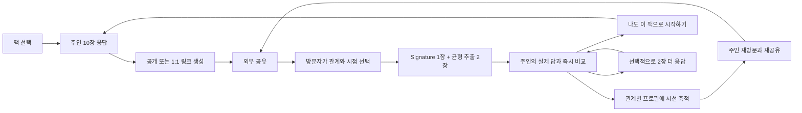

# 겹(GYEOP) 전체 제품 기획 v2.2

> 작성일: 2026-07-15
> 상태: 활성 SSOT를 종합한 장기 제품 기획
> 목적: 제품의 문제, 사용자, 핵심 루프, 단계별 범위, 안전 기준, 지표와 실행 순서를 한 문서에서 이해하게 한다.

## 0. 문서 권한

이 문서는 제품 전체 맥락과 장기 방향을 설명하는 보조 문서다. 구체적인 현재 동작이 충돌하면 아래 순서가 우선한다.

1. `docs/product/core-feature-priority.md`
2. `docs/product/question-pack-spec.md`
3. `docs/product/decision-log.md`
4. 이 문서
5. `docs/archive/`

이 문서는 새로운 제품 결정을 추가하지 않는다. 활성 SSOT에 확정된 내용을 연결하고, 아직 결정되지 않은 내용은 `제안` 또는 `미결정`으로 표시한다.

## 1. 제품 요약

### 한 줄 정의

겹은 사용자가 질문팩 10장에 먼저 답하고, 방문자가 3장으로 자신이 보는 그 사람을 남긴 뒤 실제 답과 비교하며, 다시 같은 팩의 주인이 되는 모바일 소셜 프로필이다.

### 사용자 약속

> 내가 보는 나와, 관계마다 다르게 보이는 나를 함께 발견한다.

### 해결하려는 문제

- 사람은 타인에게 어떻게 보이는지 궁금하지만 직접 묻기 어렵다.
- 친구 퀴즈는 점수와 순위로 끝나 참여 결과가 장기 자산이 되지 않는다.
- 성격 테스트는 공유하기 쉽지만 사람을 고정 유형 하나로 축소한다.
- SNS 프로필은 대부분 본인이 편집한 정보만 보여준다.

### 제품 기회

겹은 `정답 맞히기`를 `관점 남기기`로 바꾼다. 방문자의 짧은 참여는 즉시 비교라는 보상을 만들고, 동시에 주인의 관계별 프로필을 성장시킨다. 비교 화면에서 방문자가 같은 팩을 바로 시작하면 한 번의 공유가 다음 공유를 만든다.

### 핵심 가설

1. 주인은 자신을 설명하는 10장에는 답할 의향이 있다.
2. 방문자는 로그인 없이 3장이라면 친구를 떠올려 답할 의향이 있다.
3. 실제 답과 자신의 관점을 즉시 비교하면 결과 가치가 생긴다.
4. 비교 직후 같은 팩을 시작하게 하면 방문자가 새로운 주인으로 전환된다.
5. 여러 관계의 시선이 쌓이면 주인은 프로필을 다시 확인하고 재공유한다.

## 2. 사용자와 해야 할 일

| 행위자         | 상황                                     | 해야 할 일(JTBD)                                        | 성공 순간                                         |
| -------------- | ---------------------------------------- | ------------------------------------------------------- | ------------------------------------------------- |
| 팩 주인        | 나를 표현하고 친구들의 시선이 궁금함     | 부담 없이 자기 답을 만들고 외부에 공유하고 싶다         | 첫 방문자 응답이 도착해 실제 비교와 누적을 확인함 |
| 방문자         | 공유 링크로 들어왔고 가입 의도는 없음    | 내가 보는 이 사람을 짧게 남기고 실제 답과 비교하고 싶다 | 3장 제출 직후 카드별 차이를 확인함                |
| 전환된 새 주인 | 비교 결과가 재미있고 나도 해보고 싶음    | 같은 팩을 탐색 없이 바로 시작하고 싶다                  | 셀프 10장을 완료해 자신의 링크를 만듦             |
| 팩 제작자      | 좋은 질문 조합을 만들고 퍼뜨리고 싶음    | 검증된 질문을 골라 빠르게 팩을 발행하고 싶다            | 링크 공개 팩이 실제로 시작·완료·공유됨            |
| 운영자         | 공개 질문과 공유 링크의 안전을 지켜야 함 | 저품질·민감·악성 콘텐츠를 발견하고 제한하고 싶다        | 신고와 노출 위험을 제품 성장보다 먼저 통제함      |

초기 주 사용자는 Instagram, KakaoTalk, 문자 링크 공유에 익숙한 모바일 사용자다. 연령·국가 확인 없이 참여할 수 있으며, 공식 질문팩은 전체 연령용 콘텐츠 기준을 따른다.

## 3. 핵심 루프

### 루프의 우선순위

1. 방문자가 필수 3장을 완료한다.
2. 제출 전까지 주인의 답을 숨긴다.
3. 제출 직후 비교 결과를 보여준다.
4. `나도 이 팩으로 시작하기`를 가장 강한 CTA로 제공한다.
5. 선택 2장 추가 응답은 전환을 막지 않는 보조 행동으로 둔다.
6. 주인에게 시선이 쌓였다는 재방문 이유를 만든다.

이 순서를 늦추거나 끊는 기능은 P0 핵심이 아니다.

## 4. 제품 원칙

1. **방문자는 설치와 로그인 없이 참여한다.** 링크 진입부터 3장 제출까지 계정을 요구하지 않는다.
2. **주인이 먼저 답한다.** 주인은 10장 전체를 완료해야 링크를 만들 수 있다.
3. **관계는 방문자가 선택한다.** 공개 링크의 수신자를 주인이 미리 규정하지 않는다.
4. **관점에는 정답과 순위가 없다.** 친밀도 점수, 친구 순위, 고정 성격 유형을 만들지 않는다.
5. **결과 보상이 즉시 온다.** 필수 3장 완료 직후 자신이 답한 카드의 실제 답을 공개한다.
6. **방문자는 다음 주인이다.** 결과 화면의 Primary CTA는 동일한 팩의 셀프 10장으로 연결한다.
7. **관계 맥락을 평균으로 지우지 않는다.** 관계별 시선을 독립적으로 저장하고 충분한 표본에서만 집계한다.
8. **민감한 결과는 기본 비공개다.** 공개는 명시적 선택이어야 한다.
9. **템플릿 제작과 응답 소유를 분리한다.** 팩 제작자는 다른 사용자의 답변 내용을 볼 수 없다.
10. **첫 루프를 검증하기 전에 확장하지 않는다.** 팩 마켓, 결제, 광고, 피드보다 공유·완료·전환을 먼저 증명한다.

## 5. 제품 모델과 용어

| 용어           | 정의                                                                              |
| -------------- | --------------------------------------------------------------------------------- |
| 팩 템플릿      | 질문 10장과 A/B 선택지, Signature 카드, 태그와 공유 권장값을 가진 재사용 묶음     |
| 팩 플레이      | 한 사용자가 템플릿 10장에 답을 완료하고 방문자 응답을 기다리는 인스턴스           |
| 셀프 응답      | 팩 주인이 자신에 대해 남긴 10개 선택                                              |
| 초대           | 팩 플레이에 연결된 재사용 공개 링크 또는 단일 사용 1:1 링크                       |
| 방문자 관계    | 방문자가 직접 고른 주인과의 관계 및 알게 된 시점                                  |
| 카드 응답      | 셀프 응답이나 친구 응답에 포함된 질문 한 장의 A/B 선택                            |
| 친구 응답      | 방문자가 관계·시점과 함께 필수 3장 및 선택 추가 카드에 제출한 하나의 완료 기록    |
| 시선           | 유효하게 완료된 친구 응답 한 건. 프로필의 사람 수와 관계별 시선 수를 세는 단위    |
| 관계·질문 집계 | 같은 팩 플레이·카드 버전·관계에 속한 카드 응답의 좌우 선택 수                     |
| 겹 프로필      | 셀프 응답과 공개 가능한 관계·질문 집계가 원본 질문 카드 위에 누적된 주인의 프로필 |

팩과 카드의 상세 규칙은 `docs/product/question-pack-spec.md`를 따른다.

## 6. P0 — 루프 프로토타입

P0의 목적은 `셀프 완료 → 외부 공유 → 방문자 완료 → 즉시 비교 → 동일 팩 시작 → 새 공유`가 실제 모바일에서 반복되는지 확인하는 것이다.

### 6.1 진입과 계정

- 모바일 웹으로 바로 시작한다.
- 첫 화면의 주 CTA는 `질문 시작하기`다.
- 방문자는 회원가입 없이 관계 선택과 3장 응답을 완료한다.
- 팩 주인은 결과를 저장할 때 Google OAuth로 계정을 연결한다.
- P0 로그인과 draft 귀속은 답변을 시작한 같은 브라우저에서 Google 로그인을 완료할 때만 지원한다. 익명 capability가 없는 다른 브라우저에서는 기존 계정 로그인만 허용하고 미귀속 draft claim은 진행하지 않는다.
- Supabase Auth Google provider만 사용자 로그인 경로에 제공하며 카카오·네이버·비밀번호·이메일 매직 링크는 제공하지 않는다.

### 6.2 공식 팩 선택

- 운영자가 만들고 사람이 검수한 공식 팩 24개를 비공개 재미 검증에 제공한다. 제목·카드·공유 권장은 `content/packs/*-v1.json`을 따른다.
- 팩 카드에서 추천 관계, 질문 수, 예상 시간, 분위기, 민감도, 1:1 추천 여부를 보여준다.
- 다음 공식 팩 후보와 public beta 노출은 이 24팩의 핵심 루프 지표를 확인한 뒤 순차적으로 검토한다.

### 6.3 주인 10장 응답

- 한 화면에 A/B 카드 한 장만 보여준다.
- 각 카드는 사람이 작성·검수한 주인용 질문과 방문자용 질문을 함께 저장한다.
- 스와이프와 버튼 탭을 모두 지원한다.
- `3/10` 형태의 진행률, 뒤로 가기, 답변 수정, 자동 저장을 제공한다.
- 10장을 모두 완료하기 전에는 공유 링크를 만들 수 없다.
- 링크나 공유 미리보기에 셀프 응답 값을 포함하지 않는다.

### 6.4 공유 링크

| 링크      | 용도                                      | 규칙                                          |
| --------- | ----------------------------------------- | --------------------------------------------- |
| 공개 링크 | Story, 프로필, 단체방 등 여러 방문자 참여 | 여러 사람이 반복 사용하며 각 응답은 독립 저장 |
| 1:1 링크  | 특정 상대에게 DM으로 전달                 | 한 명이 완료하면 자동으로 닫힘                |

- 주인은 링크 생성 전에 방문자의 관계를 지정하지 않는다.
- 링크 활성·비활성 전환과 새 링크 발급을 지원한다.
- 민감한 팩은 1:1 링크를 기본 추천한다.
- OS 공유, KakaoTalk, Instagram, 문자, 링크 복사를 지원하되 주소록 접근은 하지 않는다.

P0에서 외부에 공유하는 기본 대상은 공개 프로필이 아니라 특정 팩 플레이 링크다. 공개 프로필 링크와 프로필에서 참여할 대표 팩을 고르는 기능은 P1에서 제공한다.

### 6.5 방문자 3장 응답

1. 링크가 누구의 어떤 팩인지 설명한다.
   - P0는 주인의 표시 이름을 받지 않고 `친구가 먼저 답한 질문팩이에요` 같은 일반 문구를 사용한다.
2. 방문자가 관계와 알게 된 시점을 직접 선택한다.
3. 모든 방문자에게 같은 Signature 카드 1장을 배정한다.
4. 나머지 카드 중 응답 수가 가장 적은 그룹에서 중복 없이 2장을 무작위 배정한다.
5. 이미 해당 방문자가 답한 카드는 다시 배정하지 않는다.
6. 필수 3장 제출 전에는 주인의 셀프 응답을 노출하지 않는다.

방문자 필수 흐름은 모바일에서 1분 이내 완료를 지향한다. 이름, 연락처, 설치, 계정 생성은 요구하지 않는다.

### 6.6 즉시 비교와 전환

- 방문자가 답한 카드마다 `주인의 실제 답`과 `내가 본 주인`을 나란히 표시한다.
- 같게 본 항목과 다르게 본 항목을 카드 단위로 설명한다.
- 관계와 알게 된 시점을 표시한다.
- 다른 선택이 있으면 Signature 차이를 우선하고, 없으면 팩 순서상 첫 차이를 `가장 흥미로운 차이`로 표시한다. 세 카드가 모두 같으면 차이를 만들지 않는다.
- 단일 친밀도 점수나 순위를 만들지 않는다.
- Primary CTA `나도 이 팩으로 시작하기`는 같은 팩의 셀프 10장으로 직접 연결한다.
- Secondary CTA `2장 더 답하기`는 아직 답하지 않은 표본 부족 카드 2장을 배정한다.
- 추가 응답을 건너뛰어도 동일 팩 시작과 결과 확인에 제한이 없다.

### 6.7 최소 겹 프로필

P0 프로필은 주인이 자신의 응답과 누적 상태를 확인하는 비공개 저장소다. 외부 방문자에게 공개되는 완성형 SNS 프로필이 아니다.

- 내가 보는 나: 팩별 셀프 10장
- 도착한 전체 시선 수: 유효하게 완료된 친구 응답 수
- 관계별 시선 수
- 질문별 표본 상태
- 최근 변화: 개인 답변이 아닌 익명 상태 변화
- 팩별 응답 현황
- 새로운 시선이 추가됐다는 변화 피드백

카드 응답은 팩 플레이·카드 버전·방문자 관계별로 좌우 선택 수를 집계한다. 관계 레이어는 같은 관계의 유효한 완료 방문자 3명 이상, 질문별 선택 수는 같은 관계·질문 카드 응답 3개 이상에서만 공개 가능 상태가 된다. 두 기준 중 하나라도 부족하면 `시선을 모으는 중 · n/3`을 표시한다.

필수 3장을 제출하지 않은 방문자는 셀프 선택과 관계별 선택 수를 볼 수 없다. 제출한 방문자는 자신이 답한 카드 범위에서만 즉시 비교를 본다. 1:1 응답은 공개 프로필 집계에 자동 포함하지 않는다. 삭제·철회·무효 응답은 전체 시선 수와 집계에서 제거한다.

프로필에는 AI가 만든 소개문, 성격 요약, 고정 유형을 사용하지 않는다. 원본 질문, 좌우 선택지, 셀프 선택, 관계별 좌우 선택 수만 표시한다.

### 6.8 알림

- 첫 번째 친구 응답 도착
- 새로운 관계의 시선 도착
- 한 팩에 응답 3개 도착

P0 알림은 계정 이메일로만 보낸다. 웹 푸시와 방문자 재촉 알림은 제공하지 않는다.

### 6.9 P0 제외 범위

- 사용자 팩 제작과 공개 팩 탐색
- 서비스 내 DM, 채팅, 댓글, 커뮤니티 피드
- 공개 사용자 검색과 팔로우
- 자유 텍스트 응답과 익명 질문
- 친구 순위, 친밀도 점수, MBTI식 고정 유형
- 공개 프로필 링크와 프로필 대표 팩 설정
- AI 질문·프로필 문장·성격 요약 생성
- 광고, 결제, 유료 해금
- 네이티브 앱 전용 참여
- 음성·영상 질문과 실시간 공동 응답

## 7. P1 — 공개 MVP

P1은 루프가 성립한 뒤 반복 사용과 질문 공급을 검증한다.

### 7.1 선택·조합형 팩 메이커

1. 관계, 주제, 분위기, 민감도를 선택한다.
2. 시스템이 검증된 질문 후보 15장을 제안한다.
3. 사용자가 10장을 고르고 Signature 카드 1장을 지정한다.
4. 순서와 좌우 선택지를 검수한다.
5. 기본 제목을 확인하고 커버 템플릿을 선택한다.
6. 비공개 또는 링크 공개로 발행한다.

빈 폼에서 10장을 모두 쓰게 하지 않는다. 직접 수정과 새 카드 작성은 고급 기능이며 필수 단계가 아니다.

### 7.2 공개 범위

- 비공개: 제작자만 사용
- 링크 공개: 링크를 받은 사람만 시작
- 전체 공개: P2에서 제공

P1은 링크 공개까지만 제공해 공개 검수 부담과 저품질 팩 범람을 제한한다.

### 7.3 관계별 프로필

- 표시 이름과 선택적 프로필 이미지. 공개 사용자 검색과 팔로우는 포함하지 않는다.
- 전체 시선 요약
- 주인이 셀프 응답에서 고른 대표 질문 카드 최대 3장
- 대표 질문마다 `내가 보는 나`와 공개 가능한 관계별 좌우 선택 수
- 관계별 시선 레이어와 같은 질문의 카드별 비교
- 표본이 충분한 관계끼리의 비교
- 프로필 참여 CTA와 연결할 대표 팩 1개
- 시간 변화는 각 관계 레이어 안의 보조 탐색

미참여 방문자에게는 대표 팩의 셀프 선택과 관계별 선택 수를 노출하지 않는다. 질문 제목과 잠긴 레이어만 보여주고, 필수 3장 제출 후 자신이 답한 카드 범위에서 비교를 연다.

관계 레이어는 같은 관계의 유효한 완료 방문자 3명 이상, 질문별 선택 수는 같은 관계·질문 카드 응답 3개 이상에서만 공개한다. 3명 미만이면 `아직 시선을 모으는 중`으로 표시한다. 주인이 명시적으로 공개한 일반 관계 집계만 공개 프로필에 포함하며 1:1·민감 관계 결과는 기본 비공개로 유지한다.

### 7.4 SNS 공유 카드

- 서비스보다 사용자의 원본 답변과 공개 가능한 관계별 집계를 주어로 쓴다.
- AI가 새로운 성격 문장이나 요약을 만들지 않는다.
- 원본 질문, 좌우 선택지, 셀프 선택, 공개 가능한 관계별 선택 수를 사용한다.
- 관계 이름과 팩 이름을 표시한다.
- 응답자 개인 신원은 기본적으로 숨긴다.
- 주인이 명시적으로 선택한 카드만 외부에 공유한다.
- `이 팩으로 나를 알아보기` 딥링크를 포함한다.
- Instagram Story 9:16을 우선한다.

### 7.5 P1 제외 범위

- 전체 공개 팩 마켓
- 유료 팩과 제작자 정산
- 피드, 댓글, DM, 팔로우
- 자유 텍스트 기반 관계 메시지

## 8. P2·P3 확장 방향

### P2 — 성장

- 완료율, 공유 전환율, 신고율을 반영한 공개 팩 탐색
- 공개 팩 리믹스와 원작 표시
- 제작자 프로필과 팩 성과
- 공개 전 민감도 분류, 신고, 숨김, 중복 탐지
- 신규 제작자 발행 제한과 연령별 노출 제한

팔로우와 랭킹은 충분한 데이터가 쌓인 뒤 검토한다. 단순 클릭 수만으로 팩을 노출하지 않는다.

### P3 — 수익화

- 프리미엄 테마와 커버
- 충분한 표본에서 제공하는 깊은 관계 인사이트
- 기간별 프로필 변화 리포트
- 크리에이터·브랜드 공식 팩
- 모임·학교·기업용 이벤트 팩

수익화는 바이럴과 재방문이 검증된 뒤 시작한다. 친구의 이름, 신원, 개별 답변을 결제로 공개하지 않으며 첫 비교 결과를 광고나 결제로 막지 않는다.

## 9. 질문팩 전략

### 팩 품질 원칙

- 정확히 A/B 카드 10장과 Signature 카드 1장을 가진다.
- 관찰 가능한 행동, 선호, 습관, 태도를 묻는다.
- 한 카드에는 하나의 판단만 넣는다.
- 양쪽 선택지를 겹치지 않고 비슷하게 매력적으로 만든다.
- 정답, 도덕적 우위, 진단, 비밀, 불필요한 개인정보를 요구하지 않는다.
- 모바일에서 질문은 두세 줄, 선택지는 각 두 줄 이내를 목표로 한다.
- 사람이 작성한 주인용 문장과 방문자용 문장을 발행 전에 함께 검수한다.

### 콘텐츠 공급 순서

1. P0: 운영자 공식 팩으로 루프 검증
2. P1: 검증된 질문 은행을 조합하는 팩 메이커
3. P2: 전체 공개, 리믹스, 제작자 시스템
4. P3: 유료·브랜드 팩

팩 제작자는 템플릿의 사용 수와 완료율을 볼 수 있지만 다른 사용자의 응답 내용에는 접근할 수 없다.

## 10. 개인정보와 안전

### 기본 공개 정책

| 데이터                  | 기본 공개 범위                                                           |
| ----------------------- | ------------------------------------------------------------------------ |
| 주인의 셀프 응답        | 방문자 필수 3장 제출 전 비공개                                           |
| 공개 링크의 방문자 응답 | 이름을 요구하지 않고 관계별 집계에만 사용                                |
| 1:1 링크 비교           | 두 참여자 사이에서 기본 비공개                                           |
| 관계별 공개 집계        | 같은 관계 응답자 3명 이상에서만 생성                                     |
| 관계·질문별 선택 수     | 관계 레이어가 공개 가능하고 같은 질문의 카드 응답이 3개 이상일 때만 공개 |
| 썸·연애팩 결과          | 명시적 공유 선택 없이는 비공개                                           |
| 팩 템플릿 성과          | 제작자에게 사용 수·완료율만 제공                                         |

### 필수 보호 장치

- 링크 토큰은 추측하기 어렵게 만들고 비활성화·재발급을 지원한다.
- 중복 제출과 자동화 공격을 제한한다.
- 분석 이벤트에 셀프·방문자 응답 값을 넣지 않는다.
- 삭제와 철회가 집계·공유 결과에 반영되도록 데이터 경로를 설계한다.
- 방문자 제출 직후 추측하기 어려운 비밀 응답 관리 링크를 발급해 현재 브라우저에 저장하고 복사할 수 있게 한다.
- 방문자는 계정이나 이름 없이 관리 링크로 응답을 철회할 수 있다. 링크 분실 시 신원 확인이나 재발급은 제공하지 않는다.
- 철회하면 응답과 집계를 제거하고 관리 링크를 폐기한다. 완료된 1:1 링크는 다시 열지 않는다.
- 인증된 주인은 계정 삭제를 요청할 수 있고, 연결된 live application 데이터는 `docs/product/data-retention-and-deletion-policy.md`의 24시간 운영 DB·30일 backup 상한에 따라 제거한다.
- 링크·데이터 기간은 확정했다. 현행 한국 개인정보 법률 서면 검토, provider backup 30일 증빙, 2배 peak cleanup·격리 restore drill, 공개 privacy 연락 채널이 없으면 production beta를 열지 않는다.
- 신고가 필요한 공개 콘텐츠를 도입할 때 운영 처리 주체와 기한을 먼저 정한다.
- 특정 관계의 소수 응답으로 개인을 역추론하지 못하게 한다.

### 금지 사항

- 작성자 신원 유료 해금
- 개별 방문자 답변의 공개 프로필 자동 노출
- 친밀도 순위와 최악의 친구 선정
- 민감한 자유질문의 익명 수집
- 데이터가 부족한 심리 진단과 확정 표현
- 템플릿 제작자의 다른 사용자 응답 열람

## 11. 경험과 브랜드 방향

### 제품 언어

권장 표현:

- `내가 보는 나`
- `친구가 보는 나`
- `서로 비슷하게 봤어요`
- `조금 다르게 보고 있어요`
- `관계에 따라 다른 모습이 보여요`
- `아직 시선이 더 필요해요`

피할 표현:

- `진짜 성격`, `정확한 분석`, `심리 진단`
- `친구가 틀렸어요`, `나를 잘 모름`
- `최고의 친구`, `친밀도 82점`
- MBTI와 유사한 고정 유형명

### 모바일 UX 원칙

- 한 화면에 하나의 주 행동만 둔다.
- 좁은 모바일 화면에서 먼저 설계한다.
- 방문자 흐름에서는 서비스 전체 내비게이션을 숨긴다.
- 진행률과 남은 카드 수를 항상 이해할 수 있게 한다.
- 뒤로 가기, 새로고침, 중복 제출, 닫힌 링크 상태를 정의한다.
- 색만으로 선택이나 관계를 구분하지 않는다.
- 터치 영역, 텍스트 대비, 스크린리더 라벨, 모션 감소를 기본으로 지원한다.

### 시각 방향

- 키워드: 겹침, 관계, 솔직함, 발견, 에너지
- 형태: 겹쳐진 카드, 오프셋 레이어, 스택
- 움직임: 카드와 시선이 하나씩 쌓이는 짧은 전환
- 프로필: 원본 질문 카드 앞면에 셀프 선택을 두고 공개 가능한 관계 집계를 같은 카드의 레이어로 연결
- 공유 카드: 원본 질문·선택지·공개 가능한 집계 한 장

심리상담 앱처럼 보이는 그래프, 레이더 차트, 점수 대시보드, MBTI형 파스텔 카드를 피한다.

## 12. 시스템 요구사항

기술 스택은 아직 결정하지 않는다. 구현 스펙은 아래 제품 경계를 만족해야 한다.

### 핵심 데이터 경계

| 개념                | 필요한 책임                                                        |
| ------------------- | ------------------------------------------------------------------ |
| 사용자·익명 세션    | 방문자 무가입 참여와 주인 계정 연결                                |
| 팩 템플릿·카드      | 10장, Signature, 태그, 버전, 제작자 출처                           |
| 팩 플레이·셀프 응답 | 한 주인의 완료 상태와 공유 가능 여부                               |
| 공유 링크           | 공개·1:1 타입, 활성 상태, 만료·완료 처리                           |
| 방문자 응답         | 관계, 시점, 배정 카드, 제출 상태, 철회 상태                        |
| 응답 관리 권한      | 방문자별 비밀 관리 토큰, 철회 가능 상태, 폐기 상태                 |
| 비교 결과           | 방문자가 제출한 카드 범위의 셀프·타인 선택 비교                    |
| 관계별 집계         | 관계 및 관계·질문 이중 최소 표본 기준, 공개 상태, 삭제·철회 재계산 |
| 프로필 노출 상태    | 주인·미참여 방문자·제출 방문자별 셀프 선택과 집계 접근 범위        |
| 알림                | 응답 도착과 프로필 변화, 민감 값 미포함                            |
| 분석 이벤트         | 퍼널 단계와 익명 식별자, 응답 값 미포함                            |

### 신뢰성 요구사항

- 답변은 카드 이동 시 저장하고 실패 시 재시도할 수 있어야 한다.
- 공개 링크의 여러 방문자 세션을 독립적으로 처리한다.
- 1:1 링크는 첫 유효 완료 이후 추가 제출을 막는다.
- 같은 방문자에게 중복 카드를 배정하지 않는다.
- 삭제·철회 후 캐시와 집계를 갱신한다.
- 비밀 관리 토큰으로 철회한 응답만 제거하고 사용한 토큰은 즉시 폐기한다.
- 철회 후에도 완료된 1:1 링크는 닫힌 상태를 유지한다.
- 공유 링크와 결과 접근 권한을 자동 테스트한다.

### 제안 품질 목표

아래 수치는 구현 스펙에서 환경과 측정 방법을 확정한다.

- 모바일 첫 화면 LCP 2.5초 이내
- 카드 전환의 체감 지연 150ms 이내
- 링크 진입부터 첫 상호작용까지 불필요한 네트워크 왕복 최소화
- 답변 저장 실패 시 사용자 선택 유실 없음

## 13. 측정 계획

### North Star 후보

**주간 활성 팩 플레이당 완료된 방문자 시선 수**

이 지표는 단순 방문이 아니라 주인의 프로필을 실제로 변화시키고 다음 공유 가능성을 만드는 행동을 측정한다. North Star의 최종 채택은 P0 데이터 이후 결정한다.

### 핵심 퍼널 목표

| 단계                                  |      1차 목표 |
| ------------------------------------- | ------------: |
| 팩 상세 → 셀프 응답 시작              |      60% 이상 |
| 셀프 응답 시작 → 10장 완료            |      75% 이상 |
| 셀프 응답 완료 → 링크 생성            |      55% 이상 |
| 링크 생성 → 실제 외부 공유            |      70% 이상 |
| 링크 방문 → 방문자 3장 응답 시작      |      60% 이상 |
| 방문자 응답 시작 → 필수 3장 완료      |      90% 이상 |
| 필수 3장 완료 → 비교 결과 확인        |      95% 이상 |
| 비교 결과 → `나도 이 팩으로 시작하기` |      20% 이상 |
| 동일 팩 시작 → 셀프 10장 응답 시작    |      80% 이상 |
| 비교 결과 → 선택 2장 추가 응답        |      25% 이상 |
| 팩 주인 1명당 완료 방문자 응답        | 평균 3개 이상 |

### 재방문 목표

- 첫 응답 도착 후 24시간 내 주인 재방문율 60% 이상
- 첫 팩 완료자의 14일 내 두 번째 팩 시작률 25% 이상
- 방문자 응답 3개 이상 받은 사용자의 14일 내 프로필 재방문율 40% 이상

### P1 팩 메이커 목표

- 제작 시작 → 팩 발행 완료율 50% 이상
- 발행까지 중앙값 3분 이하
- 한 팩 제작 시 직접 키보드 입력 단계 2회 이하
- 링크 공개 팩의 첫 7일 내 실제 사용 1회 이상 비율 30% 이상

### 안전 지표

- 신고율과 사유
- 삭제·철회 실패율
- 공개 범위 관련 문의
- 중복·자동화 제출 차단률과 오탐률
- 민감 팩의 의도하지 않은 외부 공개 건수

안전 지표가 악화되면 바이럴 실험보다 보호 장치를 먼저 개선한다.

## 14. P0 승인 기준

- 공식 팩 하나를 선택해 모바일에서 10장을 완료할 수 있다.
- 셀프 10장 완료 전에는 공유 링크가 만들어지지 않는다.
- 주인은 관계를 미리 지정하지 않고 공개 또는 1:1 링크를 생성한다.
- 공개 링크는 여러 방문자가 반복 사용할 수 있다.
- 1:1 링크는 한 명이 완료하면 자동으로 닫힌다.
- 방문자는 로그인 없이 관계와 알게 된 시점을 선택한다.
- 모든 방문자에게 Signature 카드 1장이 배정된다.
- 나머지 2장은 표본이 적은 카드에서 중복 없이 배정된다.
- 필수 3장 제출 전에는 주인의 답이 노출되지 않는다.
- 제출 직후 자신이 답한 카드에서 실제 답과 자신의 선택을 비교한다.
- 비교 결과는 같은 항목·다른 항목·관계·알게 된 시점을 보여주고 Signature 우선·팩 순서 규칙으로 대표 차이를 결정한다.
- 가장 강한 CTA가 동일 팩의 셀프 10장으로 직접 연결된다.
- 선택 2장 추가 응답은 동일 팩 시작의 선행 조건이 아니다.
- 주인은 새 응답 알림을 받고 최소 프로필에서 누적을 확인한다.
- 공개 링크의 각 방문자 응답과 관계가 독립 저장된다.
- 유효하게 완료된 친구 응답 한 건이 전체 및 관계별 `시선` 한 건으로 계산된다.
- 관계 레이어는 같은 관계 완료 방문자 3명 이상, 질문별 선택 수는 같은 관계·질문 카드 응답 3개 이상에서만 공개된다.
- 필수 3장 미제출 방문자는 프로필·공유 미리보기·API 어디에서도 셀프 선택과 관계별 선택 수를 볼 수 없다.
- P0 프로필의 최근 변화에는 개별 방문자 답변이나 신원이 노출되지 않는다.
- 프로필에는 AI가 생성한 요약, 성격 문장, 고정 유형을 표시하지 않는다.
- 썸·연애팩 결과는 명시적 선택 없이는 공개되지 않는다.
- 팩 제작자는 다른 사용자의 응답 내용에 접근할 수 없다.
- 인증된 주인의 계정 삭제와 `docs/product/data-retention-and-deletion-policy.md`의 보관·backup 완전 삭제 기준이 동작한다.
- 주요 퍼널 단계가 응답 값을 제외한 이벤트로 기록된다.

하나라도 충족하지 못하면 P0 완료로 판단하지 않는다.

## 15. 실행 순서

### Sprint 1 — 주인 단독 완료

- 공식 팩 목록
- 카드 10장 응답 UI
- 셀프 응답 저장과 이탈 복구
- 모바일 성능과 접근성 기초

### Sprint 2 — 공유와 방문자 비교

- 팩 플레이 생성
- 공개·1:1 링크와 상태 관리
- 방문자 관계·시점 선택
- Signature 1장 + 균형 추출 2장
- 게스트 3장 응답과 즉시 비교
- 선택 2장 추가 응답

### Sprint 3 — 프로필 축적

- 응답 도착 알림
- 최소 겹 프로필
- 팩 플레이·카드 버전·관계별 표본과 집계
- 관계 및 관계·질문 이중 최소 표본 기준
- 주인·미참여 방문자·제출 방문자별 노출 상태
- 삭제·철회 후 재집계

### Sprint 4 — 바이럴 검증

- 결과 공유 카드
- 동일 팩 시작 딥링크
- 핵심 퍼널 측정
- 초대 문구와 결과 CTA 실험

### Sprint 5 — P1 팩 메이커

- 질문 후보 15장 추천
- 10장 선택과 Signature 지정
- 순서·문구 검수
- 기본 제목 수정과 커버 템플릿 선택
- 비공개·링크 공개 발행

각 Sprint는 독립적인 GitHub 이슈와 구현 스펙으로 나눈다. `$gyeop-issue-writer` 전환은 이 기획이 승인된 뒤 진행한다.

## 16. 주요 리스크와 대응

| 리스크                    | 조기 신호                                           | 대응                                              |
| ------------------------- | --------------------------------------------------- | ------------------------------------------------- |
| 친구 퀴즈 복제품으로 인식 | 점수·맞히기 카피가 주로 언급됨                      | 카드별 관점 비교와 누적 프로필을 전면에 둠        |
| 주인 10장 이탈            | 셀프 완료율 75% 미만                                | 카드 문구와 전환 속도를 개선하고 중단 복구 제공   |
| 방문자 참여 부담          | 시작률 60% 또는 완료율 90% 미만                     | 관계 입력 단축, 3장 유지, 가입·설치 제거          |
| 답 공개로 인한 편향       | 제출 전 셀프 값 노출 사례                           | API와 UI 모두 제출 전 접근 차단 테스트            |
| 공개 프로필에서 답 유출   | 미참여 방문자가 셀프 선택이나 관계별 선택 수를 확인 | 대표 팩의 답 값 잠금과 권한별 프로필 응답 테스트  |
| 동일 팩 전환 저조         | 비교 → 동일 팩 시작 20% 미만                        | CTA 우선순위, 결과 가치, 딥링크 마찰 개선         |
| 표본 불균형               | 일부 카드만 반복 응답                               | Signature 외 카드를 최소 응답 수 기준으로 배정    |
| 관계 역추론               | 소수 관계 집계 문의·신고                            | 공개 집계 최소 3명과 민감 관계 비공개 유지        |
| 저품질 사용자 팩          | P1 완료율·신고율 악화                               | 검증 질문 은행 우선, 링크 공개만 제공             |
| 일회성 사용               | 재방문·두 번째 팩 시작 저조                         | 새 시선 알림과 관계별 축적 가치를 강화            |
| 과도한 조기 확장          | P0 이전 마켓·결제 요구 증가                         | 단계별 제외 범위와 승인 기준을 변경 게이트로 사용 |

## 17. 미결정 사항

공유 링크·데이터 보관·완전 삭제 기간은 `docs/product/data-retention-and-deletion-policy.md`에서 확정했다. 연령·국가 확인은 제품 진입 조건으로 두지 않는다.

### P0 구현 전 결정

- 관계와 알게 된 시점 선택지의 최종 문구
- North Star를 팩 플레이 기준과 프로필 기준 중 무엇으로 확정할지

### P0 데이터 이후 결정

- 네이티브 앱 필요성
- 관계별 프로필의 기본 공개 범위
- 셀프 재응답과 시간 변화 기능의 우선순위
- 전체 공개 팩 탐색 시점
- 유료 테마와 변화 리포트의 지불 의사

## 18. 베타 검증 질문

1. 팩을 고를 때 관계, 분위기, 질문 수 중 무엇을 먼저 봤는가?
2. 셀프 10장 중 답하기 어렵거나 비슷하게 느껴진 카드는 무엇인가?
3. 누구에게 공개 링크와 1:1 링크를 보내고 싶었는가?
4. 방문자는 관계 선택과 필수 3장 흐름을 설명 없이 이해했는가?
5. 제출 전 주인의 답이 보이지 않는 이유를 자연스럽게 받아들였는가?
6. 비교 결과에서 가장 먼저 본 정보는 무엇인가?
7. `나도 이 팩으로 시작하기`를 누르거나 누르지 않은 이유는 무엇인가?
8. 선택 2장 추가 응답은 Primary CTA를 방해했는가?
9. 주인은 새 시선이 프로필에 쌓였다고 느꼈는가?
10. 공개 범위와 민감한 관계 결과를 예상할 수 있었는가?
11. 실제 SNS에 올리고 싶은 공유 카드는 어떤 형태인가?
12. 다시 방문한다면 어떤 알림이나 변화가 계기가 될 것인가?

## 19. 한 페이지 요약

**가설**

자기인식과 타인의 관점 차이는 공유할 가치가 있고, 방문자를 같은 팩의 다음 주인으로 전환하면 반복 바이럴이 발생한다.

**P0 최소 경험**

`공식 팩 선택 → 주인 10장 → 공개·1:1 링크 → 방문자 관계 선택 → Signature 1장 + 균형 추출 2장 → 즉시 비교 → 동일 팩 시작 → 새 링크 공유`

**P0에서 만들지 않을 것**

사용자 팩 제작, 팩 마켓, 공개 프로필 링크, 점수·순위, 자유 텍스트, 피드·댓글·DM, 공개 사용자 검색, 광고·결제, AI 콘텐츠 생성과 심리 진단.

**가장 중요한 화면**

방문자가 자신이 답한 카드에서 주인의 실제 답과 자신의 관점을 비교하고, 같은 팩을 바로 시작하는 결과 화면.

**가장 중요한 지표**

방문자 3장 완료율, 비교 결과 확인율, 비교 → 동일 팩 시작률, 팩 주인당 완료 방문자 응답 수.

**첫 완료 조건**

P0 승인 기준을 모두 통과하고, 실제 외부 공유에서 방문자가 로그인 없이 3장을 완료한 뒤 새로운 주인으로 전환되는 흐름이 반복된다.
